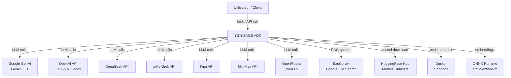
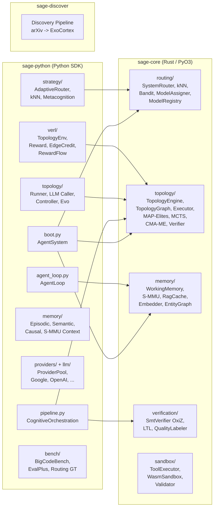

# YGN-SAGE -- Document d'Architecture Technique

> **Genere le** : 2026-03-24 | **Branche** : `VeRLGIGPO` | **Commit HEAD** : `9832b7b`
> **Auteur** : Claude Opus 4.6 (1M context), architecte principal
> **Methode** : Exploration exhaustive du code source. Le code prime sur la documentation.

---

## 1. Executive Summary

YGN-SAGE est un **Agent Development Kit (ADK)** concu pour orchestrer des topologies multi-agents avec routage cognitif adaptatif. Le systeme est structure en 3 crates/packages : un noyau Rust (`sage-core`) expose via PyO3, un SDK Python (`sage-python`), et un pipeline de decouverte de connaissances (`sage-discover`).

**Ce que le systeme fait reellement :**
- Route les taches vers 3 niveaux cognitifs (S1/S2/S3) via kNN sur embeddings (92% GT) + SystemRouter Rust + bandit contextuel Thompson.
- Genere des topologies multi-agents (8 templates + MAP-Elites + MCTS + mutations + LLM synthesis) et les execute via un runner avec resolution per-node de providers.
- Fournit un pipeline 5-stages (Classify -> Decompose -> Topology -> Assign -> Execute -> Learn) avec boucle d'apprentissage bandit.
- Integre verification formelle (OxiZ SMT) et LTL (petgraph) pour topologies et contrats.

**Ce que le systeme pretend mais ne fait pas encore pleinement :**
- **Self-Adaptive a runtime** : l'adaptation est codee (TopologyController) mais non validee quantitativement. [Evidence: sage-python/src/sage/evolution/engine.py:7-9] [Statut: Observe] [Reachability: Runtime] [Validation: Aucune quantitative]
- **GiGPO/veRL training** : l'environnement est implemente, le training n'a pas encore ete execute sur GPU (branche VeRLGIGPO prete pour RunPod). [Evidence: sage-python/src/sage/verl/] [Statut: Observe] [Reachability: Training] [Validation: Tests unitaires uniquement]
- **ONNX Quality Estimator** : tente de charger un modele `quality_estimator_v2.onnx` qui n'existe pas dans le repo. [Evidence: sage-python/src/sage/quality_estimator.py:36-39] [Statut: Observe] [Reachability: Dead code] [Validation: Aucune]

---

## 2. Repo Fingerprint

| Attribut | Valeur |
|---|---|
| **Repository** | `yannabadie/YGN-SAGE` |
| **Branche analysee** | `VeRLGIGPO` |
| **Langages** | Rust 1.94 (sage-core), Python 3.12+ (sage-python, sage-discover) |
| **Points d'entree runtime** | `sage.boot.boot_agent_system()`, `sage.pipeline.CognitiveOrchestrationPipeline.run()` |
| **Points d'entree training** | `sage.verl.topology_env.SageTopologyEnv`, `sage.verl.env_package.envs.SageTopologyVerlEnv` |
| **Tests Python** | ~1553 `def test_` dans 169 fichiers |
| **Tests Rust** | ~649 `#[test]` dans 55 fichiers |
| **CI** | GitHub Actions : 5 jobs (Rust, Rust-features, Python SDK, Python Discover, Python Windows) |
| **Feature flags Rust** | `extension-module` (default), `sandbox`, `cranelift`, `onnx`, `tool-executor`, `cognitive`, `smt` |
| **Licence** | MIT |
| **PyPI** | `ygn-sage` v0.1.0-alpha |

---

## 3. Reading Guide -- Legende de Classification

| Tag | Signification |
|---|---|
| **Observe** | Verifie dans le code source -- fichier + symbole + call path confirmes |
| **Infere** | Deduit de la structure du code mais non directement prouve |
| **Inconclusif** | Indices contradictoires ou insuffisants |
| **Runtime** | Atteignable dans le chemin d'execution normal (`boot.py` -> `pipeline.run()` -> ...) |
| **Training** | Atteignable uniquement dans le chemin d'entrainement veRL/GiGPO |
| **Experimental** | Existe derriere un feature flag ou env var optionnel |
| **Dead code** | Fichier/symbole present mais jamais importe dans un chemin atteignable |

**Classification des capacites :**
- `Reel et valide` : fichier + call path + test
- `Reel mais non valide` : fichier + call path, pas de test
- `Partiellement cable` : fichier existe, call path partiel
- `Squelette` : fichier existe, pas de call path
- `Code mort` : fichier existe, jamais importe
- `Doc-only` : mentionne dans la doc, pas dans le code

---

## 4. Mental Model

**Phrase-systeme :** YGN-SAGE est un orchestrateur multi-agent qui route les taches via classification cognitive (S1/S2/S3), genere des topologies DAG multi-agents via un moteur evolutif, assigne des modeles LLM par noeud, execute la topologie, et apprend des resultats via un bandit contextuel Thompson.

**Pipeline en 1 ligne :**
```
CLASSIFY (kNN/SystemRouter) -> DECOMPOSE (TaskPlanner) -> SELECT TOPOLOGY (6-path engine) -> ASSIGN MODELS (ModelAssigner+Z3) -> EXECUTE (TopologyRunner) -> LEARN (Bandit+S-MMU+MAP-Elites)
```

**Sous-systemes centraux :**

1. **Routing** : SystemRouter (Rust) + AdaptiveRouter (Python) + kNN embeddings + bandit contextuel
2. **Topology Engine** : 6-path generation (S-MMU hit, archive, LLM synthesis, mutation, MCTS, template) + HybridVerifier + LTL
3. **Execution** : TopologyRunner + TopologyExecutor (dual-mode : static DAG / dynamic gate-based) + ProviderPool
4. **Memory** : Working (Rust) + Episodic (SQLite) + Semantic (entity graph) + Causal (directed edges) + S-MMU (4-view petgraph)
5. **Verification** : OxiZ SMT (QF_LIA) + HybridVerifier (structural) + LTL (temporal) + ProcessRewardModel
6. **Evolution** : MAP-Elites archive + CMA-ME emitter + MCTS search + 7 mutation operators + TopologyPopulation
7. **Providers** : 8 providers (Google, OpenAI, DeepSeek, xAI, Kimi, MiniMax, OpenRouter, Codex) + ProviderPool + circuit breakers
8. **Training (experimental)** : SageTopologyEnv (GiGPO multi-step) + reward functions + edge credit + RewardFlow

---

## 5. System Context


[Evidence: docker-compose.yml:13-18, sage-python/src/sage/providers/, sage-python/src/sage/memory/remote_rag.py] [Statut: Observe] [Reachability: Runtime] [Validation: CI + tests]

---

## 6. Entrypoints and Execution Surfaces

### 6.1 Runtime

| Point d'entree | Fichier | Description | Reachability |
|---|---|---|---|
| `boot_agent_system()` | `sage-python/src/sage/boot.py:491` | Construit `AgentSystem` complet (router, engine, bandit, memory, pipeline) | Runtime |
| `AgentSystem.run(task)` | `sage-python/src/sage/boot.py:150` | Chemin principal : pipeline 5-stages si cable, sinon legacy AgentLoop | Runtime |
| `CognitiveOrchestrationPipeline.run()` | `sage-python/src/sage/pipeline.py:122` | Pipeline 5-stages async | Runtime |
| `AgentLoop.run(task)` | `sage-python/src/sage/agent_loop.py` | Boucle agent perceive/think/act/learn | Runtime |
| `TopologyRunner.run(task)` | `sage-python/src/sage/topology/runner.py` | Execution multi-agent d'une topologie | Runtime |
| `python -m sage.protocols.serve` | docker-compose.yml:22 | Serveur MCP + A2A | Runtime |

### 6.2 Training

| Point d'entree | Fichier | Description | Reachability |
|---|---|---|---|
| `SageTopologyEnv.reset()/.step()` | `sage-python/src/sage/verl/topology_env.py` | Env gym 4-etats pour GiGPO | Training |
| `SageTopologyVerlEnv` | `sage-python/src/sage/verl/env_package/envs.py` | Wrapper vectorise verl-agent | Training |
| `register_sage_topology_env()` | `sage-python/src/sage/verl/env_register.py:52` | Enregistrement dans verl-agent | Training |
| `compute_score()` | `sage-python/src/sage/verl/reward.py` | Fonction reward veRL : format + structure + density | Training |
| `python -m sage.bench` | `sage-python/src/sage/bench/__main__.py` | Benchmarks : BigCodeBench, EvalPlus, routing GT | Training/Eval |

### 6.3 Tooling

| Point d'entree | Fichier | Description | Reachability |
|---|---|---|---|
| `python -m sage.evolution` | `sage-python/src/sage/evolution/__main__.py` | CLI evolution (population, mutation, eval) | Experimental |
| `sage-discover/` | `sage-discover/src/discover/pipeline.py` | Pipeline arXiv -> ExoCortex | Tooling |
| `ui/app.py` | `ui/app.py` | Dashboard web | Tooling |

---

## 7. Container View



---

## 8. Component Registry

### 8.1 sage-core (Rust)

| Composant | Type | Responsabilite | Dependances | Reachability | Validation | Notes |
|---|---|---|---|---|---|---|
| `SystemRouter` | `#[pyclass]` | Route tache -> S1/S2/S3 + model_id | StructuralFeatures, ModelRegistry, Bandit | Runtime | Tests (12 #[test]) | Inclut `route_integrated()` avec bandit |
| `ContextualBandit` | `#[pyclass]` | Thompson sampling per-arm (Beta/Gamma posteriors) | rand | Runtime | Tests (30 #[test]) | Decay temporel, Pareto front |
| `RustKnnRouter` | `#[pyclass]` | kNN cosine sur exemplars pre-calcules | numpy | Runtime | Tests (6 #[test]) | OOD rejection, hot-path Rust |
| `ModelAssigner` | `#[pyclass]` | Assigne model_id par noeud topologie | ModelRegistry, ModelCard | Runtime | Tests (5 #[test]) | Domain-aware, budget-aware |
| `ModelRegistry` | `#[pyclass]` | Catalogue TOML de 20 modeles | toml, ModelCard | Runtime | Tests (12 #[test]) | `cards.toml` |
| `ModelCard` | `#[pyclass]` | Profil par modele (scores, couts, affinites) | serde | Runtime | Tests (14 #[test]) | s1/s2/s3 affinity + domain scores |
| `RustQualityEstimator` | `#[pyclass]` | 5-signal quality (lexical, rapide) | - | Runtime | Tests (8 #[test]) | Port Rust du Python QualityEstimator |
| `StructuralFeatures` | `#[pyclass]` | Extraction features structurelles d'une tache | - | Runtime | Tests (6 #[test]) | keyword complexity + uncertainty |
| `TopologyGraph` | `#[pyclass]` | IR unifie pour topologies multi-agents | petgraph, ulid | Runtime | Tests (4+16 #[test]) | 3-flow edges (Control/Message/State), 8 templates |
| `TopologyNode` | `#[pyclass]` | Noeud : role, model_id, system, capabilities | - | Runtime | Tests | Prompt customisable |
| `TopologyEdge` | `#[pyclass]` | Arete : type, gate, condition | - | Runtime | Tests | Gating dynamique |
| `TopologyEngine` (internal) | struct | Moteur 6-path : S-MMU, archive, LLM, mutation, MCTS, template | S-MMU, MAP-Elites, HybridVerifier, CMA-ME, MCTS, Bandit | Runtime | Tests (14+16 #[test]) | Expose via PyTopologyEngine |
| `TopologyExecutor` (internal) | struct | Ordonnancement dual-mode (static/dynamic) | petgraph | Runtime | Tests (19 #[test]) | Static=Kahn, Dynamic=gate readiness |
| `MapElitesArchive` | struct | Archive qualite-diversite 4D (108 cells) | TopologyGraph, HybridVerifier | Runtime | Tests (14 #[test]) | Pareto dominance insertion |
| `MctsSearcher` | struct | UCB1 tree search sur espace de mutations | mutations, HybridVerifier | Runtime | Tests (9 #[test]) | Pas d'appel LLM, purement structural |
| `CmaEmitter` | struct | Optimisation continue 3D (cout, temps, poids) | rand | Runtime | Tests (6 #[test]) | Covariance diagonale simplifiee |
| `HybridVerifier` | `#[pyclass]` | Verification structurelle + semantique O(V+E) | petgraph, LTL | Runtime | Tests (19 #[test]) | Erreurs hard + warnings soft |
| `LtlVerifier` | `#[pyclass]` | Model checking temporel : reachability, safety, liveness | petgraph | Runtime | Tests (17 #[test]) | BFS/DFS, pas de SMT |
| `SmtVerifier` | `#[pyclass]` | Verification formelle QF_LIA | OxiZ | Runtime (feature `smt`) | Tests (38 #[test]) | Bounds, loops, invariants, provider SAT |
| `QualityLabeler` | `#[pyclass]` | Label qualite via SMT + tree-sitter | SmtVerifier, Validator | Experimental (features `smt`+`tool-executor`) | Tests (16 #[test]) | Verification formelle des outputs |
| `MultiViewMMU` (S-MMU) | `#[pyclass]` | 4 vues : temporal, semantic, causal, entity | petgraph, ulid | Runtime | Tests (17 #[test]) | ULID chunk IDs, MAX_SEMANTIC_NEIGHBORS=128 |
| `WorkingMemory` | `#[pyclass]` | Memoire court-terme per-agent | chrono | Runtime | Tests (4 #[test]) | Fallback Python si Rust absent |
| `RustEmbedder` | `#[pyclass]` | arctic-embed-m ONNX 768-dim | ort, tokenizers, ndarray | Runtime (feature `onnx`) | Tests (3+5 #[test]) | load-dynamic DLL |
| `RagCache` | `#[pyclass]` | Cache LRU pour RAG | - | Runtime | Tests (5 #[test]) | - |
| `RustRelevanceGate` | `#[pyclass]` | Filtrage CRAG threshold | - | Runtime | Tests (8 #[test]) | - |
| `RustEntityGraph` | `#[pyclass]` | Graphe d'entites | petgraph | Runtime | Tests (12 #[test]) | - |
| `ToolExecutor` | `#[pyclass]` | Validation tree-sitter + execution Wasm/subprocess | wasmtime (opt), tree-sitter, process-wrap | Runtime (feature `tool-executor`) | Tests (8 #[test]) | Wasm WASI > subprocess fallback |
| `WasmSandbox` | `#[pyclass]` | Sandbox Wasm (wasmtime 36 LTS) | wasmtime | Experimental (feature `sandbox`) | Tests | cranelift exclu sur Windows |
| `TopologyDensity` | `#[pyclass]` | S_complex (AgentConductor) : S_node, S_edge, S_depth | petgraph | Runtime | Tests (11 #[test]) | N_max par systeme (4/7/10) |
| `TopologyReward` | `#[pyclass]` | Reward dense multi-signal (execution + structural + density + LTL) | HybridVerifier, TopologyDensity, LtlVerifier | Training | Tests (11 #[test]) | + resilience + cost_efficiency |

### 8.2 sage-python

| Composant | Type | Responsabilite | Dependances | Reachability | Validation | Notes |
|---|---|---|---|---|---|---|
| `boot.py` / `AgentSystem` | Module+Dataclass | Construction et assemblage de tout le systeme | Tous les modules | Runtime | Tests (3 test_boot) | Chemin primaire : pipeline; fallback : legacy |
| `pipeline.py` / `CognitiveOrchestrationPipeline` | Classe | Pipeline 5-stages async | router, engine, assigner, pool, bandit, QE | Runtime | Tests (32 test_pipeline) | `Reel et valide` |
| `agent_loop.py` / `AgentLoop` | Classe | Boucle perceive->think->act->learn | LLMProvider, ToolRegistry, WorkingMemory, PRM | Runtime | Tests (35+17 tests) | Circuit breakers, drift monitor |
| `topology/runner.py` / `TopologyRunner` | Classe | Execute TopologyGraph via LLM calls per-node | TopologyExecutor, LLMProvider, ProviderPool | Runtime | Tests (5 tests) | Predecessor context, retry fallback |
| `topology_controller.py` / `TopologyController` | Classe | Adaptation runtime (upgrade, prune, reroute, spawn) | QualityEstimator, PRM, ModelAssigner | Runtime | Tests (10 tests) | Thresholds hardcodes (THETA_GOOD=0.7, THETA_CRITICAL=0.3) |
| `strategy/adaptive_router.py` / `AdaptiveRouter` | Classe | Router 4-stages : structural->kNN->BERT->entropy | StructuralFeatures, KnnRouter | Runtime | Tests (34 tests) | `Reel et valide` |
| `strategy/knn_router.py` / `KnnRouter` | Classe | kNN routing sur exemplars embeddings | Embedder, numpy, RustKnnRouter | Runtime | Tests (21 tests) | 92% GT accuracy |
| `strategy/metacognition.py` / `ComplexityRouter` | Classe | Routeur heuristique (DEAD CODE) | - | Dead code | Tests (24 tests) | 34% GT -- remplace par kNN |
| `llm/provider_pool.py` / `ProviderPool` | Classe | Resolution model_id -> (provider, config) + circuit breakers | LLMProvider, CircuitBreaker, ModelRegistry | Runtime | Tests (4 tests) | `Reel et valide` |
| `providers/registry.py` / `ModelRegistry` (Python) | Classe | Decouverte live + merge TOML | ProviderConnector, tomllib | Runtime | Tests (27 tests) | Distinct du Rust ModelRegistry |
| `llm/google.py` / `GoogleProvider` | Classe | Provider Google GenAI | google-genai | Runtime | Tests | SSL patch integre |
| `llm/codex.py` / `CodexProvider` | Classe | Provider OpenAI Codex | openai | Runtime | Tests | - |
| `memory/episodic.py` / `EpisodicMemory` | Classe | Memoire cross-session SQLite/in-memory | aiosqlite (opt) | Runtime | Tests | WAL mode |
| `memory/semantic.py` / `SemanticMemory` | Classe | Graphe d'entites + relations triples | MemoryAgent | Runtime | Tests (7 tests) | Adjacency index, SQLite optional |
| `memory/causal.py` / `CausalMemory` | Classe | Graphe causal dirige | - | Runtime | Tests (16 tests) | BFS chain traversal |
| `memory/smmu_context.py` | Module | Recuperation contexte S-MMU pour injection prompt | MultiViewMMU | Runtime | Tests (16 tests) | Best-effort, weights (1.0, 2.0, 1.5, 1.0) |
| `memory/working.py` / `WorkingMemory` | Classe | Memoire court-terme, delegate a Rust | sage_core.WorkingMemory | Runtime | Tests (6 tests) | Fallback Python mock |
| `memory/remote_rag.py` / `ExoCortex` | Classe | RAG via Google File Search API | google-genai | Runtime | Tests (4 tests) | Store persiste |
| `memory/embedder.py` / `Embedder` | Classe | Wrapper embeddings (Rust ONNX ou fallback) | RustEmbedder | Runtime | Tests (15 tests) | Refuse hash embeddings pour routing |
| `quality_estimator.py` / `QualityEstimator` | Classe | Estimation qualite (Z3 ou ONNX ou abstention) | QualityLabeler, RustLearnedQualityEstimator | Runtime | Tests (4 tests) | ONNX modele ABSENT du repo |
| `topology/kg_rlvr.py` / `ProcessRewardModel` | Classe | PRM sur think tags + SMT | SmtVerifier | Runtime | Tests (11 tests) | Rust OxiZ prioritaire, Z3 Python deprecie |
| `contracts/z3_verify.py` | Module | Verification formelle provider assignment | SmtVerifier (Rust) | Runtime | Tests (18 tests) | Adapters DAG/Provider |
| `topology/llm_caller.py` | Module | Synthese topologie via LLM (Path 3) | LLMProvider | Runtime | Tests (10 tests) | JSON 2-stages (roles + structure) |
| `topology/evo_topology.py` / `TopologyEvolver` | Classe | Evolution Python de topologies | Population, Mutator, Evaluator | Runtime | Tests (5 tests) | Distinct de MAP-Elites Rust |
| `evolution/engine.py` / `EvolutionEngine` | Classe | Boucle evolutive : population + mutation + eval | Population, Mutator, Evaluator, SAMPO | Experimental | Tests (16 tests) | Aucune evidence quantitative d'amelioration |
| `events/bus.py` / `EventBus` | Classe | Bus d'evenements in-process (sync + async stream) | asyncio | Runtime | Tests (17 tests) | Ring buffer 5000 |
| `resilience.py` / `CircuitBreaker` | Classe | 3-states : CLOSED->OPEN->HALF_OPEN | - | Runtime | Tests (8 tests) | max_failures=3, cooldown=60s |
| `monitoring/drift.py` / `DriftMonitor` | Classe | Detection de derive (latence, erreurs, cout) | constants | Runtime | Tests (8 tests) | 3 actions : CONTINUE/SWITCH/RESET |
| `sandbox/manager.py` / `SandboxManager` | Classe | Execution isolee : Docker/Wasm/bubblewrap | sage_core.ToolExecutor, isolated_executor | Runtime | Tests (7 tests) | Fallback local si Docker absent |
| `routing/shadow.py` / `ShadowRouter` | Classe | Dual Rust/Python routing avec traces JSONL | SystemRouter, AdaptiveRouter | Runtime | Tests (28 tests) | Gate evidence : 500/10% soft, 1000/5% hard |
| `guardrails/` | Module | Input/output/runtime guardrails | - | Runtime | Tests (16+3 tests) | - |

### 8.3 Training (verl/)

| Composant | Type | Responsabilite | Dependances | Reachability | Validation | Notes |
|---|---|---|---|---|---|---|
| `topology_env.py` / `SageTopologyEnv` | Classe | Env gym 4-etats pour GiGPO multi-step | StepRewardVector, Embedder | Training | Tests (17 tests) | AWAITING_YAML->EXECUTING->AWAITING_DECISION->TERMINAL |
| `env_package/envs.py` / `SageTopologyVerlEnv` | Classe | Wrapper vectorise verl-agent | SageTopologyEnv | Training | Tests (35 tests) | `reset(prompts)`, `step(actions)` |
| `reward.py` / `compute_score()` | Fonction | Reward veRL : format + structure + density + edge credit | yaml, TopologyDensity | Training | Tests (20 tests) | Registre via `custom_reward_function` |
| `edge_credit.py` / `EdgeStats` | Classe | Graph-GRPO edge-level credit (arXiv 2603.02701) | yaml | Training | Tests (12 tests) | Per-edge success rates -> advantages |
| `rewardflow.py` / `RewardFlowPropagator` | Classe | Per-node credit via PageRank (arXiv 2603.18859) | - | Training | Tests (25 test_verl_v2) | State-graph backward propagation |
| `step_reward.py` / `StepRewardVector` | Dataclass | Reward decompose par step pour GiGPO | - | Training | Tests | to_verl_format() |
| `training_memory.py` / `TrainingMemory` | Classe | SQLite episodic memory pour training loop | sqlite3, numpy | Training | Tests | replay_candidate flag |
| `env_register.py` | Module | Registration dans verl-agent | SageTopologyVerlEnv | Training | Tests | 3 strategies : env_package, patch, monkey_patch |
| `env_package/projection.py` | Module | Projection pour verl-agent | - | Training | Infere | - |

### 8.4 Discovery (sage-discover)

| Composant | Type | Responsabilite | Dependances | Reachability | Validation | Notes |
|---|---|---|---|---|---|---|
| `discover/pipeline.py` | Module | arXiv -> ExoCortex ingestion | google-genai | Tooling | Tests (52) | - |
| `mcp_gateway.py` | Module | MCP gateway pour decouverte | - | Tooling | - | - |

---

## 9. Runtime Flows

### 9.1 Execution d'une tache (chemin principal)

```
1. boot_agent_system() construit AgentSystem avec:
   - Rust SystemRouter + ModelRegistry (cards.toml)
   - Rust TopologyEngine + ContextualBandit
   - Python AdaptiveRouter (kNN + structural)
   - CognitiveOrchestrationPipeline
   - ProviderPool (8 providers)

2. AgentSystem.run(task) ->
   if pipeline && !mock:
     pipeline.run(task, budget)
   else:
     legacy path (ShadowRouter -> AgentLoop)

3. pipeline.run(task):
   Stage 0: _stage_classify() -> router.assess_complexity() + route() -> system=S1/S2/S3
   Stage 1: _stage_decompose() -> TaskPlanner.plan_auto() -> TaskDAG + DAGFeatures
   Stage 2: _stage_select_topology() -> engine.generate() || Path 6 || template fallback
   Stage 3: _stage_assign_models() -> assigner.assign_models() + Z3 verify (non-blocking)
   Stage 4: _stage_execute():
     - bandit.select_with_context() -> decision_id
     - if single-node: LLM direct call
     - if multi-node: TopologyRunner.run(task)
       -> TopologyExecutor.next_ready() -> per-node LLM calls -> mark_completed()
       -> if __REROUTE__: regenerate topology + re-execute
       -> if quality < 0.3: FrugalGPT cascade retry
   Stage 5: _stage_learn():
     - QualityEstimator.estimate()
     - PRM scoring (structured content only)
     - bandit.record_outcome(decision_id, quality, cost, latency)
     - engine.record_outcome() -> S-MMU + MAP-Elites
```
[Evidence: sage-python/src/sage/pipeline.py:122-773, sage-python/src/sage/boot.py:150-412] [Statut: Observe] [Reachability: Runtime] [Validation: Tests (32 test_pipeline)]

### 9.2 Generation de topologie (6-path)

```
TopologyEngine.generate(smmu, task, embedding, system, exploration_budget):
  1. Bandit module l'exploration budget (arms > 3 => exploit)
  2. Path 1: S-MMU hit (similarity > 0.7 AND quality > 0.5) -> clone
  3. Path 2: MAP-Elites archive lookup (BehaviorDescriptor match, quality > 0.5)
  4. Path 3: LLM synthesis (Python-side: llm_caller.synthesize_topology())
  5. Path 4: Mutation (best-quality from archive + random mutation)
  6. Path 5: MCTS search (UCB1 over mutation space)
  7. Path 6: Template fallback (S1->sequential, S2->avr, S3->debate)
  -> HybridVerifier.verify(topology) -> reject if invalid
  -> Return GenerateResult { topology, source, confidence }
```
[Evidence: sage-core/src/topology/engine.rs:167-200] [Statut: Observe] [Reachability: Runtime] [Validation: Tests (14 #[test])]

### 9.3 Adaptation runtime (TopologyController)

```
TopologyRunner execute chaque noeud:
  -> TopologyController.evaluate_and_decide(node_idx, result, task, topology):
     - QualityEstimator.estimate(task, result) -> quality
     - if quality >= THETA_GOOD (0.7): continue
     - if quality < THETA_CRITICAL (0.3) && retries < MAX_RETRIES: upgrade_model
     - if quality < THETA_PRUNE (0.2): prune_node
     - if accumulated failures > threshold: reroute_topology (__REROUTE__)
  -> pipeline.py re-genere topologie si __REROUTE__
```
[Evidence: sage-python/src/sage/topology_controller.py:74-80, sage-python/src/sage/pipeline.py:601-637] [Statut: Observe] [Reachability: Runtime] [Validation: Tests (10 tests), mais pas de validation quantitative de l'amelioration]

### 9.4 Systeme memoire

```
Per-agent:
  WorkingMemory (Rust) -> memoire court-terme, evenements structures

Cross-session:
  EpisodicMemory (SQLite WAL) -> keyword search, CRUD, scoped par agent_id
  SemanticMemory (entity graph) -> triples (sujet, predicat, objet), BFS neighbourhood
  CausalMemory (directed graph) -> edges causaux, ancestor/descendant queries

Multi-view (Rust):
  S-MMU (MultiViewMMU) -> 4 graphes : temporal, semantic, causal, entity
  -> smmu_context.py recupere chunks pertinents pour injection dans prompts
  -> TopologySmmuBridge stocke outcomes pour retrieval futur

RAG:
  ExoCortex -> Google File Search API (store persistant)
  RagCache -> LRU cache Rust
```
[Evidence: sage-core/src/memory/, sage-python/src/sage/memory/] [Statut: Observe] [Reachability: Runtime] [Validation: Tests multiples]

### 9.5 Training GiGPO (experimental)

```
1. SageTopologyVerlEnv.reset(prompts) -> cree SageTopologyEnv per prompt
2. Boucle:
   a. Env attend YAML topologie du modele (AWAITING_YAML)
   b. Modele genere topologie YAML -> env parse, reward structurel
   c. Execution des noeuds (EXECUTING)
   d. Checkpoint: modele decide continue/upgrade/reroute (AWAITING_DECISION)
   e. Reward step-level via StepRewardVector + anchor keys
3. Terminal: code teste en sandbox -> execution reward
4. compute_score(): format + structure + density + edge credit
5. RewardFlowPropagator: per-node credit via PageRank
6. GiGPO normalise par anchor groups
```
[Evidence: sage-python/src/sage/verl/topology_env.py, sage-python/src/sage/verl/reward.py] [Statut: Observe] [Reachability: Training] [Validation: Tests unitaires (35+20+25), pas de run GPU]

---

## 10. State, Data, and Memory

### 10.1 Stores de donnees

| Store | Format | Localisation | Cycle de vie | Reachability |
|---|---|---|---|---|
| WorkingMemory | In-memory (Rust struct) | Per-agent, volatile | Duree d'un run | Runtime |
| EpisodicMemory | SQLite (WAL) | `~/.sage/episodic.db` | Persistant cross-session | Runtime |
| SemanticMemory | In-memory + SQLite opt | Per-agent | Session ou persistant | Runtime |
| CausalMemory | In-memory + SQLite opt | Per-agent | Session ou persistant | Runtime |
| S-MMU | In-memory (petgraph) | Global (TopologyEngine.bridge) | Duree du processus | Runtime |
| MAP-Elites Archive | In-memory (HashMap) | TopologyEngine.archive | Duree du processus | Runtime |
| Topology Cache | In-memory (HashMap, max 500) | TopologyEngine.topology_cache | Duree du processus, eviction par qualite | Runtime |
| Bandit Posteriors | In-memory (BetaPosterior/GammaPosterior per arm) | ContextualBandit | Duree du processus, decay temporel | Runtime |
| ModelRegistry | TOML (cards.toml) + live discovery | `sage-core/config/cards.toml` | Statique (20 modeles) | Runtime |
| Routing Exemplars | NPZ (embeddings + labels) | `config/routing_exemplars.npz` | Statique (pre-calcule) | Runtime |
| Training Memory | SQLite | `data/training_memory.db` | Cross-epoch | Training |
| ExoCortex | Google File Search Store | Cloud (Google) | Persistant indefiniment | Runtime |
| EventBus Buffer | In-memory ring buffer | Max 5000 events | Volatile | Runtime |
| Shadow Traces | JSONL | Disque, 10MB rotation | Diagnostic | Runtime |
| Training Data | JSONL | `sage-python/data/*.jsonl` | Statique | Training |

### 10.2 Memory Reality Check

| Capacite | Statut | Evidence |
|---|---|---|
| Episodic memory ecrite ET relue a runtime | `Reel et valide` | `agent_loop.py` injecte episodic dans prompts (sauf code tasks), tests confirment |
| Semantic memory ecrite ET relue a runtime | `Reel et valide` | `agent_loop.py` + `semantic_wiring` tests |
| S-MMU relue pour selection topologie | `Reel et valide` | `TopologyEngine.generate()` Path 1 (S-MMU hit), `smmu_context.py` |
| Causal memory influence les decisions | `Partiellement cable` | Stockee via `memory_agent`, injectee via `causal_memory`, mais pas d'evidence que les decisions en dependent |
| MAP-Elites persiste entre sessions | `Non` | In-memory seulement, perdu au redemarrage |
| Bandit posteriors persistent | `Non` | In-memory seulement (persistence module existe dans `persistence.rs` mais feature `cognitive` requise) |

---

## 11. Models, Routing, and Providers

### 11.1 Modeles LLM dans cards.toml

| Model ID | Provider | S1 | S2 | S3 | Cout input/M$ | Notes |
|---|---|---|---|---|---|---|
| gemini-3.1-pro-preview | Google | 0.10 | 0.90 | 0.90 | 2.00 | Modele principal S2/S3 |
| gemini-3.1-flash-lite-preview | Google | 0.90 | 0.45 | 0.45 | 0.25 | Modele S1 rapide |
| gpt-5.4-mini | OpenAI | 0.50 | 0.85 | 0.60 | 1.20 | Infere du nom |
| gpt-5.4-nano | OpenAI | 0.85 | 0.35 | 0.25 | 0.30 | S1 ultra-rapide |
| deepseek-v4 | DeepSeek | - | - | - | - | Infere |
| minimax-m2.7 | MiniMax | - | - | - | - | Infere |
| qwen3.5-plus | OpenRouter | - | - | - | - | Via OpenRouter |

[Evidence: sage-core/config/cards.toml:1-60] [Statut: Observe pour les 2 premiers, Infere pour les autres] [Reachability: Runtime] [Validation: Aucune (pas de test sur le contenu exact)]

### 11.2 Chaine de routage

```
1. AdaptiveRouter.route():
   Stage 0: StructuralFeatures.extract_from(task) -> complexity, uncertainty
   Stage 0.5: KnnRouter.route(task) -> system (si confidence > threshold)
   Stage 1: ONNX BERT (RustAdaptiveRouter) -- non observe comme actif en runtime
   Stage 2: Entropy probe (logprobs diversity) -> ajustement confidence

2. SystemRouter.route(task, budget):
   - StructuralFeatures + formal keywords detection
   - ModelRegistry.best_model_for_system(system, budget)
   - Budget constraint: downgrade si over budget

3. ContextualBandit.select(exploration_budget):
   - Thompson sampling sur Beta posteriors par arm (model_id, template)
   - Pareto front : qualite vs cout vs latence
```

### 11.3 Budget et cout

- Budget par defaut : `DEFAULT_BUDGET_USD = 10.0` [Evidence: constants.py:110]
- Exploration S1/S2 : 0.30, S3 : 0.50 [Evidence: constants.py:111-112]
- Cout par noeud estime : `$0.001` (hardcode) [Evidence: pipeline.py:671] -- **heuristique grossiere, pas de tracking reel des tokens**
- Guardrail max : `COST_GUARDRAIL_MAX_USD = 10.0` [Evidence: constants.py:115]

---

## 12. Training, Fine-Tuning, and Evaluation

### 12.1 SFT (historique)

- Modele : Phi-4-mini-instruct -> `yannabadie/sage-topology-policy` sur HuggingFace
- Donnees : `topology_sft_combined.jsonl` (non present dans le repo actuel)
- Statut : **V1 legacy, remplace par GiGPO**

### 12.2 RL / GiGPO (branche active)

- **Framework** : verl-agent (non installe dans le repo, dependance externe)
- **Modele cible** : Nemotron-Orchestrator-8B (GiGPO V2) -> `yannabadie/sage-topology-policy-v2`
- **Environnement** : `SageTopologyEnv` (4-etats, multi-step)
- **Reward** : 4 composants (format YAML, structure, density S_complex, edge credit Graph-GRPO)
- **Step-level** : `StepRewardVector` avec anchor keys pour GiGPO grouping
- **Per-node credit** : `RewardFlowPropagator` (PageRank backward)
- **Donnees** : `sage-python/data/` contient ~15 JSONL (gpt54_*, quality_triples, etc.)
- **Statut** : **Code complet, tests passent, jamais execute sur GPU** (branche VeRLGIGPO prete pour RunPod H100)

### 12.3 Evaluation

| Benchmark | Outil | Resultat | Evidence |
|---|---|---|---|
| BigCodeBench Hard Instruct | `sage.bench.bigcodebench_bench` | 37.8% | CLAUDE.md |
| HumanEval+ | `sage.bench.evalplus_bench` | 89.6% | CLAUDE.md |
| Routing GT (50 tasks) | `sage.bench.routing_ground_truth` | kNN 92%, SystemRouter 86%, heuristique 34% | CLAUDE.md |
| Ablation | `sage.bench.ablation` | Non documente | Infere |

### 12.4 Training Reality Check

| Capacite | Statut | Evidence |
|---|---|---|
| Environment GiGPO fonctionnel | `Reel et valide` (tests) | 35 tests env_package, 17 tests topology_env |
| Reward function complete | `Reel et valide` (tests) | 20 tests verl_reward |
| Edge credit (Graph-GRPO) | `Reel et valide` (tests) | 12 tests edge_credit |
| RewardFlow (PageRank) | `Reel et valide` (tests) | 25 tests verl_v2 |
| Training GPU execute | `Non` | Aucun log de run reussi dans le repo |
| Modele entraine deploye | `Inconclusif` | HF model existe mais date de creation non verifiable |
| Integration verl-agent | `Partiellement cable` | env_register existe, verl non installe |

---

## 13. Deployment, Configuration, and Feature Flags

### 13.1 Variables d'environnement

| Variable | Usage | Defaut | Requis |
|---|---|---|---|
| `GOOGLE_API_KEY` | Provider Google GenAI | - | Oui (pour runtime) |
| `OPENAI_API_KEY` | Provider OpenAI | - | Non |
| `DEEPSEEK_API_KEY` | Provider DeepSeek | - | Non |
| `GROK_API_KEY` | Provider xAI | - | Non |
| `KIMI_API_KEY` | Provider Kimi | - | Non |
| `MINIMAX_API_KEY` | Provider MiniMax | - | Non |
| `SAGE_ENABLE_PATH6` | Active Path 6 (topologie apprise) | `None` | Non |
| `SAGE_EXOCORTEX_STORE` | Store ExoCortex | `fileSearchStores/ygnsageresearch-wii7kwkqozrd` | Non |
| `SAGE_EXOCORTEX_MODEL` | Modele ExoCortex | `gemini-3.1-flash-lite-preview` | Non |
| `SAGE_TRAINING_MEMORY_DB` | SQLite pour training memory | - | Non (training) |
| `SAGE_DASHBOARD_TOKEN` | Token auth dashboard | - | Non |
| `HF_HUB_OFFLINE` | Mode offline HuggingFace | `0` | Non (CI Windows) |
| `ORT_DYLIB_PATH` | Chemin ONNX Runtime DLL | - | Non (auto-detect) |
| `PYTHONIOENCODING` | Encodage console Windows | `utf-8` | Oui (Windows) |

### 13.2 Feature Flags Rust

| Flag | Effet | CI |
|---|---|---|
| `extension-module` (default) | PyO3 module Python | Exclu en `--no-default-features` pour tests |
| `sandbox` | WasmSandbox (wasmtime 36) | CI Linux |
| `cranelift` | JIT compilation Wasm | CI Linux (exclu Windows: stack overflow) |
| `onnx` | Embedder ONNX (arctic-embed-m) | CI |
| `tool-executor` | ToolExecutor (tree-sitter + subprocess) | CI |
| `cognitive` | Persistence SQLite (rusqlite) | CI |
| `smt` | SmtVerifier (OxiZ) | CI |

### 13.3 Fallbacks

| Composant | Si absent | Consequence |
|---|---|---|
| sage_core (Rust) | Python fallbacks | WorkingMemory mock, pas de Rust routing/topology |
| ONNX model | Hash embeddings interdits | kNN routing degrade |
| Docker | bubblewrap ou local exec | Sandbox degrade |
| GOOGLE_API_KEY | ExoCortex et GoogleProvider indisponibles | Fallback vers autre provider |
| QualityLabeler (smt+tool-executor) | QualityEstimator abstient | Bandit ne recoit pas de feedback |

---

## 14. Security, Sandboxing, and Verification

### 14.1 Sandbox

- **Priorite d'execution** : Wasm WASI > subprocess timeout > Docker > bubblewrap > local (si allow_local=True)
- **ToolExecutor** (Rust) : validation tree-sitter avant execution, timeout configurable
- **WasmSandbox** : wasmtime 36 LTS, cranelift JIT (Linux), pre-compiled modules (Windows)
- **SandboxManager** (Python) : Docker-based avec limites memoire/CPU/reseau
- **`_check_sandbox_availability()`** : warning si aucun sandbox disponible au boot

[Evidence: sage-core/src/sandbox/tool_executor.rs:1-8, sage-python/src/sage/boot.py:80-105] [Statut: Observe] [Reachability: Runtime] [Validation: Tests (36 test_sandbox_executor)]

### 14.2 Verification Formelle (SMT)

- **OxiZ** (Rust, pure Rust, 0 deps C++) : QF_LIA, bounds checking, loop verification, invariant implication, provider assignment SAT
- **SmtVerifier** : 10 methodes PyO3 (verify_bounds, verify_loop, verify_arithmetic, verify_invariant, verify_provider_assignment, verify_invariant_with_feedback, synthesize_invariant)
- **CEGAR** : `verify_invariant_with_feedback()` + `synthesize_invariant()` (max 5 rounds)
- **Usage runtime** : `pipeline.py:_verify_assignment_formal()` -- verification NON-BLOQUANTE de l'assignation providers
- **Usage training** : `QualityLabeler` combine SMT + tree-sitter pour labeling qualite

[Evidence: sage-core/src/verification/smt.rs, sage-python/src/sage/contracts/z3_verify.py] [Statut: Observe] [Reachability: Runtime (feature smt)] [Validation: 38 #[test] Rust + 18 tests Python]

### 14.3 LTL Model Checking

- **LtlVerifier** (Rust, petgraph) : reachability, safety (no high->low info flow), liveness (entry reaches exit), bounded liveness (depth limit)
- **Integration** : `HybridVerifier` appelle `LtlVerifier` sur chaque topologie generee
- **Pas de SMT** : O(V+E) BFS/DFS

[Evidence: sage-core/src/verification/ltl.rs, sage-core/src/topology/verifier.rs:7] [Statut: Observe] [Reachability: Runtime] [Validation: 17 #[test]]

### 14.4 Trust Boundaries

- Pas de `verify=False` (directive explicite CLAUDE.md)
- CircuitBreaker per-provider (3 failures -> open, 60s cooldown)
- Guardrails : input/output/runtime (module `guardrails/`)
- Sandbox : code execute en isolation, jamais sur la machine hote en production
- ExoCortex : API key Google, pas de credentials dans le code

---

## 15. Quality Attributes and Stress Scenarios

### 15.1 Attributs de qualite

| Attribut | Implementation | Evidence | Statut |
|---|---|---|---|
| **Performance** | Rust hot-paths (routing, kNN, S-MMU, executor) | `sage-core/src/` | `Reel et valide` |
| **Resilience** | CircuitBreaker per-subsystem + per-provider | `resilience.py`, `provider_pool.py` | `Reel et valide` |
| **Observabilite** | EventBus + AgentEvent + DriftMonitor | `events/bus.py`, `monitoring/drift.py` | `Reel et valide` |
| **Adaptabilite** | TopologyController (upgrade/prune/reroute/spawn) | `topology_controller.py` | `Reel mais non valide quantitativement` |
| **Verification formelle** | OxiZ SMT + LTL + HybridVerifier | `verification/`, `topology/verifier.rs` | `Reel et valide` |
| **Evolution** | MAP-Elites + CMA-ME + MCTS + 7 mutations | `topology/` (Rust) | `Reel et valide` (tests), pas d'evidence runtime |
| **Cout-efficacite** | FrugalGPT cascade + budget constraints + density score | `pipeline.py:640-665`, `density.rs` | `Partiellement cable` |
| **Securite sandbox** | Wasm/Docker/bubblewrap isolation | `sandbox/` | `Reel et valide` |

### 15.2 Scenarios de stress

**Scenario 1 : Tous les providers tombent sauf un**
- CircuitBreaker ouvre apres 3 echecs par provider
- ProviderPool fallback vers `default_provider`
- TopologyRunner retry avec fallback provider per-node
- [Evidence: sage-python/src/sage/topology/runner.py:147-179] [Statut: Observe] [Validation: Tests]

**Scenario 2 : Topologie invalide generee par mutation**
- HybridVerifier detecte (erreurs structurelles O(V+E))
- MutationResult::Invalid retourne, mutation rejetee
- Engine essaie le path suivant dans la cascade 6-path
- [Evidence: sage-core/src/topology/mutations.rs:20-26, engine.rs] [Statut: Observe] [Validation: Tests (19 verifier)]

**Scenario 3 : Drift de performance a runtime**
- DriftMonitor analyse window d'events (latence, erreurs, cout)
- drift_score > 0.4 -> SWITCH_MODEL event
- drift_score > 0.7 -> RESET_AGENT event
- [Evidence: sage-python/src/sage/monitoring/drift.py, agent_loop.py:280-296] [Statut: Observe] [Validation: Tests (8)]

---

## 16. Architecture Decisions and Trade-offs

### ADR-1 : Rust First, Python Tolerant
**Decision** : Hot-paths en Rust (routing, S-MMU, topologie, verification), orchestration en Python.
**Raison** : Performance critique pour routing (< 1ms), verification (sub-0.1ms), embeddings.
**Consequence** : Double maintenance (Rust struct + PyO3 wrapper), fallbacks Python necessaires.
[Evidence: sage-core/Cargo.toml, sage-python/src/sage/memory/working.py:27-31] [Statut: Observe]

### ADR-2 : kNN comme routeur principal (92% GT)
**Decision** : Remplace l'heuristique par mots-cles (34% GT) par kNN sur arctic-embed-m (92% GT).
**Raison** : arXiv 2505.12601 montre que kNN simple surpasse MLP, GNN, attention pour le routing LLM.
**Consequence** : Dependance a ONNX Runtime + modele arctic-embed-m. Hash embeddings interdits pour routing.
[Evidence: sage-python/src/sage/strategy/knn_router.py:1-13] [Statut: Observe] [Validation: Benchmark]

### ADR-3 : Bandit contextuel Thompson (pas LinUCB)
**Decision** : Beta posteriors per-arm avec Thompson sampling, Gamma pour cout/latence, Pareto front.
**Raison** : Pas besoin de features contextuelles lineaires, posteriors conjugues sont simples et efficaces.
**Consequence** : Cold start lent (posteriors uninformatives), pas de persistence cross-session.
[Evidence: sage-core/src/routing/bandit.rs:1-97] [Statut: Observe] [Validation: 30 tests]

### ADR-4 : 8 templates de topologie + evolution
**Decision** : Sequential, Parallel, AVR, SelfMoA, Hierarchical, Hub, Debate, Brainstorming comme primitives, enrichies par MAP-Elites/MCTS/mutations.
**Raison** : MASFactory (2603.06007) + AgentConductor (2602.17100) patterns valides.
**Consequence** : 6-path cascade complexe dans TopologyEngine.
[Evidence: sage-core/src/topology/templates.rs, engine.rs] [Statut: Observe]

### ADR-5 : Three-flow edge model
**Decision** : Control (ordering) + Message (data) + State (sync) edges sur TopologyGraph.
**Raison** : MASFactory (2603.06007) distingue explicitement ces 3 flux.
**Consequence** : Complexite accrue du graphe (3x plus d'aretes potentielles), mais semantique plus riche.
[Evidence: sage-core/src/topology/topology_graph.rs:22-26] [Statut: Observe]

### ADR-6 : OxiZ (pure Rust) au lieu de Z3 (C++)
**Decision** : Pure Rust SMT solver via crate `oxiz`.
**Raison** : Zero deps C++, compilation simple, performance sub-0.1ms pour QF_LIA.
**Consequence** : Limite a QF_LIA (linear integer arithmetic). Python Z3 deprecie.
[Evidence: sage-core/src/verification/smt.rs:1-11, sage-python/src/sage/topology/kg_rlvr.py:44-57] [Statut: Observe]

### ADR-7 : Dual-mode executor (Static + Dynamic)
**Decision** : Kahn's topological sort pour DAGs statiques, gate-based readiness pour topologies cycliques.
**Raison** : AVR, Hub, Debate ont des boucles de feedback; sequential/parallel sont DAGs purs.
**Consequence** : TopologyExecutor auto-detecte le mode depuis le template type.
[Evidence: sage-core/src/topology/executor.rs:18-26] [Statut: Observe]

### ADR-8 : GiGPO multi-step avec anchor keys
**Decision** : Reward decompose par step avec anchor keys pour grouping (role:difficulty:context_hash).
**Raison** : GiGPO (arXiv 2505.10978) normalise par anchor groups pour credit assignment step-level.
**Consequence** : Plus fin que GRPO (episode-level), mais necessite des decisions reelles aux checkpoints.
[Evidence: sage-python/src/sage/verl/step_reward.py, topology_env.py:96-98] [Statut: Observe] [Reachability: Training]

### ADR-9 : Shadow routing avec evidence gates
**Decision** : ShadowRouter execute les deux routeurs (Rust + Python) et compare, avec gates evidence (500/10%, 1000/5%) avant promotion.
**Raison** : Evidence-first : pas de promotion du Rust router sans preuve de parity.
**Consequence** : 49.6% divergence observee (1090 traces) => gates FAIL => Python non remplace.
[Evidence: sage-python/src/sage/routing/shadow.py, constants.py:91-96] [Statut: Observe]

### ADR-10 : S1/S2/S3 comme systemes cognitifs (Kahneman)
**Decision** : S1 = rapide/intuitif, S2 = delibere/analytique, S3 = formel/verification. Pas des stages pipeline.
**Raison** : Modele cognitif issu de Kahneman, valide par la litterature routing LLM.
**Consequence** : Chaque systeme a ses propres modeles preferes, budgets, et topologies.
[Evidence: constants.py:13-21, sage-core/config/cards.toml (s1/s2/s3_affinity)] [Statut: Observe]

---

## 17. Known Gaps, Contradictions, and Technical Debt

### 17.1 Contradictions docs/code

| Contradiction | Detail | Impact |
|---|---|---|
| **"Self-Adaptive" a 0%** | CLAUDE.md mentionne "Self-Adaptive: SA-1, SA-3, SA-4 + Path 6" mais `evolution/engine.py:7-9` dit "No quantitative evidence that evolution improves task outcomes yet" | Marketing vs realite |
| **Cost estimation hardcodee** | `pipeline.py:671` : `ctx.cost = n_nodes * 0.001` -- pas de tracking reel des tokens | Suivi de cout fictif |
| **ONNX Quality Estimator absent** | `quality_estimator.py:36` charge `quality_estimator_v2.onnx` qui n'existe pas | QualityEstimator abstient toujours si QualityLabeler (smt) absent |
| **ComplexityRouter toujours importe** | `boot.py:47` importe `ComplexityRouter` (34% GT) malgre "DEAD CODE" dans CLAUDE.md | Code mort maintenu pour compat |
| **RustLearnedQualityEstimator** | `quality_estimator.py:34` tente d'importer `RustLearnedQualityEstimator` qui n'existe pas dans `lib.rs` | ImportError silencieux |

### 17.2 Modules orphelins ou partiellement cables

| Module | Statut | Detail |
|---|---|---|
| `sage-python/src/sage/protocols/a2a_server.py` | Squelette | `raise NotImplementedError("Task cancellation not yet supported")` line 67 |
| `sage-python/src/sage/evolution/self_improve.py` | Partiellement cable | Auto-amelioration -- non teste en production |
| `sage-python/src/sage/agents/handoff.py` | Squelette | Agent handoff pattern -- non cable dans pipeline |
| `sage-python/src/sage/execution_decision.py` | Partiellement cable | Existe, usage limite |
| `sage-core/src/routing/persistence.rs` | Code disponible mais dormant | Persistence bandit derriere feature `cognitive` |
| `ui/app.py` | Squelette | Dashboard, non integre dans CI |

### 17.3 Dette technique

| Item | Severite | Detail |
|---|---|---|
| **Pas de persistence MAP-Elites/Bandit** | Haute | Tout l'apprentissage runtime est perdu au redemarrage. S-MMU, MAP-Elites, bandit posteriors sont in-memory. |
| **Estimation de cout fictive** | Moyenne | `$0.001 * n_nodes` ne reflete pas les couts reels d'API |
| **Shadow routing gates echouees** | Moyenne | 49.6% divergence (1090 traces), gates non franchies. Rust router pas promu. |
| **Training jamais execute sur GPU** | Haute | Toute l'infra veRL/GiGPO est testee en unitaire mais pas en conditions reelles |
| **Seuils hardcodes** | Basse | `THETA_GOOD=0.7`, `THETA_CRITICAL=0.3`, etc. dans `topology_controller.py` -- "subject to ablation" |
| **Path 6 derriere env var** | Basse | `SAGE_ENABLE_PATH6` -- topologie apprise non activee par defaut |
| **Pas de metriques d'evolution** | Moyenne | `evolution/engine.py` note l'absence de Wilcoxon, Cohen's d, courbes de convergence |

---

## 18. Key Files Quick Reference

| Fichier | Role | Importance |
|---|---|---|
| `sage-python/src/sage/boot.py` | Point d'entree principal, assemblage systeme | Critique |
| `sage-python/src/sage/pipeline.py` | Pipeline 5-stages | Critique |
| `sage-python/src/sage/agent_loop.py` | Boucle agent perceive/think/act/learn | Critique |
| `sage-python/src/sage/topology/runner.py` | Execution multi-agent | Haute |
| `sage-python/src/sage/topology_controller.py` | Adaptation runtime | Haute |
| `sage-python/src/sage/strategy/adaptive_router.py` | Router 4-stages | Haute |
| `sage-python/src/sage/strategy/knn_router.py` | kNN routing (92% GT) | Haute |
| `sage-python/src/sage/quality_estimator.py` | Estimation qualite | Haute |
| `sage-python/src/sage/llm/provider_pool.py` | Resolution model_id -> provider | Haute |
| `sage-python/src/sage/constants.py` | Tous les seuils et constantes | Haute |
| `sage-python/src/sage/verl/topology_env.py` | Env GiGPO multi-step | Haute (training) |
| `sage-python/src/sage/verl/reward.py` | Reward function veRL | Haute (training) |
| `sage-python/src/sage/verl/edge_credit.py` | Graph-GRPO edge credit | Moyenne (training) |
| `sage-python/src/sage/verl/rewardflow.py` | RewardFlow PageRank | Moyenne (training) |
| `sage-python/src/sage/memory/episodic.py` | Memoire cross-session SQLite | Moyenne |
| `sage-python/src/sage/memory/smmu_context.py` | Injection S-MMU dans prompts | Moyenne |
| `sage-python/src/sage/events/bus.py` | EventBus observabilite | Moyenne |
| `sage-python/src/sage/resilience.py` | Circuit breakers | Moyenne |
| `sage-python/src/sage/monitoring/drift.py` | Detection derive | Moyenne |
| `sage-python/src/sage/topology/llm_caller.py` | Synthese topologie via LLM | Moyenne |
| `sage-core/src/lib.rs` | Point d'entree Rust, exports PyO3 | Critique |
| `sage-core/src/routing/bandit.rs` | Bandit contextuel Thompson | Haute |
| `sage-core/src/routing/system_router.rs` | SystemRouter S1/S2/S3 | Haute |
| `sage-core/src/topology/engine.rs` | TopologyEngine 6-path | Critique |
| `sage-core/src/topology/topology_graph.rs` | IR TopologyGraph | Critique |
| `sage-core/src/topology/executor.rs` | TopologyExecutor dual-mode | Haute |
| `sage-core/src/topology/map_elites.rs` | Archive MAP-Elites 4D | Haute |
| `sage-core/src/memory/smmu.rs` | S-MMU 4-view | Haute |
| `sage-core/src/verification/smt.rs` | SMT verification OxiZ | Haute |
| `sage-core/src/verification/ltl.rs` | LTL model checking | Moyenne |
| `sage-core/config/cards.toml` | 20 modeles LLM profiles | Haute |

---

## 19. Open Questions

1. **MAP-Elites et bandit sont purement in-memory.** Que se passe-t-il en production quand le processus redemarre ? Le module `persistence.rs` existe mais est-il actif derriere `cognitive` ? Aucune evidence d'appel au runtime.

2. **Le ONNX quality estimator n'existe pas dans le repo.** `quality_estimator_v2.onnx` est reference dans le code mais absent. Le `QualityLabeler` (SMT) est-il suffisant comme seul backend ?

3. **Le training GiGPO a-t-il ete execute au moins une fois sur GPU ?** Les logs `train_phase_a_v*.log` existent mais leur contenu n'a pas ete verifie (hors scope de cette analyse).

4. **Le shadow routing montre 49.6% de divergence.** Cela signifie-t-il que le Rust router est meilleur (hypothese dans MEMORY.md) ou pire ? Aucune evaluation independante du Rust router sur le GT 50 tasks n'est documentee dans le code.

5. **Le cout par noeud est hardcode a $0.001.** Le tracking reel du cout par token API n'est pas implemente dans pipeline.py. Les metriques de cout sont-elles fiables ?

6. **`ComplexityRouter` est importe dans boot.py mais documente comme "DEAD CODE".** Est-il utilise dans un chemin reel ou seulement comme type hint pour backward compat ?

7. **L'evolution Python (`evolution/engine.py`) et l'evolution Rust (MAP-Elites + MCTS + CMA-ME) coexistent.** Quel est le chemin d'evolution actif a runtime ? Le Python semble utilise par le CLI `python -m sage.evolution`, le Rust par `TopologyEngine`.

8. **Path 6 (topologie apprise) est derriere `SAGE_ENABLE_PATH6`.** Quand et comment ce flag est-il active en production ?

---

## 20. LLM Quick-Reference Cheatsheet

```
PROJET: YGN-SAGE (Agent Development Kit)
LANGAGES: Rust (sage-core) + Python (sage-python, sage-discover)
PIPELINE: CLASSIFY -> DECOMPOSE -> TOPOLOGY -> ASSIGN -> EXECUTE -> LEARN

ROUTING:
  kNN (92% GT) > SystemRouter Rust (86%) > Bandit Thompson > Heuristic (34%, dead)
  4-stages: structural -> kNN -> BERT ONNX -> entropy

TOPOLOGIE:
  8 templates: sequential, parallel, avr, self_moa, hierarchical, hub, debate, brainstorming
  6-path engine: S-MMU hit > archive > LLM synthesis > mutation > MCTS > template
  3-flow edges: control + message + state
  Execution: static (Kahn DAG) ou dynamic (gate-based)

PROVIDERS: Google, OpenAI, DeepSeek, xAI, Kimi, MiniMax, OpenRouter, Codex
  20 modeles dans cards.toml
  ProviderPool + CircuitBreaker per-provider

MEMOIRE:
  Working (Rust, volatile) | Episodic (SQLite WAL) | Semantic (entity graph)
  Causal (directed graph) | S-MMU (4-view petgraph) | ExoCortex (Google RAG)

VERIFICATION:
  OxiZ SMT (QF_LIA, feature smt) | LTL (petgraph BFS/DFS) | HybridVerifier (structural)
  ProcessRewardModel (PRM sur <think> tags)

TRAINING (branche VeRLGIGPO, experimental):
  GiGPO multi-step | SageTopologyEnv (4-etats) | StepRewardVector + anchor keys
  Reward: format + structure + density + edge_credit (Graph-GRPO) + RewardFlow (PageRank)
  Cible: Nemotron-Orchestrator-8B, RunPod H100

BUILD:
  Rust: maturin develop --features smt,onnx,cognitive,tool-executor
  Python: pip install -e ".[all,dev]"
  Test Rust: cargo test --no-default-features --features smt,tool-executor --lib
  Test Python: python -m pytest tests/ -v

POINTS D'ATTENTION:
  - MAP-Elites/Bandit non persistants (perdu au restart)
  - Cout estime $0.001/node (pas de tracking reel)
  - ONNX quality model absent du repo
  - Training GiGPO jamais execute sur GPU
  - Shadow routing: 49.6% divergence, gates non franchies
```
