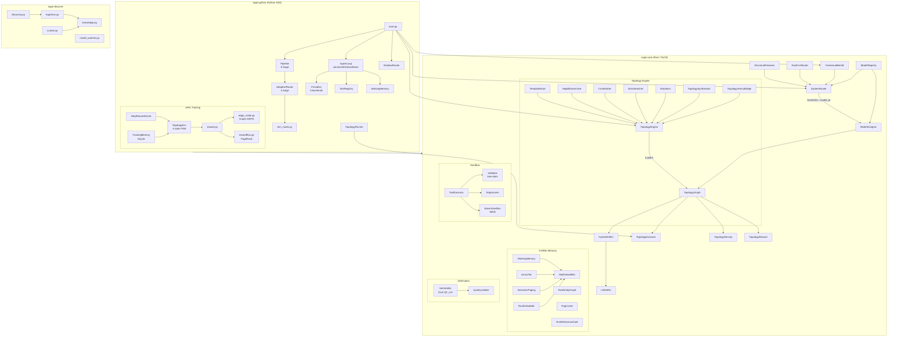

# AI-ARCHITECTURE.md — YGN-SAGE System Reference

> **Target reader**: LLMs only. Optimized for token-efficient reasoning, not human aesthetics.
> **Generated**: 2026-03-24 | **Branch**: VeRLGIGPO | **Tests**: 357 Rust + 47 Python = 404 passing

---

## Table of Contents

- [Mental Model](#mental-model)
- [Architecture Diagram](#architecture-diagram)
- [Component Registry](#component-registry)
- [Data Flow Narratives](#data-flow-narratives)
- [File-by-File Reference](#file-by-file-reference)
  - [sage-core (Rust, 49 files)](#sage-core-rust-49-files)
  - [sage-python (Python, 40 key files)](#sage-python-python-40-key-files)
- [Research References](#research-references)
- [LLM Quick-Reference Cheatsheet](#llm-quick-reference-cheatsheet)

---

## Mental Model

YGN-SAGE is a **Self-Adaptive Generation Engine** — a multi-agent orchestration framework that treats agent topology as a learnable, evolvable program. The core insight: **topology matters more than model capability** (AdaptOrch: Var_tau/Var_M >= 20).

**5 cognitive pillars**: Topology (DAG structure), Tools (sandboxed execution), Memory (S-MMU multi-view graph), Evolution (MAP-Elites + CMA-ME), Strategy (kNN/bandit routing).

**Pipeline**: `CLASSIFY(S1/S2/S3) -> DECOMPOSE(DAG) -> SELECT_TOPOLOGY(6-path engine) -> ASSIGN_MODELS(per-node) -> EXECUTE(dual-mode) -> LEARN(bandit+S-MMU+MAP-Elites)`.

**Cognitive systems** (Kahneman): S1 = fast/intuitive (factual lookup), S2 = deliberate/tools (code gen, multi-step), S3 = formal/reasoning (proofs, Z3, deep CoT).

**Routing cascade**: structural features (< 1ms) -> kNN embedding (92% GT accuracy) -> SystemRouter (bandit-integrated) -> model assignment (per-node, budget-constrained). kNN is primary. Heuristic ComplexityRouter is DEAD CODE (34% GT).

**Training target**: GiGPO (multi-step GRPO) on Qwen3.5-9B via veRL, producing a learned topology policy that generates YAML DAGs. Graph-GRPO edge credit + RewardFlow per-node credit provide fine-grained learning signal.

**Key constraint**: Zero heuristics. All decisions formally verified (OxiZ SMT), learned (ONNX/bandit), or research-backed. No hardcoded thresholds.

---

## Architecture Diagram



---

## Component Registry

### sage-core (Rust)

| Component | Type | Responsibility | Internal Dependencies | Exposes to Python |
|---|---|---|---|---|
| `lib.rs` | Module root | PyO3 module registration, feature gating | All submodules | `sage_core` module |
| `types.rs` | Data types | AgentConfig, ToolSpec, MemoryScope, TopologyRole, Message | ulid, chrono | `AgentConfig`, `ToolSpec`, `MemoryScope`, `AgentStatus`, `TopologyRole` |
| `agent.rs` | Runtime | Agent struct (config + status + children) | types | — (Rust-only) |
| `pool.rs` | Agent mgmt | Thread-safe DashMap agent pool | agent, types | `AgentPool` |
| `hardware.rs` | Detection | CPU/RAM/SIMD detection (raw_cpuid + sysinfo) | — | `HardwareProfile` |
| `sort_utils.rs` | Perf utils | pdqsort, argsort, partition (NumPy zero-copy) | numpy | `h96_quicksort`, `h96_argsort`, etc. |
| **memory/mod.rs** | Memory tier | WorkingMemory: 3-tier (buffer + Arrow + S-MMU) | smmu, arrow_tier, paging | `WorkingMemory`, `MemoryEvent` |
| **memory/smmu.rs** | Core memory | Multi-View S-MMU: 4 orthogonal graphs (temporal, semantic, causal, entity) | petgraph, ulid | `MultiViewMMU` (via `PyMultiViewMMU`) |
| **memory/arrow_tier.rs** | Storage | Arrow RecordBatch compaction of MemoryEvents | arrow, smmu | — (internal) |
| **memory/embedder.rs** | Embedding | ONNX arctic-embed-m (768-dim), L2-norm, batch | ort, tokenizers | `RustEmbedder` (feature: onnx) |
| **memory/entity_graph.rs** | Knowledge | Unified entity-relation graph (semantic + causal edges) | petgraph | `RustEntityGraph` |
| **memory/event.rs** | Data | MemoryEvent (ULID id, type, content, timestamp) | ulid, chrono | `MemoryEvent` |
| **memory/paging.rs** | Eviction | Semantic paging: least-relevant-first eviction | smmu | — (via WorkingMemory) |
| **memory/rag_cache.rs** | Caching | FIFO+TTL cache for file search results (DashMap) | — | `RagCache` |
| **memory/relevance_gate.rs** | Filtering | CRAG-style keyword overlap gate (blocks irrelevant injection) | — | `RustRelevanceGate` |
| **routing/mod.rs** | Module root | Routing submodule registration | — | — |
| **routing/system_router.rs** | Core routing | S1/S2/S3 decision + model selection + bandit integration | features, model_card, model_registry, bandit | `SystemRouter`, `RoutingDecision`, `RoutingConstraints` |
| **routing/bandit.rs** | Learning | ContextualBandit: per-arm Beta/Gamma posteriors, Thompson sampling | ulid, rand | `ContextualBandit`, `BanditDecision` |
| **routing/features.rs** | Feature extraction | Structural features from task text (< 1ms) | — | `StructuralFeatures` |
| **routing/knn.rs** | Routing | kNN on pre-computed exemplar embeddings, OOD rejection | — | `RustKnnRouter` |
| **routing/model_assigner.rs** | Assignment | Per-node model assignment (affinity + domain + cost scoring) | model_card, model_registry, topology_graph | `ModelAssigner` |
| **routing/model_card.rs** | Data | ModelCard: capability descriptor + S1/S2/S3 affinities | toml, serde | `ModelCard`, `CognitiveSystem` |
| **routing/model_registry.rs** | Registry | ModelCards + telemetry + calibrated affinity blending | model_card | `ModelRegistry` |
| **routing/persistence.rs** | Storage | SQLite WAL persistence for ContextualBandit (feature: cognitive) | rusqlite, bandit | — (via bandit methods) |
| **routing/quality.rs** | Estimation | 5-signal quality estimator (non-empty, length, code, errors, AVR) | — | `RustQualityEstimator` |
| **topology/mod.rs** | Module root | Topology submodule registration + re-exports | — | — |
| **topology/topology_graph.rs** | Core IR | TopologyGraph: petgraph DiGraph + 3-flow edges + 8 templates | petgraph, ulid, serde | `TopologyGraph`, `TopologyNode`, `TopologyEdge` |
| **topology/engine.rs** | Orchestrator | DynamicTopologyEngine: 6-path generation (S-MMU/archive/LLM/mutation/MCTS/template) | smmu_bridge, map_elites, cma_me, mcts, mutations, templates, verifier, llm_synthesis, bandit | — (via PyTopologyEngine) |
| **topology/executor.rs** | Scheduler | Dual-mode: Static (Kahn's toposort) + Dynamic (gate-based readiness) | topology_graph | — (via PyTopologyExecutor) |
| **topology/templates.rs** | Templates | 8 factory functions: sequential, parallel, AVR, SelfMoA, hierarchical, hub, debate, brainstorming | topology_graph | `PyTemplateStore` |
| **topology/mutations.rs** | Operators | 7 mutation operators: add_node, remove_node, add_edge, remove_edge, change_model, swap_roles, change_system | topology_graph, verifier | — (internal) |
| **topology/map_elites.rs** | Evolution | MAP-Elites 4D grid archive (agent_count, depth, cost, diversity) with Pareto insertion | topology_graph, verifier | — (internal) |
| **topology/cma_me.rs** | Optimization | CMA-ME emitter: diagonal covariance, 3D continuous params (cost, time, edge_weight) | rand | — (internal) |
| **topology/mcts.rs** | Search | UCB1 tree search over mutation space (no LLM) | mutations, verifier, topology_graph | — (internal) |
| **topology/density.rs** | Metric | S_complex density function (AgentConductor): S_node + S_edge + S_depth | topology_graph, petgraph | `TopologyDensity`, `DensityScore` |
| **topology/reward.rs** | Reward | Multi-signal reward: execution + structural + density + temporal + resilience + cost_efficiency | — | `TopologyReward`, `RewardScore` |
| **topology/llm_synthesis.rs** | Synthesis | 3-stage LLM topology pipeline: role assignment -> structure design -> validation | topology_graph, verifier | — (internal, Python calls) |
| **topology/smmu_bridge.rs** | Bridge | Stores/retrieves topology outcomes in S-MMU with structural features | smmu, bandit | — (internal) |
| **topology/verifier.rs** | Verification | HybridVerifier: 8 structural checks + LTL temporal checks, O(V+E) | topology_graph, ltl | `PyHybridVerifier`, `VerificationResult` |
| **topology/pyo3_wrappers.rs** | FFI | PyTopologyEngine + PyTopologyExecutor + PyGenerateResult wrappers | engine, executor, smmu | `TopologyEngine`, `TopologyExecutor`, `GenerateResult` |
| **verification/mod.rs** | Module root | LTL (always) + SMT (feature: smt) + QualityLabeler (features: smt+tool-executor) | — | — |
| **verification/smt.rs** | SMT solver | OxiZ-backed QF_LIA: memory safety, loop bounds, arithmetic, invariants, provider assignment | oxiz | `SmtVerifier`, `SmtVerificationResult` (feature: smt) |
| **verification/ltl.rs** | Temporal logic | LTL model checking: reachability, safety, liveness, bounded liveness (petgraph BFS/DFS) | topology_graph | `LtlVerifier`, `LtlResult` |
| **verification/quality_labeler.rs** | Auto-labeling | Formal quality labeler: tree-sitter + SMT for zero-heuristic quality scoring | smt, validator | `QualityLabeler`, `QualityLabel` (features: smt+tool-executor) |
| **sandbox/mod.rs** | Module root | Sandbox feature gating (wasm, subprocess, tool_executor, validator) | — | — |
| **sandbox/tool_executor.rs** | Execution | Combined validator + executor: Wasm WASI first, subprocess fallback | subprocess, validator, wasm | `ToolExecutor` (feature: tool-executor) |
| **sandbox/validator.rs** | Security | tree-sitter AST analysis: blocked imports/calls/patterns | tree-sitter | `ValidationResult` (feature: tool-executor) |
| **sandbox/subprocess.rs** | Execution | Timeout-enforced Python subprocess (tokio, kill_on_drop) | tokio | `ExecResult` (feature: tool-executor) |
| **sandbox/wasm.rs** | Sandbox | WASI deny-by-default (no FS, no env, no network) via wasmtime Component Model | wasmtime | `WasmSandbox` (feature: sandbox) |

### sage-python (Key modules)

| Component | Type | Responsibility | Key Dependencies |
|---|---|---|---|
| `boot.py` | Initialization | Full agent stack bootstrap (7 phases), wires Rust/Python | sage_core, all modules |
| `pipeline.py` | Orchestration | 5-stage CognitiveOrchestrationPipeline | pipeline_stages, z3_verify |
| `pipeline_stages.py` | Stages | DAGFeatures, domain inference, macro-topology selection | — |
| `agent_loop.py` | Runtime | perceive/think/act/learn loop, AVR, escalation, drift | tools, memory, resilience |
| `agent.py` | Data | AgentConfig, AgentResult dataclasses | — |
| `agent_pool.py` | Pool | Python agent pool manager | — |
| `strategy/adaptive_router.py` | Routing | 4-stage cascade: structural -> kNN -> BERT -> entropy | sage_core, knn_router |
| `strategy/knn_router.py` | Routing | kNN on arctic-embed-m exemplars (92% GT accuracy) | sage_core.RustKnnRouter, numpy |
| `strategy/metacognition.py` | Routing | ComplexityRouter (DEAD CODE 34% GT), CognitiveProfile types | — |
| `strategy/structural_features.py` | Features | Python port of Rust StructuralFeatures | — |
| `strategy/engine.py` | Strategy | Strategy engine orchestration | — |
| `strategy/allocator.py` | Resources | Budget allocation across topology nodes | — |
| `routing/shadow.py` | Validation | ShadowRouter: dual Rust/Python JSONL trace comparison | sage_core.SystemRouter |
| `topology/engine.py` | Topology | Python DynamicTopologyEngine (delegates to Rust) | sage_core.TopologyEngine |
| `topology/runner.py` | Execution | Execute TopologyGraph as real multi-agent system (MASFactory) | sage_core, llm.base |
| `topology/llm_caller.py` | LLM bridge | LLM topology synthesis (Path 3) — calls provider for YAML | llm.base |
| `topology/evo_topology.py` | Evolution | TopologyEvolver + TopologyPopulation (Python evolution) | — |
| `topology/topology_verifier.py` | Verification | Python bridge to Rust HybridVerifier | sage_core |
| `topology/topology_archive.py` | Archive | Python bridge to Rust MapElitesArchive | — |
| `topology/patterns.py` | Patterns | Python topology pattern library | — |
| `topology/py_graph.py` | Compat | Python-native topology graph (legacy compat) | — |
| `topology/ltl_bridge.py` | Bridge | Python bridge to Rust LtlVerifier | sage_core |
| `topology/kg_rlvr.py` | PRM | ProcessRewardModel for step-level quality | — |
| `topology_controller.py` | Runtime | Runtime adaptation: upgrade_model, spawn_subagent, reroute, prune | — |
| `llm/base.py` | Interface | LLMProvider ABC, Message, Role, LLMConfig | — |
| `llm/google.py` | Provider | Google Gemini provider | google-genai |
| `llm/codex.py` | Provider | OpenAI Codex provider | openai |
| `llm/config_loader.py` | Config | cards.toml loader | — |
| `llm/model_card.py` | Data | Python ModelCard (mirrors Rust) | — |
| `llm/model_registry.py` | Registry | Python ModelCardCatalog | — |
| `llm/model_assigner.py` | Assignment | Python model assigner (delegates to Rust) | sage_core |
| `llm/provider_pool.py` | Pool | Multi-provider connection pool | — |
| `llm/router.py` | Routing | ModelRouter (multi-provider dispatch) | — |
| `providers/connector.py` | Provider | Unified provider connector (8 backends) | — |
| `providers/openai_compat.py` | Provider | OpenAI-compatible provider (DeepSeek, xAI, Kimi, MiniMax, OpenRouter) | openai |
| `memory/embedder.py` | Embedding | Python Embedder (delegates to Rust RustEmbedder) | sage_core |
| `memory/smmu_context.py` | Bridge | Python S-MMU context manager | sage_core.MultiViewMMU |
| `memory/episodic.py` | Memory | SQLite episodic memory (WAL mode) | sqlite3 |
| `memory/semantic.py` | Memory | Semantic memory (entity-relation, Python legacy) | — |
| `memory/causal.py` | Memory | Causal memory (Python legacy) | — |
| `verl/topology_env.py` | Training | GiGPO multi-step topology env (4-state FSM) | verl, reward, step_reward |
| `verl/reward.py` | Training | veRL reward function (format + structure + execution + edge credit) | yaml, edge_credit |
| `verl/edge_credit.py` | Training | Graph-GRPO edge-level credit assignment | — |
| `verl/rewardflow.py` | Training | RewardFlow per-node credit via PageRank | — |
| `verl/step_reward.py` | Training | StepRewardVector for GiGPO per-step advantages | — |
| `verl/training_memory.py` | Training | SQLite episodic memory for training loop | sqlite3, numpy |

---

## Data Flow Narratives

### Scenario 1: Simple S1 Task (template topology, single provider)

```
User: "What is the capital of France?"

1. boot.py -> AdaptiveRouter.route(task)
2.   -> StructuralFeatures.extract(task)
     word_count=7, no code, question_mark=True, complexity=0.25, tool=False
3.   -> knn_router.route(embedding)  // arctic-embed-m 768-dim
     Returns (system=1, confidence=0.92, distance=0.87)
4.   -> SystemRouter.route(task, budget)
     S1 decision (complexity < 0.35, no tools, no formal keywords)
     Selects cheapest S1-affinity model (e.g. gemini-2.5-flash)
5. TopologyEngine.generate(task, system=1)
   Path 5 (template fallback): S1 -> sequential template
   3 nodes: input_processor -> worker -> output_formatter
6. ModelAssigner.assign_models(graph, domain="general", budget=5.0)
   All nodes -> gemini-2.5-flash (highest S1 affinity within budget)
7. TopologyExecutor::new(graph) -> ExecutionMode::Static
   Kahn's toposort: [0, 1, 2]
8. TopologyRunner.run():
   Node 0: format prompt -> LLM call -> "Paris"
   Node 1: reason -> LLM call -> "The capital of France is Paris."
   Node 2: format -> output
9. QualityEstimator.estimate() -> 0.75
10. ContextualBandit.record_outcome() -> update Beta posterior
11. S-MMU.register_chunk() -> store for future retrieval
```

### Scenario 2: Complex S3 Task (learned topology, multi-provider, runtime adaptation)

```
User: "Prove by induction that sum(1..n) = n*(n+1)/2. Generate verified Python."

1. StructuralFeatures.extract()
   complexity=0.65 (algo+design), has_formal_keywords("prove","induction")=True
2. knn_router.route() -> (system=3, confidence=0.88)
3. SystemRouter: S3 (formal keywords override) -> selects best S3 model

4. TopologyEngine.generate(task, system=3)
   Path 1 (S-MMU hit): similar past proof task found, quality=0.82 -> clone topology
   OR Path 2 (archive hit): MAP-Elites cell [3-agents, depth=3, cheap, diverse] -> use
   OR Path 5 (template fallback): S3 -> debate template

5. HybridVerifier.verify(graph):
   - No orphan nodes
   - Has entry/exit
   - DAG acyclicity
   - Role semantic checks
   - LTL liveness: all entries reach exits

6. SmtVerifier.verify_arithmetic("sum(1..n) == n*(n+1)/2")
   QF_LIA check -> VALID

7. ModelAssigner: heterogeneous assignment
   prover_node (S3, tools) -> gpt-5.4-mini (highest formal_z3_strength within budget)
   coder_node (S2, tools) -> gemini-2.5-flash (good code, cheap)
   verifier_node (S3) -> deepseek-r1 (reasoning)

8. TopologyExecutor: Dynamic mode (debate template)
   Gate-based readiness with iteration limit

9. TopologyRunner.run() with TopologyController:
   Node 0: prover generates induction proof
   Controller.evaluate_and_decide():
     quality=0.4 -> action=upgrade_model -> swap to stronger model
   Node 0 re-run: quality=0.85 -> continue
   Node 1: coder generates Python
   Node 2: verifier checks

10. TopologyReward.compute():
    execution=1.0 (tests pass), structural=0.95, density=0.72, temporal=1.0
    total = mean([1.0, 0.95, 0.72, 1.0]) = 0.917

11. ContextualBandit: update arm (model, template) posteriors
12. MapElitesArchive: insert if Pareto-dominant in behavior cell
13. S-MMU: register outcome with embedding for future retrieval
```

### Scenario 3: GiGPO Training Loop (veRL env -> YAML gen -> reward -> advantage)

```
Training setup: Qwen3.5-9B on RunPod H100, 1965 training entries

1. TopologyEnv.reset(prompt, ground_truth):
   State -> AWAITING_YAML
   Build few-shot prompt from TrainingMemory (similar past successes)
   Return observation: task description + format instructions

2. Model generates YAML topology:
   nodes:
     - role: analyst, system: 2
     - role: coder, system: 2, capabilities: [tools]
     - role: reviewer, system: 3
   edges:
     - [0, 1, control]
     - [1, 2, control]

3. TopologyEnv.step(yaml_text):
   a. reward.py._score_format(yaml) -> 1.0 (valid YAML, has nodes)
   b. reward.py._score_structure(yaml) -> 0.85 (roles present, edges valid)
   c. Parse into TopologyGraph via sage_core
   d. HybridVerifier: structural_score = 0.95
   e. TopologyDensity: s_complex = 0.72
   f. Execute topology against task (real LLM calls)
   g. Sandbox test: pass@1 -> execution = 1.0 or 0.0

4. StepRewardVector decomposition:
   step_rewards = [format_score, structure_score, node_0_reward, node_1_reward, node_2_reward, execution_score]
   anchor_keys = ["yaml_gen", "structure", "node:analyst", "node:coder", "node:reviewer", "sandbox"]
   GiGPO computes per-step advantages within anchor groups

5. Edge credit (Graph-GRPO):
   edge_credit.compute_edge_advantages(group_of_K_topologies):
   For each edge (i,j): S_ij = P(Success | edge present)
   Advantages: A_ij = (S_ij - mean) / (std + eps)
   Credit mixed into reward: final = base_reward + 0.3 * edge_credit

6. RewardFlow (PageRank propagation):
   Build state graph from K rollouts: state = (role, quality_bucket)
   Personalized PageRank from terminal rewards -> per-node credit
   Supplements edge credit with flow-based attribution

7. TrainingMemory.store_episode():
   SQLite: task_id, topology_yaml, n_nodes, outcome, total_reward, embedding
   Marks successful topologies as replay candidates

8. veRL GiGPO update:
   Per-step advantages -> policy gradient update on Qwen3.5-9B
   Token-level: advantage at each step weighted by action probability
   Result: model learns which topology structures work for which task types
```

---

## File-by-File Reference

### sage-core (Rust, 49 files)

---

#### `sage-core/src/lib.rs`
**Role**: PyO3 module root -- registers all Python-visible classes and functions.
**Mechanism**: `#[pymodule]` with feature-gated blocks (`smt`, `onnx`, `sandbox`, `tool-executor`).
**Interface**: `fn sage_core(m: &Bound<'_, PyModule>) -> PyResult<()>`
**Calls**: All submodules (types, pool, memory, routing, topology, verification, sandbox, sort_utils)
**Called by**: Python `import sage_core`
**Dettes**: Windows PyO3 inventory workaround for TopologyGraph (standalone functions instead of `#[pymethods]`)

---

#### `sage-core/src/types.rs`
**Role**: Core data types shared across all modules.
**Mechanism**: Serde-serializable enums/structs with PyO3 bindings. ULID for IDs.
**Interface**: `AgentConfig::new(name, model, system_prompt)`, `ToolSpec::py_new(...)`, enums `MemoryScope`, `TopologyRole`, `AgentStatus`, `Role`, `Message`, `ToolCall`, `ToolResult`
**Calls**: ulid, chrono
**Called by**: agent.rs, pool.rs, all modules using AgentConfig
**Dettes**: RAS

---

#### `sage-core/src/agent.rs`
**Role**: Runtime agent representation (config + lifecycle state).
**Mechanism**: Simple struct wrapping AgentConfig with status tracking and children list.
**Interface**: `Agent::new(config) -> Self`, fields: `config`, `status`, `step_count`, `result`, `children_ids`
**Calls**: types
**Called by**: pool.rs
**Dettes**: RAS

---

#### `sage-core/src/hardware.rs`
**Role**: Host hardware detection (CPU, RAM, SIMD capabilities).
**Mechanism**: raw_cpuid for x86 ISA detection, sysinfo for memory/cores. Platform-conditional (x86/aarch64).
**Interface**: `HardwareProfile::detect() -> Self`, getters: `total_memory_mb`, `has_avx2`, `has_avx512`, `has_neon`, `is_simd_capable`
**Calls**: raw_cpuid, sysinfo
**Called by**: Python boot.py (hardware-aware scheduling)
**Dettes**: RAS

---

#### `sage-core/src/pool.rs`
**Role**: Thread-safe agent pool using DashMap (concurrent HashMap).
**Mechanism**: `register()` inserts agent + updates parent's children. `search()` uses substring match.
**Interface**: `AgentPool::new()`, `register(config) -> id`, `search(query)`, `get_children(parent_id)`, `terminate(id)`, `len()`
**Calls**: agent, types, dashmap
**Called by**: Python agent_pool.py
**Dettes**: RAS

---

#### `sage-core/src/sort_utils.rs`
**Role**: Sorting utilities -- pdqsort wrapper + NumPy zero-copy.
**Mechanism**: `sort_unstable_by` (pattern-defeating quicksort). `h96_quicksort_zerocopy` operates directly on NumPy array via `readwrite()`.
**Interface**: `h96_quicksort(arr) -> Vec<f32>`, `h96_quicksort_zerocopy(&PyArray1<f32>)`, `vectorized_partition_h96(arr, pivot)`, `h96_argsort(arr) -> Vec<usize>`
**Calls**: numpy
**Called by**: Python (MCTS UCB node selection)
**Papier/Algo**: vqsort planned when Windows support lands
**Dettes**: vqsort-rs not yet available on Windows

---

#### `sage-core/src/memory/mod.rs`
**Role**: Memory module root -- 3-tier architecture (active buffer + Arrow + S-MMU).
**Mechanism**: WorkingMemory owns Vec<MemoryEvent> + Vec<RecordBatch> + MultiViewMMU. `compact_to_arrow_with_meta()` converts buffer to Arrow + registers in S-MMU. `retrieve_relevant_chunks()` does multi-view BFS.
**Interface**: `WorkingMemory::new(agent_id, parent_id)`, `add_event()`, `compact_to_arrow_with_meta()`, `retrieve_relevant_chunks()`, `get_page_out_candidates()`, `get_latest_arrow_chunk()`
**Calls**: smmu, arrow_tier, paging, event
**Called by**: Python memory/working.py, agent_loop.py
**Dettes**: RAS

---

#### `sage-core/src/memory/smmu.rs`
**Role**: Multi-View Semantic Memory Management Unit -- 4 orthogonal graph views.
**Mechanism**: Single `DiGraph<ChunkMetadata, MultiEdge>` with edge labels (Temporal, Semantic, Causal, Entity). Registration: temporal edge to previous chunk, semantic edges via cosine similarity (>0.5 threshold, bounded to K=128 recent), causal edges from parent_chunk_id, entity edges via Jaccard keyword similarity. BFS retrieval with weighted score propagation. Utility-based eviction (recency * access_count). Auto-GC at 10,000 chunks.
**Interface**: `MultiViewMMU::register_chunk(...)-> ULID`, `retrieve_relevant(chunk_id, max_hops, weights) -> Vec<(id, score)>`, `evict_by_utility(count)`, `evict_oldest(count)`
**Calls**: petgraph, ulid
**Called by**: memory/mod.rs (WorkingMemory), topology/smmu_bridge.rs
**Dettes**: RAS

---

#### `sage-core/src/memory/arrow_tier.rs`
**Role**: Zero-copy immutable columnar storage for compacted memory events.
**Mechanism**: Converts Vec<MemoryEvent> to Arrow RecordBatch (7 columns: agent_id, parent_id, id, event_type, content, timestamp_ns, is_summary). Registers chunk in S-MMU with metadata.
**Interface**: `compact_buffer_to_arrow(agent_id, parent_id, buffer, chunks, smmu, keywords, embedding, parent_chunk_id, summary) -> PyResult<String>`
**Calls**: arrow, smmu
**Called by**: memory/mod.rs
**Dettes**: RAS

---

#### `sage-core/src/memory/embedder.rs`
**Role**: ONNX Runtime embedder for semantic memory edges.
**Mechanism**: Loads snowflake-arctic-embed-m ONNX model (768-dim). Mean pooling + L2 normalization. Auto-discovers ORT DLL via OnceLock. Releases GIL during ORT LoadLibrary to prevent Windows deadlock.
**Interface**: `RustEmbedder::new(model_path, tokenizer_path)`, `embed(text) -> Vec<f32>`, `embed_batch(texts)`, `batch_cosine_similarity(texts)`
**Calls**: ort, tokenizers
**Called by**: Python memory/embedder.py
**Papier/Algo**: arctic-embed-m (109M params, Snowflake)
**Dettes**: GIL held during inference (stack-local tensor borrow prevents allow_threads)

---

#### `sage-core/src/memory/entity_graph.rs`
**Role**: Unified entity-relation graph (semantic + causal edges), replacing Python semantic.py + causal.py.
**Mechanism**: petgraph DiGraph with 3 edge kinds (Semantic(label), Causal(label, confidence), Temporal). BFS context retrieval with substring entity matching. Causal chain traversal with depth limit.
**Interface**: `RustEntityGraph::new()`, `add_entity(name, type, metadata)`, `add_relation(from, to, type)`, `add_causal_relation(cause, effect, rel, conf)`, `get_context_for(task, max_depth)`, `get_causal_chain(entity, max_depth)`
**Calls**: petgraph
**Called by**: Python (reserved for Phase C runtime controller)
**Dettes**: SQLite persistence not yet wired; in-memory only

---

#### `sage-core/src/memory/event.rs`
**Role**: Immutable memory event record.
**Mechanism**: ULID id, UTC timestamp, event_type, content, is_summary flag. Serde-serializable.
**Interface**: `MemoryEvent::new(type, content)`, `MemoryEvent::summary(content)`, getters
**Calls**: ulid, chrono
**Called by**: memory/mod.rs, arrow_tier.rs
**Dettes**: RAS

---

#### `sage-core/src/memory/paging.rs`
**Role**: Semantic paging -- identifies eviction candidates by graph distance.
**Mechanism**: Retrieves all reachable chunks ranked by relevance, returns the tail (least relevant) + unreachable chunks as eviction candidates.
**Interface**: `page_out_candidates(smmu, active_chunk_id, max_hops, budget) -> Vec<String>`
**Calls**: smmu
**Called by**: memory/mod.rs (WorkingMemory.get_page_out_candidates)
**Dettes**: RAS

---

#### `sage-core/src/memory/rag_cache.rs`
**Role**: FIFO + TTL cache for File Search / RAG query results.
**Mechanism**: DashMap<u64, CacheEntry> with atomic hit/miss counters. FIFO eviction at capacity (oldest-inserted, not LRU). TTL-based expiry on get().
**Interface**: `RagCache::new(max_entries, ttl_seconds)`, `put(hash, data)`, `get(hash) -> Option<Vec<u8>>`, `stats() -> (hits, misses, entries)`, `clear()`
**Calls**: dashmap
**Called by**: Python memory/rag_backend.py
**Dettes**: RAS

---

#### `sage-core/src/memory/relevance_gate.rs`
**Role**: CRAG-style keyword overlap gate for memory injection filtering.
**Mechanism**: Tokenizes (lowercase, alphanumeric, >= 3 chars, stop-word filtered). Scores by |overlap| / |task_tokens|. Default threshold 0.3.
**Interface**: `RustRelevanceGate::new(threshold)`, `score(task, context) -> f32`, `is_relevant(task, context) -> bool`
**Calls**: -- (standalone)
**Called by**: Python memory/relevance_gate.py, agent_loop.py
**Papier/Algo**: Inspired by CRAG (Corrective RAG)
**Dettes**: RAS

---

#### `sage-core/src/routing/mod.rs`
**Role**: Routing module registration.
**Mechanism**: Feature-gated submodule exports. `persistence` behind `cognitive` feature.
**Calls**: All routing submodules
**Dettes**: RAS

---

#### `sage-core/src/routing/system_router.rs`
**Role**: Core cognitive routing engine -- S1/S2/S3 decision + model selection.
**Mechanism**: (1) StructuralFeatures extraction. (2) System decision: formal_keywords -> S3, high_complexity -> S3, tool/code -> S2, else -> S1. (3) Budget-constrained model selection from ModelRegistry (sorted by system affinity). (4) Bandit integration via route_integrated(). (5) record_outcome() feeds both bandit and registry telemetry.
**Interface**: `SystemRouter::new(registry)`, `route(task, budget)`, `route_constrained(task, constraints)`, `route_integrated(task, constraints, topology_id)`, `record_outcome(decision_id, quality, cost, latency_ms)`, `set_bandit(bandit)`
**Calls**: features, model_card, model_registry, bandit
**Called by**: Python boot.py, routing/shadow.py
**Papier/Algo**: kNN routing (2505.12601), Cascade Routing (2410.10347)
**Dettes**: RAS

---

#### `sage-core/src/routing/bandit.rs`
**Role**: Contextual bandit for (model, topology) arm selection.
**Mechanism**: Per-arm Beta posteriors (quality, [0,1]) + Gamma posteriors (cost/latency, non-negative). Thompson sampling for exploitation. Random arm selection for exploration. Temporal decay (configurable, clamped [0.9, 1.0]). Warm-start from affinity matrix. Pending decision tracking with overflow eviction at 10K.
**Interface**: `ContextualBandit::create(decay, exploration)`, `add_arm(model_id, template)`, `choose(exploration_budget) -> BanditDecision`, `record_outcome(decision_id, quality, cost, latency_ms)`, `warm_start(models, templates, affinities)`, `set_decay(factor)`, `arm_summaries()`
**Calls**: rand, ulid
**Called by**: system_router.rs, topology/engine.rs, Python boot.py
**Papier/Algo**: LinUCB variant with Beta/Gamma conjugate posteriors, PILOT (2508.21141)
**Dettes**: RAS

---

#### `sage-core/src/routing/features.rs`
**Role**: Stage 0 structural feature extraction from task text (< 1ms).
**Mechanism**: 6 keyword groups (algo, code, debug, design, uncertainty, tool). Complexity = base(0.2) + group_boost + code_block_bonus + word_count_scaling. Clamped [0,1].
**Interface**: `StructuralFeatures::extract(task) -> Self`, fields: `word_count`, `has_code_block`, `has_question_mark`, `keyword_complexity`, `keyword_uncertainty`, `tool_required`
**Calls**: -- (standalone)
**Called by**: system_router.rs
**Dettes**: RAS

---

#### `sage-core/src/routing/knn.rs`
**Role**: Rust kNN router for pre-computed exemplar embeddings.
**Mechanism**: Flat row-major storage. L2-normalized dot product = cosine similarity. Partial sort for top-k (select_nth_unstable_by). Distance-weighted majority vote. OOD rejection via threshold on nearest distance.
**Interface**: `RustKnnRouter::new(k, distance_threshold)`, `load_exemplars(embeddings, labels, dim)`, `route(query) -> Option<(system, confidence, nearest_dist)>`
**Calls**: -- (standalone)
**Called by**: Python strategy/knn_router.py
**Papier/Algo**: arXiv 2505.12601 -- kNN outperforms MLP/GNN/attention for LLM routing
**Dettes**: RAS

---

#### `sage-core/src/routing/model_assigner.rs`
**Role**: Per-node model assignment using composite scoring.
**Mechanism**: Score = 0.4*calibrated_affinity + 0.4*domain_score + 0.2*(1-cost_norm). Iterates graph nodes, skips models that violate capability requirements (tools, json). Budget-constrained: stops when remaining budget < epsilon.
**Interface**: `ModelAssigner::from_registry(reg)`, `assign_models(graph, domain, budget) -> count`, `assign_single_node(graph, idx, domain, budget) -> model_id`
**Calls**: model_card, model_registry, topology_graph
**Called by**: Python pipeline.py, boot.py
**Dettes**: RAS

---

#### `sage-core/src/routing/model_card.rs`
**Role**: Structured capability descriptor for LLM models (Google A2A-inspired).
**Mechanism**: TOML-deserializable `[[models]]` array. Fields: benchmark scores (code/reasoning/tool_use/math/z3), cost/latency, S1/S2/S3 affinities, capability flags, domain scores, safety rating.
**Interface**: `ModelCard::parse_toml(str)`, `load_from_file(path)`, `best_system()`, `affinity_for(system)`, `estimate_cost(input, output)`, `domain_score(domain)`
**Calls**: toml, serde
**Called by**: model_registry.rs, model_assigner.rs
**Dettes**: RAS

---

#### `sage-core/src/routing/model_registry.rs`
**Role**: ModelCard registry with telemetry tracking and calibrated affinity blending.
**Mechanism**: HashMap<id, ModelCard> + HashMap<id, TelemetryRecord>. TelemetryRecord tracks quality_sum, cost_sum, count, latencies (VecDeque ring buffer, 100 samples). Calibrated affinity: w = min(count/50, 0.8), result = (1-w)*card_affinity + w*observed_quality. Domain routing: score = 0.6*domain + 0.3*calibrated_affinity + 0.1*(1-cost_norm).
**Interface**: `ModelRegistry::from_toml_file(path)`, `select_for_system(system)`, `calibrated_affinity(model_id, system)`, `select_best_for_domain(domain, budget)`, `record_telemetry_full(id, quality, cost, latency)`
**Calls**: model_card
**Called by**: system_router.rs, model_assigner.rs
**Dettes**: RAS

---

#### `sage-core/src/routing/persistence.rs`
**Role**: SQLite persistence for ContextualBandit (feature: cognitive).
**Mechanism**: WAL journal mode. Two tables: `bandit_config` (key/value for decay/exploration) + `bandit_arms` (per-arm posteriors). Upsert via `INSERT OR REPLACE`.
**Interface**: `save_bandit(bandit, path)`, `load_bandit(path) -> ContextualBandit`
**Calls**: rusqlite, bandit
**Called by**: bandit.rs (py_save_to_sqlite, py_load_from_sqlite)
**Dettes**: RAS

---

#### `sage-core/src/routing/quality.rs`
**Role**: 5-signal quality estimator (no LLM, no regex).
**Mechanism**: Signal 1: non-empty (+0.30). Signal 2: length adequacy (ratio-based, +0.00-0.20). Signal 3: code task + code presence (+0.10-0.20). Signal 4: no error patterns (+0.15). Signal 5: AVR convergence (+0.05-0.15). Clamped [0,1].
**Interface**: `RustQualityEstimator::estimate(task, result, latency_ms, had_errors, avr_iterations) -> f32`
**Calls**: -- (standalone)
**Called by**: Python quality_estimator.py, agent_loop.py
**Dettes**: RAS

---

#### `sage-core/src/topology/mod.rs`
**Role**: Topology module root -- re-exports TopologyGraph, TopologyNode, TopologyEdge.
**Dettes**: RAS

---

#### `sage-core/src/topology/topology_graph.rs`
**Role**: Core IR -- unified graph representation for multi-agent topologies.
**Mechanism**: petgraph DiGraph<TopologyNode, TopologyEdge>. TopologyNode: role, model_id, system(1/2/3), required_capabilities, retry_count, max_cost_usd, max_wall_time_s. TopologyEdge: EdgeType(Control/Message/State), gate(Open/Closed), condition, field_mapping. 8 TopologyTemplate variants. ULID topology id. Methods: add_node, try_add_edge, entry_nodes, exit_nodes, toposort, to_yaml, from_yaml, try_get_node, prune_node.
**Interface**: `TopologyGraph::try_new(template)`, `add_node(node) -> usize`, `try_add_edge(from, to, edge)`, `node_count()`, `edge_count()`, `entry_nodes()`, `exit_nodes()`, `toposort()`, `to_yaml()`, `from_yaml(str)`, `get_predecessors(idx)`, `get_edges()`
**Calls**: petgraph, ulid, serde, yaml
**Called by**: All topology modules, routing/model_assigner.rs, Python topology/*
**Dettes**: RAS

---

#### `sage-core/src/topology/engine.rs`
**Role**: Central topology orchestrator -- 6-path generation strategy.
**Mechanism**: Priority: (1) S-MMU hit (similarity > 0.7, quality > 0.5) -> clone. (2) Archive hit (MAP-Elites lookup) -> use. (3) LLM synthesis (Python callback). (4) Mutation (best-from-archive + random mutation). (5) MCTS search (UCB1 over mutations). (6) Template fallback (S1 -> sequential, S2 -> avr, S3 -> debate). Owns: TopologySmmuBridge, MapElitesArchive, HybridVerifier, TopologySynthesizer, ContextualBandit, CmaEmitter, topology_cache.
**Interface**: `TopologyEngine::new()`, `generate(task, system, smmu) -> GenerateResult`, `record_outcome(quality, cost, topology)`, `evolve(iterations, smmu)`, `archive_size()`, `cache_size()`
**Calls**: smmu_bridge, map_elites, cma_me, mcts, mutations, templates, verifier, llm_synthesis, bandit
**Called by**: pyo3_wrappers.rs (PyTopologyEngine), Python boot.py
**Dettes**: RAS

---

#### `sage-core/src/topology/executor.rs`
**Role**: Dual-mode execution engine for topology graphs.
**Mechanism**: Static mode (Sequential/Parallel/Hierarchical/Brainstorming): Kahn's algorithm O(V+E) topological sort, returns waves of independent nodes. Dynamic mode (AVR/Hub/Debate/SelfMoA): gate-based readiness polling, supports loops with iteration limit (default 1000). NodeStatus state machine: Pending -> Ready -> Running -> Completed|Skipped.
**Interface**: `TopologyExecutor::new(graph)`, `next_ready(graph) -> Vec<usize>`, `mark_completed(idx)`, `mark_skipped(idx)`, `is_done() -> bool`, `mode()`, `iteration_count()`
**Calls**: topology_graph, petgraph
**Called by**: pyo3_wrappers.rs, Python topology/runner.py
**Dettes**: RAS

---

#### `sage-core/src/topology/templates.rs`
**Role**: 8 built-in topology template factories.
**Mechanism**: Each factory builds a complete TopologyGraph with typed nodes, control/message/state edges, gates, and conditions. Templates: (1) Sequential: A -> B -> C. (2) Parallel: source -> [workers] -> aggregator. (3) AVR: coder -> verifier -> refiner (loop). (4) SelfMoA: parallel experts -> aggregator. (5) Hierarchical: planner -> [workers] -> reviewer. (6) Hub: coordinator -> [specialists] -> coordinator. (7) Debate: agents + judge. (8) Brainstorming: ideator -> evaluator -> synthesizer.
**Interface**: `sequential(model_id)`, `parallel(model_id, worker_count)`, `avr(model_id)`, etc. + `PyTemplateStore` for Python access.
**Calls**: topology_graph
**Called by**: engine.rs, Python
**Dettes**: RAS

---

#### `sage-core/src/topology/mutations.rs`
**Role**: 7 topology mutation operators for evolutionary search.
**Mechanism**: Each operator: take graph by value -> apply mutation -> validate via HybridVerifier -> MutationResult(Success|Invalid). Operators: (1) add_node (attach to exit). (2) remove_node (relink predecessors). (3) add_edge (random pair). (4) remove_edge (random edge). (5) change_model (random node). (6) swap_roles (random pair). (7) change_system (random node, +-1). `apply_random_mutation()` selects uniformly.
**Interface**: `add_node(graph, role, model_id, system)`, `remove_node(graph, idx)`, ..., `apply_random_mutation(graph) -> MutationResult`
**Calls**: topology_graph, verifier
**Called by**: engine.rs, mcts.rs
**Dettes**: RAS

---

#### `sage-core/src/topology/map_elites.rs`
**Role**: MAP-Elites 4D grid archive for quality-diversity search.
**Mechanism**: 4 behavior dimensions: agent_count (4 buckets), max_depth (3), cost_range (3), model_diversity (3). Total cells = 108. Pareto insertion: new entry replaces existing only if strictly higher quality AND strictly lower cost. All insertions verified via HybridVerifier. `evolve()`: sample from archive, apply random mutation, attempt insertion.
**Interface**: `MapElitesArchive::new()`, `insert(graph, quality, cost, source)`, `lookup(descriptor) -> Option`, `evolve(iterations) -> usize`, `archive_size()`, `best_quality()`
**Calls**: topology_graph, verifier, mutations
**Called by**: engine.rs
**Papier/Algo**: MAP-Elites (Mouret & Clune, 2015)
**Dettes**: RAS

---

#### `sage-core/src/topology/cma_me.rs`
**Role**: CMA-ME emitter for continuous parameter optimization.
**Mechanism**: Optimizes 3 params: max_cost_usd, max_wall_time_s, edge_weight. Diagonal covariance (simplified for 3D). ask(): Box-Muller Gaussian sampling N(mean, sigma^2 * cov_diag). tell(): sort by fitness, top mu=n/2 elites, update mean + cov_diag. Values clamped [0.01, 10.0].
**Interface**: `CmaEmitter::new(dim, initial_sigma)`, `ask(n) -> Vec<Vec<f64>>`, `tell(samples, fitnesses)`, `mean()`, `generation`
**Calls**: rand
**Called by**: engine.rs (evolve path)
**Papier/Algo**: CMA-ES (Hansen, 2006) adapted for MAP-Elites
**Dettes**: RAS

---

#### `sage-core/src/topology/mcts.rs`
**Role**: Monte Carlo Tree Search over topology mutation space.
**Mechanism**: UCB1 selection (exploit + c * sqrt(ln(parent_visits)/visits)). Expansion: apply random mutation. Rollout: heuristic scoring (verifier validity + node count bonus). Backpropagation: update visit_count + total_quality up the tree. Time-limited + simulation-limited.
**Interface**: `MctsSearcher::new(max_simulations, max_time_ms, c)`, `search(root_topology) -> Option<TopologyGraph>`
**Calls**: mutations, verifier, topology_graph
**Called by**: engine.rs (Path 5)
**Papier/Algo**: UCB1 (Auer et al., 2002), adapted for topology search
**Dettes**: RAS

---

#### `sage-core/src/topology/density.rs`
**Role**: Topology density function (S_complex) from AgentConductor.
**Mechanism**: S_complex = (S_node + S_edge + S_depth) / 3. S_node = exp(-|V|/N_max). S_edge = exp(-|E|/max_edges). S_depth = 1 - (longest_path/|V|). N_max per system: S1=4, S2=7, S3=10. over_budget flag when node_count > N_max.
**Interface**: `TopologyDensity::compute(graph, system) -> DensityScore`
**Calls**: topology_graph, petgraph
**Called by**: topology/reward.rs, Python verl/reward.py
**Papier/Algo**: AgentConductor (arXiv 2602.17100)
**Dettes**: RAS

---

#### `sage-core/src/topology/reward.rs`
**Role**: Verified dense reward for topology RL training.
**Mechanism**: Multi-signal combination with equal weighting (formally grounded, no tuned weights). Signals: execution (pass@1, 0/1), structural (HybridVerifier, [0,1]), density (S_complex, [0,1]), temporal (LTL, [0,1]), resilience (survival bonus), cost_efficiency (1 - tanh(cost/budget)). Total = mean(available signals).
**Interface**: `TopologyReward::compute(execution, structural, density, temporal, budget, cost, survived) -> RewardScore`
**Calls**: -- (standalone)
**Called by**: Python verl/reward.py, topology/engine.rs
**Dettes**: RAS

---

#### `sage-core/src/topology/llm_synthesis.rs`
**Role**: 3-stage LLM topology synthesis pipeline (Rust parsing/validation, Python LLM calls).
**Mechanism**: Stage 1: parse role assignments JSON (RoleSpec: role, system, capabilities, priority). Stage 2: parse structure design JSON (adjacency matrix + edge types). Stage 3: build TopologyGraph from parsed data, validate via HybridVerifier. Rate limiting (configurable min interval). Error types: RoleParseFailed, StructureParseFailed, DimensionMismatch, ValidationFailed.
**Interface**: `TopologySynthesizer::new()`, `build_from_roles_and_structure(roles_json, structure_json) -> Result<TopologyGraph, SynthesisError>`
**Calls**: topology_graph, verifier
**Called by**: engine.rs (Path 3), Python topology/llm_caller.py
**Papier/Algo**: MASFactory (arXiv 2603.06007) Vibe Graphing pipeline
**Dettes**: RAS

---

#### `sage-core/src/topology/smmu_bridge.rs`
**Role**: Topology-aware S-MMU bridge for storing/retrieving topology outcomes.
**Mechanism**: TopologyOutcome (input): topology_id, task_summary, keywords, embedding, template, quality, cost, latency, structural features. Stores: S-MMU chunk + OutcomeMeta sidecar. Retrieves: TopologySuggestion with similarity score. Injects bandit priors from similar past tasks.
**Interface**: `TopologySmmuBridge::new()`, `record_outcome(smmu, outcome) -> chunk_id`, `suggest(smmu, task_summary, keywords, embedding) -> Vec<TopologySuggestion>`, `inject_bandit_priors(bandit, suggestions)`
**Calls**: smmu, bandit
**Called by**: engine.rs
**Dettes**: RAS

---

#### `sage-core/src/topology/verifier.rs`
**Role**: HybridVerifier -- fast O(V+E) structural + semantic verification.
**Mechanism**: 8 structural checks: (1) non-empty. (2) has entry nodes. (3) has exit nodes. (4) no orphan nodes. (5) DAG acyclicity (for static templates). (6) control edge connectivity. (7) role semantic validity (known roles). (8) budget consistency. Plus LTL temporal checks (liveness, safety) via delegation.
**Interface**: `HybridVerifier::new()`, `verify(graph) -> VerificationResult {valid, errors, warnings}`
**Calls**: topology_graph, ltl, petgraph
**Called by**: engine.rs, mutations.rs, map_elites.rs, llm_synthesis.rs
**Dettes**: RAS

---

#### `sage-core/src/topology/pyo3_wrappers.rs`
**Role**: Thin Python wrappers for TopologyEngine and TopologyExecutor.
**Mechanism**: PyTopologyEngine owns inner TopologyEngine + MultiViewMMU (avoids dual-mutable-reference). PyTopologyExecutor delegates all methods. PyGenerateResult provides topology_id (template:nodeCount:ulidPrefix).
**Interface**: `PyTopologyEngine::new()`, `generate(task, system)`, `record_outcome(quality, cost)`, `evolve(iterations)`. `PyTopologyExecutor::new(graph)`, `next_ready(graph)`, `mark_completed(idx)`, `is_done()`. `PyGenerateResult::topology()`, `source()`, `confidence()`, `topology_id()`
**Calls**: engine, executor, smmu
**Called by**: Python via sage_core imports
**Dettes**: RAS

---

#### `sage-core/src/verification/mod.rs`
**Role**: Verification module root -- LTL (always) + SMT (feature: smt) + QualityLabeler (features: smt+tool-executor).
**Dettes**: RAS

---

#### `sage-core/src/verification/smt.rs`
**Role**: OxiZ-backed SMT verification -- pure Rust Z3 replacement.
**Mechanism**: QF_LIA (quantifier-free linear integer arithmetic). Recursive descent parser for arithmetic expressions (Expr AST with And/Or/Not/Cmp/Arith). Checks: (1) memory safety (bounds: 0 <= idx < size). (2) loop bounds (iter_count < max). (3) arithmetic verification (concrete + symbolic). (4) invariant verification (pre AND NOT post UNSAT). (5) CEGAR feedback (verify_invariant_with_feedback, max 5 rounds). (6) provider assignment (SAT with integer encoding).
**Interface**: `SmtVerifier::new()`, `verify_bounds(idx, size) -> bool`, `verify_loop_bound(iters, max) -> bool`, `verify_arithmetic(expr) -> SmtVerificationResult`, `verify_invariant(pre, post) -> bool`, `verify_invariant_with_feedback(pre, post) -> (bool, Vec<String>)`, `verify_provider_assignment(n_nodes, n_providers, constraints) -> Option<Vec<usize>>`
**Calls**: oxiz
**Called by**: Python contracts/z3_verify.py, verification/quality_labeler.rs
**Papier/Algo**: CEGAR (Clarke et al., 2000)
**Dettes**: RAS

---

#### `sage-core/src/verification/ltl.rs`
**Role**: LTL model checking for TopologyGraph temporal properties.
**Mechanism**: All O(V+E) graph algorithms, no SMT. (1) Reachability: BFS from source to target. (2) Safety: check no high-to-low security label flows. (3) Liveness: every entry can reach at least one exit. (4) Bounded liveness: all entry-to-exit paths within depth limit (DFS with depth tracking).
**Interface**: `LtlVerifier::new()`, `check_reachability(graph, from, to) -> LtlResult`, `check_safety(graph) -> LtlResult`, `check_liveness(graph) -> LtlResult`, `check_bounded_liveness(graph, max_depth) -> LtlResult`
**Calls**: topology_graph, petgraph
**Called by**: verifier.rs (HybridVerifier)
**Dettes**: RAS

---

#### `sage-core/src/verification/quality_labeler.rs`
**Role**: Formal quality labeler for LLM code responses -- zero heuristics.
**Mechanism**: (1) Extract ```python code blocks. (2) tree-sitter validation (syntax + blocked patterns). (3) Structural completeness (has def + has return). (4) Extract arithmetic assertions -> SMT verification. (5) Score = weighted sum of formal checks.
**Interface**: `QualityLabeler::new()`, `label(task, response) -> QualityLabel {score, syntax_valid, structurally_complete, assertions_verified, details}`
**Calls**: smt.rs (SmtVerifier), validator.rs (tree-sitter)
**Called by**: Python (auto-labeling pipeline for training data)
**Papier/Algo**: MASPRM (arXiv 2510.24803) inspired
**Dettes**: RAS

---

#### `sage-core/src/sandbox/mod.rs`
**Role**: Sandbox module root -- feature-gated (wasm, tool-executor).
**Dettes**: eBPF module disabled (solana_rbpf CI issues)

---

#### `sage-core/src/sandbox/tool_executor.rs`
**Role**: Combined code validator + sandboxed executor.
**Mechanism**: Priority: (1) Wasm WASI (deny-by-default, if loaded). (2) Subprocess fallback (timeout only). Validates via tree-sitter before execution. Pre-compiled Wasm component support.
**Interface**: `ToolExecutor::new(python_exe, timeout_secs)`, `validate(code) -> ValidationResult`, `validate_and_execute(code, args_json) -> ExecResult`, `load_precompiled_component(bytes)`
**Calls**: subprocess, validator, wasm
**Called by**: Python tools/sandbox_executor.py
**Dettes**: Subprocess has no OS-level sandboxing (Audit3 F-02)

---

#### `sage-core/src/sandbox/validator.rs`
**Role**: tree-sitter Python AST security validator.
**Mechanism**: Parses code with tree-sitter-python. Scans CST for blocked imports (35 modules), blocked calls (20+ functions), blocked patterns. Error-tolerant partial trees.
**Interface**: `validate_python_code(code) -> ValidationResult {valid, blocked_imports, blocked_calls, syntax_errors}`
**Calls**: tree-sitter
**Called by**: tool_executor.rs, quality_labeler.rs
**Dettes**: RAS

---

#### `sage-core/src/sandbox/subprocess.rs`
**Role**: Timeout-enforced Python subprocess execution.
**Mechanism**: tokio async runtime. Writes code to temp file, executes via `python <file>`, stdin JSON args. kill_on_drop for cleanup. No shell=True.
**Interface**: `execute_python_subprocess(python_exe, code, args_json, timeout_secs) -> ExecResult {stdout, stderr, exit_code, timed_out, duration_ms}`
**Calls**: tokio
**Called by**: tool_executor.rs
**Dettes**: No seccomp/namespace/cgroup isolation (Audit3 F-02)

---

#### `sage-core/src/sandbox/wasm.rs`
**Role**: WASI deny-by-default Wasm sandbox.
**Mechanism**: wasmtime Component Model (WIT world: "tool-env"). WasiState: inherit stdout/stderr only. No filesystem, env vars, network, subprocess. Pre-compiled component support for Windows (no cranelift).
**Interface**: `WasmSandbox::new()`, `execute(wasm_bytes, args) -> Result`, `execute_precompiled(component, args) -> Result`
**Calls**: wasmtime, wasmtime_wasi
**Called by**: tool_executor.rs
**Dettes**: RAS

---

### sage-python (Python, 40 key files)

---

#### `sage-python/src/sage/boot.py`
**Role**: Full agent stack bootstrap -- 7-phase initialization.
**Mechanism**: Phase 1: .env loading. Phase 2: Rust imports (SystemRouter, ModelRegistry, TopologyEngine, ContextualBandit). Phase 3: Python providers + tools. Phase 4: Memory (episodic, ExoCortex). Phase 5: ShadowRouter (dual Rust/Python tracing). Phase 6: Wire TopologyEngine + ContextualBandit into boot. Phase 7: Guardrails + event bus.
**Calls**: All sage modules, sage_core
**Called by**: Application entry points
**Dettes**: RAS

---

#### `sage-python/src/sage/pipeline.py`
**Role**: 5-stage CognitiveOrchestrationPipeline.
**Mechanism**: Stage 0: Classify (router -> S1/S2/S3 + domain). Stage 1: Decompose (TaskDAG). Stage 2: Select topology (TopologyEngine.generate). Stage 3: Assign models (ModelAssigner). Stage 4: Execute (TopologyRunner). + OxiZ verification at model assignment.
**Calls**: pipeline_stages, z3_verify, topology runner
**Called by**: boot.py, agent applications
**Dettes**: RAS

---

#### `sage-python/src/sage/agent_loop.py`
**Role**: Core agent runtime -- perceive/think/act/learn cycle.
**Mechanism**: Phase: perceive (gather context) -> think (LLM reasoning) -> act (tool calls, code execution) -> learn (outcome recording). AVR loop for S2 (Act-Verify-Refine with max iterations). S3 escalation on repeated failure. DriftMonitor for sliding-window analysis. CircuitBreaker for resilience. RelevanceGate for memory injection filtering.
**Calls**: tools, memory, resilience, monitoring/drift, kg_rlvr
**Called by**: boot.py, pipeline.py
**Dettes**: RAS

---

#### `sage-python/src/sage/strategy/adaptive_router.py`
**Role**: 4-stage learned routing cascade.
**Mechanism**: Stage 0: structural features (keyword complexity). Stage 0.5: kNN embedding (92% accuracy). Stage 1: ONNX BERT classifier. Stage 2: entropy probe (logprobs). Duck-type compatible with ComplexityRouter.
**Calls**: sage_core, knn_router, structural_features
**Called by**: boot.py, pipeline.py
**Dettes**: Stage 3 (online learning) not yet implemented

---

#### `sage-python/src/sage/strategy/knn_router.py`
**Role**: kNN routing on pre-computed arctic-embed-m exemplars.
**Mechanism**: Load .npz exemplar file. Embed query via Embedder. Rust hot-path via RustKnnRouter. Distance-weighted majority vote. Refuses hash embeddings.
**Calls**: sage_core.RustKnnRouter, memory/embedder
**Called by**: adaptive_router.py
**Papier/Algo**: arXiv 2505.12601
**Dettes**: RAS

---

#### `sage-python/src/sage/topology/runner.py`
**Role**: Execute TopologyGraph as real multi-agent system.
**Mechanism**: Node lifecycle: aggregate predecessor outputs -> build prompt -> LLM call -> store output. Uses TopologyExecutor for readiness-based scheduling. Supports TopologyController for runtime adaptation (upgrade_model, spawn_subagent, reroute, prune).
**Calls**: sage_core (TopologyGraph, TopologyExecutor), llm/base
**Called by**: pipeline.py, verl/topology_env.py
**Papier/Algo**: MASFactory (arXiv 2603.06007)
**Dettes**: RAS

---

#### `sage-python/src/sage/topology/llm_caller.py`
**Role**: LLM bridge for topology synthesis (Path 3).
**Mechanism**: Calls provider with task description -> receives YAML topology -> parses via sage_core.
**Calls**: llm/base
**Called by**: topology/engine.py
**Dettes**: RAS

---

#### `sage-python/src/sage/routing/shadow.py`
**Role**: ShadowRouter -- dual Rust/Python routing for comparison.
**Mechanism**: Routes via both Rust SystemRouter and Python ComplexityRouter. Writes JSONL traces with both decisions. Used for validation/migration.
**Calls**: sage_core.SystemRouter, strategy/metacognition
**Called by**: boot.py
**Dettes**: 49.6% divergence (Rust better calibrated). Gates FAIL -- Rust should be used independently

---

#### `sage-python/src/sage/verl/topology_env.py`
**Role**: GiGPO multi-step topology training environment.
**Mechanism**: 4-state FSM: AWAITING_YAML -> EXECUTING -> AWAITING_DECISION -> TERMINAL. Step 0: model generates YAML topology. Checkpoint steps: model decides continue/upgrade/reroute. Terminal: sandbox test. StepRewardVector decomposition for per-step advantages. TrainingMemory for few-shot context.
**Calls**: verl/reward, verl/step_reward, verl/training_memory, memory/embedder
**Called by**: veRL training script
**Papier/Algo**: GiGPO (arXiv 2505.10978), verl-agent
**Dettes**: RAS

---

#### `sage-python/src/sage/verl/reward.py`
**Role**: veRL reward function -- multi-signal scoring.
**Mechanism**: (1) Format scoring: YAML validity [-2.0, +1.0]. (2) Structure scoring: roles/edges/capabilities [0.0, 1.0]. (3) Execution scoring: sandbox pass@1 [0.0, 1.0]. (4) Edge credit integration from Graph-GRPO.
**Calls**: yaml, edge_credit
**Called by**: topology_env.py, veRL config
**Papier/Algo**: GiGPO (2505.10978), Graph-GRPO (2603.02701)
**Dettes**: RAS

---

#### `sage-python/src/sage/verl/edge_credit.py`
**Role**: Graph-GRPO edge-level credit assignment.
**Mechanism**: For K topologies on same prompt: S_ij = P(Success | edge(i,j) present). Advantages: A_ij = (S_ij - mean) / (std + eps). EdgeStats tracks per-edge success rates.
**Calls**: yaml
**Called by**: reward.py
**Papier/Algo**: Graph-GRPO (arXiv 2603.02701)
**Dettes**: RAS

---

#### `sage-python/src/sage/verl/rewardflow.py`
**Role**: RewardFlow -- per-node credit via state-graph PageRank.
**Mechanism**: Build state graph from K rollouts: state = (role, quality_bucket). Personalized PageRank from terminal rewards -> per-node credit. Damping factor 0.85, max 20 iterations.
**Calls**: -- (standalone)
**Called by**: topology_env.py
**Papier/Algo**: RewardFlow (arXiv 2603.18859, AAMAS 2026)
**Dettes**: RAS

---

#### `sage-python/src/sage/verl/step_reward.py`
**Role**: StepRewardVector for GiGPO per-step advantages.
**Mechanism**: Decomposes episode reward into per-step rewards with anchor keys. to_verl_format() outputs {rewards, anchor_keys, total_return, n_steps}.
**Calls**: -- (standalone)
**Called by**: topology_env.py
**Papier/Algo**: GiGPO (arXiv 2505.10978) Section 3
**Dettes**: RAS

---

#### `sage-python/src/sage/verl/training_memory.py`
**Role**: SQLite episodic memory for training loop persistence.
**Mechanism**: Schema: episodes (task_id, prompt_hash, domain, topology_yaml, n_nodes, difficulty, outcome, total_reward, per_node_results, adaptations_triggered, embedding, is_replay_candidate). Similarity search via cosine on embeddings. Replay candidate marking.
**Calls**: sqlite3, numpy
**Called by**: topology_env.py
**Dettes**: RAS

---

## Research References

| Tag | Reference | arXiv | Used In | Implementation |
|---|---|---|---|---|
| GiGPO | Group-in-Group Policy Optimization | 2505.10978 | verl/topology_env.py, verl/step_reward.py | Partial (multi-step env ready, veRL training pending) |
| Graph-GRPO | Graph-level GRPO with edge credit | 2603.02701 | verl/edge_credit.py, verl/reward.py | Complete (edge credit computation) |
| RewardFlow | Per-node credit via state-graph PageRank | 2603.18859 | verl/rewardflow.py | Complete (PageRank propagation) |
| CARD | Cognitive Architecture for Responsible Delegation | 2603.01089 | Architectural inspiration | Inspired (S1/S2/S3 cognitive systems) |
| AgentConductor | Topology orchestration with S_complex | 2602.17100 | topology/density.rs, topology/engine.rs | Complete (density function, N_max bounds) |
| The Conductor | Qwen2.5-7B GRPO + 6 providers | 2512.04388 | Competitor benchmark | Inspired (training methodology reference) |
| AdaptOrch | Topology > model capability | 2602.16873 | Core design axiom | Inspired (Var_tau/Var_M >= 20 validated) |
| OpenSage | Per-node model selection at runtime | 2602.16891 | routing/model_assigner.rs | Inspired (per-node heterogeneous assignment) |
| kNN Routing | kNN on embeddings outperforms MLP/GNN | 2505.12601 | routing/knn.rs, strategy/knn_router.py | Complete (92% GT accuracy, Rust hot-path) |
| TopoCurate | Topology-aware data curation | 2603.01714 | Training data pipeline | Inspired (data quality filtering) |
| MASPRM | Multi-Agent System Process Reward Model | 2510.24803 | verification/quality_labeler.rs, topology/kg_rlvr.py | Partial (step-level quality estimation) |
| MAPPA | Multi-Agent Planning with Parallel Actions | 2601.23228 | topology/executor.rs | Inspired (parallel wave execution) |
| AgentDropout | Runtime agent pruning | 2503.18891 | topology_controller.py (prune action) | Partial (prune_node implemented) |
| OFA-MAS | MoE graph generative per-node LLM | 2601.12996 | routing/model_assigner.rs | Inspired (per-node LLM_i formalization) |
| ARG-Designer | Autoregressive graph generation | 2507.18224 | Architectural reference | Inspired (YAML topology generation) |
| SYMPHONY | UCB scheduling on heterogeneous LLM pool | 2601.22623 | routing/bandit.rs (Thompson sampling) | Inspired (heterogeneous pool scheduling) |
| Cascade Routing | Quality estimators > routing algorithms | 2410.10347 | routing/quality.rs, routing/system_router.rs | Complete (5-signal estimator + cascade) |
| Budget-Aware Routing | Budget-constrained routing | 2602.21227 | routing/system_router.rs (budget constraint) | Inspired (budget-constrained selection) |
| CoALA | Cognitive Architectures for Language Agents | N/A | Memory pillar design | Inspired (3-tier memory architecture) |
| FoVer | Formal Verification of LLM outputs | N/A | verification/smt.rs | Inspired (OxiZ formal checks) |
| AlphaEvolve | Evolutionary code generation | N/A | topology/map_elites.rs, topology/mutations.rs | Inspired (MAP-Elites + mutation operators) |
| MASFactory | Vibe Graphing LLM-to-graph, 3-flow edges | 2603.06007 | topology/llm_synthesis.rs, topology/runner.py | Complete (3-stage synthesis, 3-flow edges) |
| MAP-Elites | Quality-diversity optimization | N/A | topology/map_elites.rs | Complete (4D grid archive, Pareto insertion) |
| CMA-ES | Covariance Matrix Adaptation Evolution Strategy | N/A | topology/cma_me.rs | Complete (diagonal covariance, 3D) |

---

## LLM Quick-Reference Cheatsheet

**5-second briefing**: SAGE routes tasks to S1/S2/S3, generates multi-agent topology DAGs (8 templates + evolution + LLM synthesis), assigns heterogeneous models per node, executes with dual-mode scheduler, and learns via bandit + S-MMU + MAP-Elites. Training: GiGPO on Qwen3.5-9B produces YAML topology policies.

**Conventions**:
- Rust = performance-critical (routing, memory, verification, topology graph). Python = orchestration + providers + training.
- All IDs are ULIDs (26-char Crockford Base32, chronologically sortable).
- Feature flags: `smt` (OxiZ), `onnx` (arctic-embed-m), `sandbox` (Wasm WASI), `tool-executor` (tree-sitter + subprocess), `cognitive` (SQLite persistence).
- Config: `sage-core/config/cards.toml` for model cards. `config/routing_exemplars.npz` for kNN.
- Build: `maturin develop --features smt,onnx,cognitive,tool-executor` then `pip install -e ".[all,dev]"`.

**Anti-patterns**:
- NEVER hardcode thresholds -- all decisions must be formally verified, learned, or research-backed.
- NEVER use ComplexityRouter (34% GT accuracy) -- kNN is primary (92% GT).
- NEVER add `verify=False` -- no corporate proxy on this machine.
- NEVER use hash embeddings for routing -- only arctic-embed-m semantic embeddings.
- NEVER modify cards.toml model affinities without telemetry evidence -- calibrated_affinity blends card priors with observed quality.
