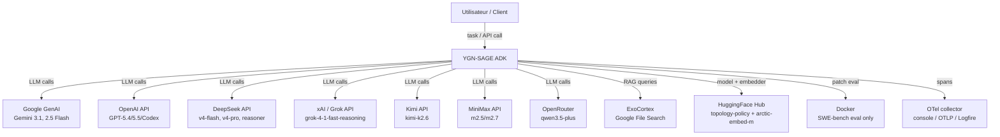
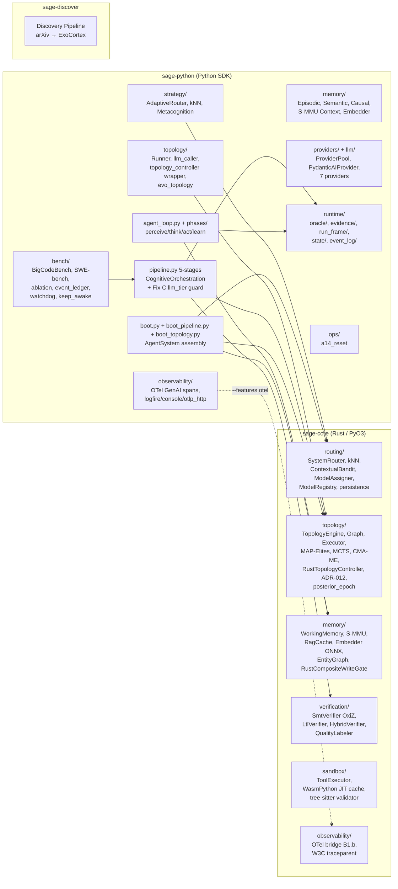

# YGN-SAGE — Document d'Architecture Technique

> **Généré le** : 2026-05-04 | **Branche** : `main` | **Commit HEAD** : `a6f869c4`
> **Auteurs** : Claude Opus 4.7 (1M context), architecte principal. Précédente révision Claude Opus 4.6 (2026-03-25, branche VeRLGIGPO, commit `3891243`).
> **Méthode** : Exploration exhaustive du code source au commit HEAD. Le code prime sur la documentation.
> **Delta vs 2026-03-25** : ~982 commits écoulés. Cycles 7 (SAGE_ORACLE flip), 8 (R6.1c + A14 epoch guard), 9 (deepseek-v4-flash migration + Fix C + recovery infrastructure). Training **parqué** depuis 2026-04-15 (`b2f59ee`, -4.3 GB). Sous-système `runtime/` (event_log + oracle + evidence + run_frame + state) ajouté. ADR-013 §5 flip (sandbox WASI par défaut). ADR-012 (TopologyController Rust-primary). ADR-014 (LtlVerifier renommage). 10 invariants dans `docs/contracts/runtime-integrity-ledger.md`.

---

## 1. Executive Summary

YGN-SAGE est un **Agent Development Kit (ADK)** structuré en 3 packages : un noyau Rust (`sage-core`) exposé via PyO3, un SDK Python (`sage-python`), et un pipeline de découverte de connaissances (`sage-discover`). Le système orchestre des topologies multi-agents avec routage cognitif adaptatif.

**Ce que le système fait réellement (2026-05-04) :**

> **Note sur les pourcentages cités** (cycle-13 K Phase 0.6, 2026-05-06) :
> les capacités sont trackées en machine-readable dans `docs/CLAIMS.yaml`
> (sortie autogénérée de `docs/claims/*.yaml`). Lorsque ce document cite
> un chiffre historiquement cité (kNN ~92% — `routing.knn_92pct` `evidence_pending` ; SystemRouter ~88% — `routing.system_router_88pct` `evidence_pending` ; BCB 45.9% ; MASBENCH +22pp ; SWE-bench Lite 10%), le statut autoritaire est dans le registre. Les
> chiffres sans test/bench CI-runnable piné sont taggés
> `evidence_pending` dans le registre et NE doivent PAS être traités
> comme preuve de capacité tant que `python -m sage.ops.claims_audit
> --strict` ne pin pas l'évidence.

- Route les tâches vers 3 niveaux cognitifs (S1/S2/S3) via kNN sur embeddings (`routing.knn_92pct` = `evidence_pending`) + Rust SystemRouter (`routing.system_router_88pct` = `evidence_pending`) + bandit contextuel Thompson, avec **attribution causale** Stage-0 → Stage-5 (`route_integrated()` + `record_outcome_checked()` depuis cycle-9 `6f23eea4`).
- Génère des topologies multi-agents (11 templates + MAP-Elites + MCTS + CMA-ME + LLM synthesis) et les exécute via `TopologyRunner` avec résolution per-node de providers.
- Pipeline 5-stages (CLASSIFY → DECOMPOSE → TOPOLOGY → ASSIGN → EXECUTE → LEARN) avec boucle d'apprentissage bandit, **TopologyController Rust-primary** (ADR-012, 2026-04-20).
- Sandbox **par défaut** : tree-sitter AST + RustPython wasm32-wasip1 deny-by-default WASI-p1 (ADR-013 §5 flip 2026-04-22, `validate_and_execute` ne fall-back plus en subprocess).
- Vérification formelle OxiZ SMT (QF_LIA) + LTL (petgraph) + HybridVerifier + Rust QualityLabeler.
- Sous-système **runtime/ integrity** : OracleStack (default-on cycle-7, `128e1b89`) → bandit/MAP-Elites/online-evolution/training-memory ne sont mis à jour QUE sur `OracleVerdict.trainable=True`. A14 epoch guard (cycle-8, `6b2ebcbe + f9521616`) lie `posterior_epoch.json` aux SHA-256 des fichiers d'état via `topology_state_manifest.json`.
- Cycle-9 bench infrastructure : event ledger NDJSON + wall-clock watchdog + Windows keep-awake — gate-quality crash-safe partial completion.
- OpenTelemetry GenAI spans (B1, 2026-04-25) avec bridge Rust (B1.b) via `--features otel`.

**Ce que le système prétend mais ne fait pas encore pleinement :**

- **A3 N=50 ablation cloud** : aborted le 2026-05-04 03:24 (Windows Modern Standby S0 DRIPS), 34/300 tasks complétées. Recovery infrastructure shipped (commits `a56a76e2` à `c136463e`). Cycle-10 cible : full v7 N=10 counterbalanced replay puis A3 N=50 cloud.
- **Fix C `a23e196b`** : désactive `TopologyController` quand `tier=budget`. Correctement câblé end-to-end MAIS empiriquement non-validateur du gap v7 (cgpro round-2 review 2026-05-04 : v7 4/10→7/10 gap est très probablement sample variance sur tasks borderline).
- **Optional learned-policy path** (legacy env-var name `SAGE_ENABLE_PATH6`; sibling-of-6, NOT engine path 6 per Rust `TopologySource` enum) : checkpoint Phase C (`yannabadie/sage-topology-policy-local`, 40% MASBENCH) sur HuggingFace. **Off par défaut** (`SAGE_ENABLE_PATH6=1` requis). Inférence-only (training PARKED).
- **GiGPO V2 (Nemotron-Orchestrator-8B)** : code complet, jamais exécuté GPU sur main (parqué 2026-04-15 `b2f59ee`, -4.3 GB). Le code training, `verl/`, `scripts/`, `data/`, `models/` vit sur une branche dédiée `training`.
- **`evolution/engine.py`** : "No quantitative evidence that evolution improves task outcomes yet" (`engine.py:7-9`).
- **Persistence MAP-Elites + bandit** : Rust `persistence.rs` shipped + actif (default features incluent `cognitive` depuis ADR-013 §5). `restore_arm` fix `restore` `context_sum`/`context_count` (cgpro 2026-04-26).

---

## 2. Repo Fingerprint

| Attribut | Valeur |
|---|---|
| **Repository** | `yannabadie/YGN-SAGE` |
| **Branche analysée** | `main` |
| **HEAD commit** | `a6f869c4` (2026-05-04) |
| **Langages** | Rust 1.94 (sage-core), Python 3.13 (sage-python, sage-discover) |
| **Tests Python collected** | **3179** (canonical : `docs/status/current.json`) |
| **Tests Rust** | **553** (`cargo test --features smt,cognitive,sandbox,cranelift,tool-executor`) |
| **Tests sage-discover** | **100** |
| **mypy / ruff** | mypy 0 errors / 183 files, ruff clean, type:ignore ceiling 45/45 |
| **CI** | GitHub Actions : 11 jobs (Rust no-default, rust-features, Python SDK Linux, Python SDK Windows, Python Discover, OTel Linux, OTel Windows MSVC, integration-smoke, build-wasm-sandbox, Trap-E matrix, Security pip-audit/SBOM) |
| **Feature flags Rust (default)** | `extension-module`, `sandbox`, `cranelift`, `tool-executor`, `cognitive` |
| **Feature flags Rust (opt-in)** | `onnx` (ort, tokenizers, ndarray + DLL), `smt` (oxiz), `otel` (B1.b Rust span bridge) |
| **PyPI** | `ygn-sage` v0.1.0-alpha (sage_core déclaré comme dep depuis cycle `e57ae680`) |
| **Licence** | MIT |
| **Training** | PARKED sur main 2026-04-15 (`b2f59ee`). Code training sur branche `training` dédiée. Checkpoints HF : `yannabadie/sage-topology-policy-local` (Phase C, 40% MASBENCH), `yannabadie/sage-topology-policy-v2` (Nemotron, GiGPO veRL) |
| **Points d'entrée runtime** | `sage.boot.boot_agent_system()`, `sage.pipeline.CognitiveOrchestrationPipeline.run()` |
| **Points d'entrée bench** | `python -m sage.bench --type {bigcodebench,evalplus,ablation,routing_gt,swebench}` |

---

## 3. Reading Guide — Légende de Classification

| Tag | Signification |
|---|---|
| **Observé** | Vérifié dans le code source — fichier + symbole + call path confirmés |
| **Inféré** | Déduit de la structure du code mais non directement prouvé |
| **Inconclusif** | Indices contradictoires ou insuffisants |
| **Runtime** | Atteignable dans le chemin d'exécution normal (`boot.py` → `pipeline.run()`) |
| **Bench** | Atteignable dans le chemin bench (`python -m sage.bench`) |
| **Experimental** | Existe derrière un feature flag ou env var optionnel |
| **Code mort** | Fichier/symbole présent mais jamais importé dans un chemin atteignable |
| **Parqué** | Code complet mais non exécuté en production. Ex : training sur main. |

**Classification des capacités :**
- `Réel et validé` : fichier + call path + tests + (idéalement) benchmark
- `Réel mais non validé quantitativement` : fichier + call path + tests, pas de benchmark
- `Partiellement câblé` : fichier existe, call path partiel
- `Squelette` : fichier existe, pas de call path
- `Doc-only` : mentionné dans la doc, pas dans le code

---

## 4. Mental Model

**Phrase-système :** YGN-SAGE est un orchestrateur multi-agent qui route les tâches via classification cognitive (S1/S2/S3), génère des topologies DAG multi-agents via un moteur évolutif Rust 6-path, assigne des modèles LLM par nœud, exécute la topologie avec adaptation runtime gérée côté Rust, et apprend des résultats via un bandit contextuel Thompson tout en émettant des évidences typées (OracleStack) qui gates les mises à jour bandit / MAP-Elites / training-memory.

**Pipeline en 1 ligne :**
```
CLASSIFY (kNN/SystemRouter+bandit decision_id) → DECOMPOSE (TaskPlanner DAG features) → SELECT TOPOLOGY (6-path engine [path 6 = template fallback] + optional learned-policy path opt-in via legacy SAGE_ENABLE_PATH6) → ASSIGN MODELS (Rust ModelAssigner + Z3 verify) → EXECUTE (TopologyRunner + Rust TopologyController) → LEARN (QualityEstimator + OracleStack → bandit.record_outcome_checked + MAP-Elites + S-MMU)
```

**Sous-systèmes centraux (10) :**

1. **Routing** : Rust SystemRouter + AdaptiveRouter (Python) + kNN embeddings + ContextualBandit
2. **Topology Engine** : 6-path generation (S-MMU hit, archive, LLM synthesis, mutation, MCTS, template) + HybridVerifier + LTL
3. **Execution** : TopologyRunner + TopologyExecutor dual-mode + ProviderPool (7 providers)
4. **Memory** : Working (Rust) + Episodic (SQLite) + Semantic (entity graph) + Causal + S-MMU (4-view) + ExoCortex RAG
5. **Verification** : OxiZ SMT (QF_LIA) + HybridVerifier + LTL + ProcessRewardModel
6. **Evolution** : MAP-Elites archive + CMA-ME + MCTS + 7 mutation operators + TopologyPopulation
7. **Adaptation runtime (ADR-012, Rust-primary)** : `RustTopologyController` (Rust state machine + 5 décision paths) + Python wrapper pour embedder/SmtVerifier/topology-graph
8. **Runtime Integrity** : OracleStack + RuntimeContracts + StateCore + RunFrame + EvidenceProducers + 10 invariants dans le ledger
9. **Observability** : EventBus (in-process) + DriftMonitor + OpenTelemetry GenAI spans (B1) + Rust span bridge (B1.b, `--features otel`)
10. **Bench infrastructure (cycle-9)** : Event ledger NDJSON + wall-clock watchdog + Windows keep-awake + targeted filters (`--ablation-configs`, `--task-ids`)

---

## 5. System Context


[Evidence: `sage-core/config/cards.toml` (23 modèles), `sage-python/src/sage/providers/`, `sage-python/src/sage/observability/`, `docker-compose.yml`] [Statut: Observé] [Reachability: Runtime] [Validation: CI + tests]

**Note** : le sandbox d'exécution n'utilise PLUS Docker au runtime (sauf pour SWE-bench Docker grading). Depuis ADR-013 §5 (2026-04-22), `validate_and_execute` exécute par défaut dans RustPython wasm32-wasip1 deny-by-default, embarqué dans `sage_core`.

---

## 6. Entrypoints and Execution Surfaces

### 6.1 Runtime

| Point d'entrée | Fichier | Description | Reachability |
|---|---|---|---|
| `boot_agent_system()` | `sage-python/src/sage/boot.py:353` | Construit `AgentSystem` complet (router, engine, bandit, memory, pipeline, runtime/oracle) | Runtime |
| `AgentSystem.run(task)` | `sage-python/src/sage/agent_system.py` | Chemin unifié (Phases 1-3 mergées) : `system.run()` → `pipeline.run()` | Runtime |
| `CognitiveOrchestrationPipeline.run()` | `sage-python/src/sage/pipeline.py:122` | Pipeline 5-stages async | Runtime |
| `AgentLoop.run(task)` | `sage-python/src/sage/agent_loop.py` | Boucle perceive/think/act/learn (par nœud topology + bypass) | Runtime |
| `TopologyRunner.run(task)` | `sage-python/src/sage/topology/runner.py:247` | Exécution multi-agent + Rust TopologyController | Runtime |
| `python -m sage` | `sage-python/src/sage/__main__.py` | Root CLI dispatcher (`c9448a9b`) | Runtime |
| `python -m sage.protocols.serve` | `sage-python/src/sage/protocols/` | Serveur MCP + A2A (a2a-sdk 0.3.x) | Runtime |
| `python -m sage.ops.a14_reset` | `sage-python/src/sage/ops/a14_reset.py` | Reset A14 state files post-poison | Ops |

### 6.2 Bench

| Point d'entrée | Fichier | Description |
|---|---|---|
| `python -m sage.bench --type bigcodebench` | `sage-python/src/sage/bench/bigcodebench_bench.py` | BigCodeBench Hard/Full × Instruct/Complete |
| `python -m sage.bench --type swebench` | `sage-python/src/sage/bench/swebench_bench.py` | SWE-bench Lite/Verified/Pro avec diff verifier opt-in (observe par défaut) |
| `python -m sage.bench --type ablation` | `sage-python/src/sage/bench/__main__.py` (`_run_ablation`) | 6 configs paired ablation. Filtres `--ablation-configs` + `--task-ids` (α.1+α.2 cycle-9) |
| `python -m sage.bench --type routing_gt` | `sage-python/src/sage/bench/routing_ground_truth.py` | 50 tasks GT bench. Historic figures (kNN ~92% / SystemRouter ~88% / heuristic ~34%) tracked in `docs/CLAIMS.yaml` and currently `evidence_pending`. |
| `python -m sage.bench --type evalplus` | `sage-python/src/sage/bench/evalplus_bench.py` | EvalPlus (saturated, déprécié) |

Sortie : `<output>.json` (BenchReport) + `<output>.events.jsonl` (event ledger NDJSON, depuis cycle-9 `0036217b`).

### 6.3 Tooling

| Point d'entrée | Fichier | Description |
|---|---|---|
| `python -m sage.evolution` | `sage-python/src/sage/evolution/__main__.py` | CLI évolution (population, mutation, eval) |
| `sage-discover/` | `sage-discover/src/discover/pipeline.py` | Pipeline arXiv → ExoCortex |
| `ui/app.py` | `ui/app.py` | Dashboard FastAPI + WebSocket |

### 6.4 Training (PARKED sur main)

Le code training (`verl/`, `scripts/training/`, `data/training_*.jsonl`, `models/`) est sur la branche dédiée `training` depuis 2026-04-15 (commit `b2f59ee`, -4.3 GB). Sur `main` :
- Inférence learned-policy reste possible via `SAGE_ENABLE_PATH6=1` (legacy env-var name; sibling-of-6, NOT engine path 6 — lazy-load HF checkpoint)
- Tous les modules `sage.verl.*` ont été retirés de `main`

---

## 7. Container View



---

## 8. Component Registry

### 8.1 sage-core (Rust) — test count: see `docs/status/current.json`

| Composant | Type | Responsabilité | Reachability | Notes |
|---|---|---|---|---|
| `SystemRouter` | `#[pyclass]` | Route tâche → S1/S2/S3 + model_id, **route_integrated** + record_outcome_checked | Runtime | Bandit attribution invariant (cycle-9 `6f23eea4`) |
| `ContextualBandit` | `#[pyclass]` | Thompson sampling per-arm Beta/Gamma, persistence SQLite (cycle `cognitive`) | Runtime | `restore_arm` corrige context_sum/count (`d9b0b659`) |
| `RustKnnRouter` | `#[pyclass]` | kNN cosine sur exemplars NPZ, OOD rejection | Runtime | accuracy: `routing.knn_92pct` `evidence_pending` |
| `ModelAssigner` | `#[pyclass]` | Assigne model_id par nœud topologie | Runtime | Domain-aware, budget-aware |
| `ModelRegistry` | `#[pyclass]` | Catalogue TOML 23 modèles | Runtime | `cards.toml` |
| `ModelCard` | `#[pyclass]` | Profil par modèle (scores, coûts, affinités) | Runtime | s1/s2/s3 affinity + domain scores |
| `RustCompositeWriteGate` | `#[pyclass]` | 5-signal memory write gate (cycle-8 T2) | Runtime | salience + tier + conf + nov + rel |
| `RustQualityEstimator` | `#[pyclass]` | 5-signal quality (lexical, fast) | Runtime | Port Rust |
| `TopologyGraph` | `#[pyclass]` | IR unifié 3-flow edges (Control/Message/State) | Runtime | 11 templates |
| `TopologyEngine` | `#[pyclass]` | Moteur 6-path (S-MMU, archive, LLM, mutation, MCTS, template) | Runtime | + posterior_epoch guard |
| `TopologyExecutor` | struct | Ordonnancement dual-mode (static Kahn / dynamic gate) | Runtime | |
| **`RustTopologyController`** | `#[pyclass]` | **ADR-012 (2026-04-20)** : 5 decision paths + state machine en Rust | Runtime | Python wrappe pour embedder/SmtVerifier accès |
| `MapElitesArchive` | struct | Archive QD 4D, persistence cycle `cognitive` | Runtime | Pareto dominance |
| `MctsSearcher` | struct | UCB1 sur mutations | Runtime | |
| `CmaEmitter` | struct | Optimisation continue 3D, RNG seam (`5ef1940f`) | Runtime | |
| `HybridVerifier` | `#[pyclass]` | Vérification structurelle + sémantique O(V+E) | Runtime | |
| `LtlVerifier` | `#[pyclass]` | Model checking temporel (ADR-014 rename) | Runtime | BFS/DFS sur petgraph |
| `SmtVerifier` | `#[pyclass]` | Vérification formelle QF_LIA | Runtime (`smt`) | OxiZ pure Rust |
| `QualityLabeler` | `#[pyclass]` | Label qualité via SMT + tree-sitter | Experimental (`smt`+`tool-executor`) | |
| `MultiViewMMU` (S-MMU) | `#[pyclass]` | 4 vues : temporal, semantic, causal, entity | Runtime | ULID chunks |
| `WorkingMemory` | `#[pyclass]` | Mémoire court-terme per-agent | Runtime | |
| `RustEmbedder` | `#[pyclass]` | arctic-embed-m ONNX 768-dim | Runtime (`onnx`) | DLL load-dynamic |
| `RagCache` | `#[pyclass]` | Cache LRU pour RAG | Runtime | |
| `RustEntityGraph` | `#[pyclass]` | Graphe d'entités (sémantique) | Runtime | |
| **`ToolExecutor`** | `#[pyclass]` | **ADR-013 §5** (2026-04-22) : tree-sitter + RustPython wasm32-wasip1 par défaut | Runtime (default) | `validate_and_execute` fail-closed sans Wasm. `execute_raw` gated par `SAGE_UNSAFE_RAW_EXEC=1` |
| WasmPython JIT cache | mod | Précompile `.cwasm` (~30s → ~1s warm) | Runtime | `$HOME/.sage/wasm_python_cache/`, `50b4ee8` |
| **`PosteriorEpoch`** | mod | A14 epoch guard, `topology_state_manifest.json` SHA-256 binding | Runtime | Cycle-8 invariant 3 |
| OTel bridge | mod | W3C traceparent + Rust span exporter (B1.b) | Experimental (`otel`) | `sage-core/src/observability/` |

### 8.2 sage-python (Python SDK) — test count: see `docs/status/current.json`

#### Pipeline / boot

| Composant | Fichier | Tests | Reachability | Notes |
|---|---|---|---|---|
| `boot_agent_system()` | `boot.py:353` | test_boot_*.py (32) | Runtime | Phases 1-3 mergées, `llm_tier` thread |
| `init_pipeline()` | `boot_pipeline.py:141` | | Runtime | Wire pipeline + controller + tool_forge |
| `init_topology()` | `boot_topology.py` | test_boot_topology (4) | Runtime | A14 epoch guard preflight |
| `CognitiveOrchestrationPipeline` | `pipeline.py:122` | test_pipeline_*.py (54) | Runtime | 5 stages + Fix C `_llm_tier` guard (`a23e196b`) |
| `AgentLoop` | `agent_loop.py` | test_agent_loop_*.py (35+) | Runtime | + phases/{perceive,think,act,learn}.py |

#### Topology

| Composant | Fichier | Tests | Reachability |
|---|---|---|---|
| `TopologyRunner` | `topology/runner.py:247` | test_topology_runner (5) | Runtime |
| `TopologyController` (wrapper) | `topology_controller.py` | test_topology_controller (44) | Runtime |
| `TopologyEvolver` | `topology/evo_topology.py` | test_evolution_evo_topology (5) | Experimental |
| `llm_caller.synthesize_topology()` | `topology/llm_caller.py` | test_topology_llm_caller (10) | Runtime |
| `ProcessRewardModel` | `topology/kg_rlvr.py` | test_topology_kg_rlvr (11) | Runtime |
| `ToolForge` (UCT + SMITH) | `tools/forge.py` | tests forge | Runtime |

#### Routing / Strategy

| Composant | Fichier | Tests | Reachability |
|---|---|---|---|
| `AdaptiveRouter` | `strategy/adaptive_router.py` | test_strategy_adaptive (34) | Runtime |
| `KnnRouter` | `strategy/knn_router.py` | test_strategy_knn (21) | Runtime |
| `ComplexityRouter` | `strategy/metacognition.py` | (24) | **Emergency fallback** (Priority-3 dans `pipeline.py:477`) |
| `ShadowRouter` | `routing/shadow.py` | test_routing_shadow (28) | Runtime |

#### Memory / RAG

| Composant | Fichier | Tests | Reachability |
|---|---|---|---|
| `EpisodicMemory` | `memory/episodic.py` | test_episodic (15+) | Runtime |
| `SemanticMemory` | `memory/semantic.py` | test_semantic (7+) | Runtime |
| `CausalMemory` | `memory/causal.py` | test_causal (16) | Runtime |
| `WorkingMemory` | `memory/working.py` | test_working (6) | Runtime |
| `smmu_context` | `memory/smmu_context.py` | test_smmu_context (16) | Runtime |
| `Embedder` | `memory/embedder.py` | test_embedder (15) | Runtime |
| `ExoCortex` | `memory/remote_rag.py` | test_remote_rag (4) | Runtime |
| `consolidator` | `memory/consolidator.py` | tests | Runtime |
| `MemoryAgent` | `memory/memory_agent.py` | (T2 cycle-9) | Runtime |

#### Providers (7 actifs)

| Composant | Fichier | Notes |
|---|---|---|
| `ProviderPool` | `llm/provider_pool.py` | TTL'd exclusion 300s + re-probe (`3148667`) |
| `PydanticAIProvider` | `providers/pydantic_ai_provider.py` | Migration depuis LiteLLM 2026-04-18 |
| `GoogleProvider` | `llm/google.py` | Gemini 3.1 + 2.5 Flash |
| `CodexProvider` | `llm/codex.py` | OpenAI Codex |
| `OpenAIProvider`, `DeepSeekProvider`, `XaiProvider`, `KimiProvider`, `MinimaxProvider`, `OpenRouterProvider` | via PydanticAI ou directs | A33 deepseek `reasoning_content` multi-turn safety (`27770580`) |
| `ModelRegistry` (Python) | `providers/registry.py` | Discovery cache 24h, 27 tests |

#### Runtime Integrity (NEW since cycle-7/8/9)

| Sous-système | Fichier | Description |
|---|---|---|
| `runtime/event_log/` | `payload_schemas.py`, `writer.py`, `redaction.py`, `errors.py` | Event log avec payload schema versioning + 14 manifests (cycle-8 R6.1c) |
| `runtime/oracle/` | `_oracles.py`, `stack.py`, `verdict.py`, `env.py` | OracleStack default-on (cycle-7 `128e1b89`). Kill-switch via `SAGE_ORACLE=0\|false\|off\|...` |
| `runtime/evidence/` | `producers/*.py`, `payloads.py`, `delta.py` | EvidenceProducers (cycle-6 `25e604dd`). Trainable=True gate |
| `runtime/run_frame/` | `builder.py`, `frame.py` | RunFrame summary avec `parent_event_id` consistency |
| `runtime/state/` | `reducer.py`, `frame.py` | StateCore edge-channel separation (cycle-5 R6) |

#### Bench infrastructure (cycle-9 NEW)

| Composant | Fichier | Tests | Notes |
|---|---|---|---|
| `BenchEventLedger` | `bench/event_ledger.py` | test_event_ledger (11) | Append-only NDJSON + fsync per emit |
| `run_with_wallclock_watchdog` | `bench/watchdog.py` | test_bench_watchdog (7) | `HostSuspendDetected` raise si elapsed_wall > timeout × grace |
| `prevent_os_sleep` | `bench/keep_awake.py` | test_bench_keep_awake (6) | Windows `SetThreadExecutionState` ES_SYSTEM_REQUIRED |
| Host-suspend integration | `tests/test_bench_host_suspend_integration.py` | (3) | E2E mock-based, simule sleep mid-task |
| Targeted filters | `bench/__main__.py` flags | test_bench_targeted_filters (6) | `--ablation-configs`, `--task-ids` |

#### Contracts

| Composant | Fichier | Description |
|---|---|---|
| `TaskPlanner` | `contracts/planner.py` | DAG construction (`plan_static`, `plan_auto`) |
| `DAGFeatures` | `pipeline_stages.py:80` | omega / delta / gamma (AdaptOrch arXiv 2602.16873) |
| `select_macro_topology` | `pipeline_stages.py:159` | Mappe DAGFeatures → 11 templates |
| `cost_tracker` | `contracts/cost_tracker.py` | Tracking cost via provider responses |
| `policy.py` | `contracts/policy.py` | PolicyVerifier |
| `repair.py` | `contracts/repair.py` | Two-stage SR/diff repair |

#### Observability

| Composant | Fichier | Notes |
|---|---|---|
| `EventBus` | `events/bus.py` | In-process bus, ring buffer 5000 |
| OTel GenAI spans | `observability/otel_*.py` | B1 (2026-04-25), `SAGE_OTEL_EXPORTER` env |
| `DriftMonitor` | `monitoring/drift.py` | 3 actions (CONTINUE/SWITCH/RESET) |

#### Ops / Security / Sandbox

| Composant | Fichier | Description |
|---|---|---|
| `a14_reset` | `ops/a14_reset.py` | Reset A14 state files post-poison (CONTAMINATED.json + audit dump) |
| `SandboxManager` | `sandbox/manager.py` | Wrapper haut niveau Wasm/bubblewrap/local |
| `guardrails/` | `guardrails/{input,output,runtime}.py` | Rule-based safety (skipped via `_skip_guardrails`) |
| `security/` | `security/typed_repo.py` etc. | Path-jail (Linux backslash normalize, `9734a17d`) |

### 8.3 sage-discover (100 tests)

| Composant | Description |
|---|---|
| `discover/pipeline.py` | arXiv → ExoCortex ingestion |
| `mcp_gateway.py` | MCP gateway pour discovery |
| `agency_bench.py` | Smoke tests |

---

## 9. Runtime Flows

### 9.1 Exécution d'une tâche (chemin principal)

```
1. boot_agent_system(llm_tier="auto") construit AgentSystem :
   - Rust SystemRouter + ModelRegistry (cards.toml, 23 modèles)
   - Rust TopologyEngine + ContextualBandit + persistence (cognitive)
   - Python AdaptiveRouter (kNN + structural)
   - CognitiveOrchestrationPipeline (avec llm_tier passé pour Fix C)
   - ProviderPool (7 providers, TTL'd exclusion)
   - runtime/oracle (OracleStack default-on)
   - runtime/event_log (writer + payload_schemas)

2. AgentSystem.run(task) → pipeline.run(task, budget) (Phases 1-3 mergées)

3. pipeline.run(task) :
   Stage 0: classify_route_and_decide():
     - kNN router (primary; accuracy: `routing.knn_92pct` `evidence_pending`)
     - Rust SystemRouter.route_integrated() → bandit decision_id
     - ComplexityRouter (heuristic, emergency fallback Priority-3 — accuracy `evidence_pending`)
     - Stage 0 input guardrails (perceive.py:119) — skippable via _skip_guardrails

   Stage 1: decompose():
     - TaskPlanner.plan_auto(task, llm) → TaskDAG
     - compute_dag_features(dag) → DAGFeatures(omega, delta, gamma)

   Stage 2: select_topology():
     - select_macro_topology(features) → template name (11 options)
     - TopologyEngine.generate() 6-path : S-MMU > archive > LLM > mutation > MCTS > template fallback
     - OR optional learned-policy path (legacy `SAGE_ENABLE_PATH6=1`; sibling-of-6, NOT engine path 6) : Nemotron-Orchestrator-8B inference

   Stage 3: assign_models():
     - Rust ModelAssigner.assign_models() (domain + budget aware)
     - bandit quality override pour underperformers
     - z3_verify (non-blocking) :  provider assignment SAT

   Stage 4: execute():
     - Fix C (a23e196b) : _effective_controller = None if llm_tier=="budget"
     - bandit.select_with_context() → decision_id
     - if single-node: AgentLoop.run() (perceive→think→act→learn) avec guardrail_pipeline (sauf _skip_guardrails)
     - if multi-node: TopologyRunner.run() avec _effective_controller :
       - per-node AgentLoop via factory
       - RustTopologyController.evaluate_and_decide() (5 paths : reroute, quality cascade, debate gate, parallel inconsistency, prune)
       - upgrade_model / reroute / spawn_subagent / open_gate (configurable thresholds)
     - if quality < THETA_CRITICAL: FrugalGPT cascade retry

   Stage 5: learn():
     - QualityEstimator.estimate() (Z3 → ONNX → abstain)
     - OracleStack → EvidenceRef + OracleVerdict.trainable
     - Trainable=True gate :
         - SystemRouter.record_outcome_checked() (bandit attribution invariant)
         - bandit posterior update
         - MAP-Elites archive insert (Pareto dominance)
         - online_evolution.maybe_evolve()
         - training_memory.store()
     - RunFrame summary emit (parent_event_id consistency)
```
[Evidence: `pipeline.py:122-2629`, `boot.py:353-679`, `boot_pipeline.py:141-292`] [Statut: Observé] [Reachability: Runtime] [Validation: 54 tests test_pipeline_*]

### 9.2 Génération de topologie (6-path)

```
TopologyEngine.generate(smmu, task, embedding, system, exploration_budget):
  1. Bandit module l'exploration budget (arms > 3 → exploit)
  2. Path 1: S-MMU hit (similarity > 0.7 AND quality > 0.5) → clone
  3. Path 2: MAP-Elites archive lookup (BehaviorDescriptor match)
  4. Path 3: LLM synthesis (Python llm_caller.synthesize_topology)
  5. Path 4: Mutation (best-quality + random mutation)
  6. Path 5: MCTS search (UCB1 sur mutation space)
  7. Path 6: Template fallback (S1→sequential, S2→avr, S3→debate)
  → HybridVerifier.verify(topology) — reject if invalid
  → posterior_epoch.validate_epoch_for_save() (A14 guard)
  → Return GenerateResult { topology, source, confidence }
```

### 9.3 Adaptation runtime (Rust-primary, ADR-012)

```
TopologyRunner per-node :
  → RustTopologyController.evaluate_and_decide(node_idx, result, task, topology) :
     - 5 decision paths in Rust (similarity, quality cascade, debate-gate, parallel inconsistency, prune)
     - state machine en Rust
     - Python wrapper expose embedder, SmtVerifier, topology graph for scoring
  → Decision : continue / upgrade_model / reroute_topology / debate_gate / prune_node / spawn_subagent
  → if reroute: __REROUTE__ → pipeline regenerate topology
  → if quality cascade triggered: FrugalGPT retry stronger model
```
[Evidence: `sage-core/src/topology/controller.rs`, `sage-python/src/sage/topology_controller.py`] [Statut: Observé] [Reachability: Runtime] [Validation: 44 tests, but pas de validation quantitative cycle-9]

### 9.4 Host-suspend detection (cycle-9 NEW)

```
BigCodeBenchBench.run() per task :
  → t0 = time.time()
  → asyncio.wait_for(system.run(task), timeout=120) — peut être bypass par Modern Standby S0
  → latency_ms = (time.time() - t0) * 1000  # wall-clock, advances during OS suspend
  → if latency_ms > task_timeout × wallclock_grace_factor (default 2.0) :
       - mark host_suspend_detected = True
       - rollback passed_count if applicable
       - emit_task_abort(reason="host_suspend_detected")
       - exclude from gate-quality stats
  → emit_task_end / emit_task_timeout / emit_task_abort to event_ledger NDJSON
```

### 9.5 OracleStack + EvidenceRef (cycle-7 default-on)

```
Pipeline emits *_event with payload :
  → OracleStack._oracles[].evaluate(payload) → list[OracleVerdict]
  → Each OracleVerdict has trainable: bool + reason_code + EvidenceRef
  → EvidenceRef.evidence_hash : SHA-256 sur payload sanitisé (no raw stderr/secret)
  → if not any(v.trainable): bandit.record_outcome NOT called, MAP-Elites NOT updated
  → run_frame_summary.payload.parent_event_id = final_result.seq (RunFrame invariant)
```
[Evidence: `runtime/oracle/`, `runtime/evidence/`, `runtime/run_frame/`] [Statut: Observé] [Reachability: Runtime] [Validation: 100+ tests]

---

## 10. State, Data, and Memory

### 10.1 Stores de données

| Store | Format | Localisation | Cycle de vie | Reachability |
|---|---|---|---|---|
| WorkingMemory | In-memory Rust | Per-agent | Volatile | Runtime |
| EpisodicMemory | SQLite WAL | `~/.sage/episodic.db` | Persistant cross-session | Runtime |
| SemanticMemory | SQLite + in-memory | Per-agent | Persistant | Runtime |
| CausalMemory | SQLite + in-memory | Per-agent | Persistant | Runtime |
| **A14 state files** | bandit_state.db, archive_state.db, engine_extras.json, **topology_state_manifest.json** | `~/.sage/` | Persistant + epoch-bound | Runtime |
| posterior_epoch | JSON | `~/.sage/posterior_epoch.json` | Persistant | Runtime |
| S-MMU | In-memory petgraph | Global | Process-life | Runtime |
| MAP-Elites Archive | In-memory + SQLite (cognitive) | TopologyEngine.archive | Cross-session via persistence | Runtime |
| Bandit Posteriors | In-memory + SQLite (cognitive) | ContextualBandit | Cross-session via persistence | Runtime |
| ModelRegistry | TOML (cards.toml) + live discovery | `sage-core/config/cards.toml` | Statique (23 modèles) | Runtime |
| Routing Exemplars | NPZ | `config/routing_exemplars.npz` | Statique | Runtime |
| Wasm cache | `.cwasm` files | `$HOME/.sage/wasm_python_cache/` | Per-build, self-invalidate | Runtime |
| ExoCortex | Google File Search | Cloud | Persistant indéfini | Runtime |
| Event Ledger NDJSON | NDJSON append-only | `<bench_output>.events.jsonl` | Bench artifact | Bench |
| Wasm-python module | Embedded `rustpython.wasm` | Embedded build | Statique | Runtime |
| Discovery Cache | JSON | `~/.sage/discovery_cache/` | 24h TTL | Runtime |
| Contaminated backup | `_CONTAMINATED.json` | `~/.sage/contaminated_*` | Persistant marker | Ops |

### 10.2 Memory Reality Check (mise à jour)

| Capacité | Statut | Evidence |
|---|---|---|
| Episodic memory écrite ET relue à runtime | `Réel et validé` | `agent_loop.py` + `phases/perceive.py` |
| Semantic memory écrite ET relue à runtime | `Réel et validé` | T2 cycle-9 wiring (`886597de`) |
| Causal memory écrite via memory_agent | `Réel et validé` | T2 wiring shipped |
| S-MMU relue pour Path 1 sélection topologie | `Réel et validé` | `TopologyEngine.generate()` |
| MAP-Elites persiste entre sessions | `Réel et validé` (NEW) | Persistence via feature `cognitive` (default) |
| Bandit posteriors persistent (incl. context_sum/count) | `Réel et validé` (NEW) | `restore_arm` fix (`d9b0b659`, cgpro find) |
| A14 epoch fail-closed | `Réel et validé` (cycle-8) | `posterior_epoch.json` + manifest SHA-256 binding (`f9521616`) |
| OracleStack gate causal learning | `Réel et validé` (cycle-7) | Default-on flip `128e1b89` |
| Bandit attribution invariant | `Réel et validé` (cycle-9) | `record_outcome_checked` (`6f23eea4`) |
| Cost tracking réel par token | `Partiellement câblé` | `contracts/cost_tracker.py` lit `provider.usage` mais pas appelé partout |

---

## 11. Models, Routing, and Providers

### 11.1 Modèles LLM dans `cards.toml` (23 modèles, 8 providers)

Source de vérité : `sage-core/config/cards.toml` (symlink depuis `sage-python/config/cards.toml`).

| Tier | Model ID | Provider | Coût input/M$ | Notes |
|---|---|---|---|---|
| **codex** | `gpt-5.3-codex` | OpenAI | — | SOTA coding |
| **reasoner** | `gemini-3.1-pro-preview` | Google | $2.00 | Évaluation complexe |
| **fast** | `gemini-3.1-flash-lite-preview` | Google | $0.25 | Low-latency S1 |
| **budget** | **`deepseek-v4-flash`** | DeepSeek | (cycle-9 migration `24f97f3c`) | Successeur non-thinking de deepseek-chat (sunset 2026-07-24). Budget bench tier. |
| **budget-alt** | `grok-4-1-fast-reasoning` | xAI | $0.20 | 2M context |
| **topology-sft** | `gpt-5.4` | OpenAI | — | SFT data generation |
| **topology-policy** | `nvidia/Nemotron-Orchestrator-8B` | veRL training | — | Qwen3 architecture, GRPO orchestrator. RunPod H100 |
| Autres budget | `deepseek-v4-pro`, `deepseek-reasoner` | DeepSeek | — | |
| Autres frontier | `gpt-5.4-pro`, `gpt-5.5`, `gpt-5.5-pro` | OpenAI | — | Cycle-12+ |
| Autres frontier | `gemini-2.5-flash`, `gemini-3-flash-preview` | Google | — | |
| Autres budget | `gpt-5.4-mini`, `gpt-5.4-nano` | OpenAI | $0.30-1.20 | |
| Autres | `MiniMax-M2.5`, `MiniMax-M2.5-highspeed`, `minimax-m2.7` | MiniMax | $0.30/$1.20 | Self-evolving |
| Autres | `kimi-k2.6` | Kimi/Moonshot | — | Native PydanticAI OpenAIModelProfile (cycle A8 Phase 3) |
| Autres | `qwen/qwen3.5-plus-02-15` | OpenRouter | $0.26/$1.56 | |
| Autres | `grok-3`, `grok-code-fast-1` | xAI | — | |

[Evidence: `sage-core/config/cards.toml` — 23 entrées `[[models]]`] [Statut: Observé]

### 11.2 Chaîne de routage

```
1. Pipeline Stage 0 (classify_route_and_decide) :
   - kNN primary (RustKnnRouter; `routing.knn_92pct` `evidence_pending`) — Stage A
   - Rust SystemRouter.route_integrated() — Stage B (`routing.system_router_88pct` `evidence_pending`)
     - StructuralFeatures + formal keywords detection
     - ModelRegistry.best_model_for_system(system, budget)
     - ContextualBandit attribution decision_id
   - ComplexityRouter heuristic — Priority-3 emergency fallback (accuracy `evidence_pending`)
   - Stage 0 input guardrails (skippable via _skip_guardrails)

2. ContextualBandit.select(decision_id, context_vec):
   - Thompson sampling sur Beta posteriors per (model_id, template) arm
   - Pareto front : qualité vs coût vs latence
   - Restore-from-disk if persistence active (cognitive feature)

3. ModelAssigner per nœud topologie (Rust) :
   - domain_scores cards.toml (code/math/reasoning/tool_use/formal/creative/factual)
   - budget downgrade if over budget
   - bandit quality override pour underperformers
```
[Evidence: `pipeline.py:_stage_classify`, `routing/shadow.py`, `sage-core/src/routing/`] [Statut: Observé]

### 11.3 Budget et coût (mise à jour)

- Budget par défaut : `DEFAULT_BUDGET_USD = 10.0`
- Tracking coût réel : `contracts/cost_tracker.py` lit `provider.usage.input_tokens × cost_input_per_m + ...`. **Câblé partiellement** : actif sur le pipeline path principal (`pipeline.py:_stage_execute` utilise per-task pipeline ctx.cost depuis P0.3 wiring 2026-04-18).
- Bench cost tracker : `bench/bigcodebench_bench.py` somme `r.cost_usd` des `TaskResult`s pour avg_cost_usd réel.

---

## 12. Training, Fine-Tuning, and Evaluation

### 12.1 Training PARKED sur main (2026-04-15 `b2f59ee`)

Le code training (`verl/`, `scripts/`, `data/`, `models/` + tests training) a été **retiré de main** (-4.3 GB) pour réduire la surface du code et concentrer main sur le runtime + bench. Le code vit sur la branche dédiée `training`.

Sur `main` :
- Inférence learned-policy : `SAGE_ENABLE_PATH6=1` charge un checkpoint local (legacy env-var name; sibling-of-6, NOT engine path 6 — lazy-load HF)
- Aucun module `sage.verl.*` actif
- Bench infrastructure (BigCodeBench, SWE-bench, ablation) reste sur main

### 12.2 Optional learned-policy path — topologie apprise (inference seulement sur main; legacy env-var name `SAGE_ENABLE_PATH6`; sibling-of-6, NOT engine path 6)

- **V1 (legacy)** : Phi-4-mini-instruct SFT, 70% YAML valid, sur HF `yannabadie/sage-topology-policy`.
- **V2 (Phase C, best)** : `yannabadie/sage-topology-policy-local` — 40% MASBENCH.
- **V2 (Nemotron, GiGPO)** : `yannabadie/sage-topology-policy-v2` — Nemotron-Orchestrator-8B, NVIDIA Open Model License, Qwen3 architecture, GRPO-trained orchestrator (arXiv 2511.21689).

Lazy-loaded sur premier appel, fallback sur templates si output invalide.

### 12.3 Évaluation (benchmarks)

| Benchmark | Outil | Résultat | Date |
|---|---|---|---|
| BigCodeBench Hard Instruct (full pipeline, fast tier) | `sage.bench.bigcodebench_bench` | **45.9%** | 2026-04-26 |
| BCB-Hard N=50 official Docker (budget tier, oracle) | `sage.bench.bigcodebench_bench` | internal **30%** / Docker **32%** / 49/50 per-task agreement | 2026-04-29 |
| A2 ablation v7 (budget tier, N=10) | `sage.bench.ablation` | full **4/10**, baseline 8/10, no-grd 7/10 | 2026-05-03 |
| A3 ablation N=50 | `sage.bench.ablation` | **ABORTED** at 34/300 (Modern Standby) | 2026-05-04 |
| α paired diagnostic N=8 + replay N=8 | `sage.bench.ablation` --task-ids | full = no-grd = 4/8 (morn), 3/8 vs 4/8 (replay) | 2026-05-04 |
| SWE-bench Lite Docker-graded | `sage.bench.swebench_bench` | **10%** (1/10), patch-gen 70% | 2026-04-21 |
| Routing GT 50 tasks | `sage.bench.routing_ground_truth` | Historic figures (kNN ~92%, SystemRouter ~88%, heuristic ~34%) — `routing.knn_92pct` / `routing.system_router_88pct` `evidence_pending` in `docs/CLAIMS.yaml` | 2026-04 |

**Important** : MASBENCH leaderboard frozen depuis April 2025. Frontier 2026 models pas soumis. La VALEUR de SAGE est le **framework delta** (ablation), pas l'absolu vs frontier.

### 12.4 Training Reality Check (mise à jour)

| Capacité | Statut | Evidence |
|---|---|---|
| Environment GiGPO fonctionnel | `Réel mais sur branche training` | Tests passent sur la branche, pas sur main |
| Reward function complète | `Réel mais sur branche training` | |
| Training GPU exécuté | `Inconclusif sur main` | Aucun log sur main, branche training a un H100 RunPod setup |
| Modèle entraîné déployé | `Réel et inférable` | HF v2 existe + Phase C best |
| Optional learned-policy inference active runtime (legacy `SAGE_ENABLE_PATH6`; sibling-of-6) | `Experimental` | `SAGE_ENABLE_PATH6=1` requis |

---

## 13. Deployment, Configuration, and Feature Flags

### 13.1 Variables d'environnement (mise à jour majeure)

| Variable | Usage | Default |
|---|---|---|
| `GOOGLE_API_KEY` | Provider Google GenAI | — |
| `OPENAI_API_KEY` | Provider OpenAI | — |
| `DEEPSEEK_API_KEY` | Provider DeepSeek | — |
| `GROK_API_KEY` | Provider xAI | — |
| `KIMI_API_KEY` | Provider Kimi | — |
| `MINIMAX_API_KEY` | Provider MiniMax | — |
| `OPEN_ROUTER_API_KEY` | OpenRouter | — |
| `SAGE_ENABLE_PATH6` | Active optional learned-policy inference (legacy env-var name; sibling-of-6, NOT engine path 6) | unset |
| `SAGE_EXOCORTEX_STORE` | Store ExoCortex (multi-tenant fix 2026-04-18 `e338b7e`) | unset (no-op silent) |
| **`SAGE_ORACLE`** | OracleStack kill-switch | **DEFAULT-ON** depuis cycle-7 (`128e1b89`). Off : `0\|false\|off\|no\|disable\|disabled` |
| `SAGE_STATECORE` | Edge-channel separation (R6) | `0` |
| `SAGE_RUN_FRAME` | RunFrame trailing diagnostic (R7) | `0` |
| `SAGE_TRACE_JSONL_DIR` | JSONL sink (R5) | unset |
| `SAGE_BOOT_BYPASS_EPOCH_GUARD` | A14 guard forensic load-only bypass | `0` (require `SAGE_BOOT_BYPASS_REASON` + `SAGE_OPERATOR_ID` if used) |
| **`SAGE_DANGEROUS_TOOLS`** | Register `execute_bash` at boot | **`0`** (flipped from `True` 2026-04-23) |
| **`SAGE_UNSAFE_RAW_EXEC`** | Allow `ToolExecutor.execute_raw` (bypass AST + Wasm) | unset (audited escape hatch) |
| `SAGE_EMISSION_FORMAT` | SR-block emission for SWE-bench | `unified` |
| `SAGE_DIFF_VERIFIER_MODE` | Pre-emission diff verifier | `off` (code) / `observe` (recommended for SWE-bench) |
| `SAGE_PERSIST_SR_MISSING` | Persist raw response on SR failure | `0` |
| `SAGE_OTEL_EXPORTER` | OTel sink (B1, 2026-04-25) | `none` |
| `SAGE_OTEL_RAW_PAYLOADS` | Skip redaction + truncation | `0` (dev only) |
| `SAGE_BENCH_LOG_FILE` | SWE-bench gen log path | derive |
| `SAGE_WASM_CACHE_DIR` | Wasm-python cache | `$HOME/.sage/wasm_python_cache/` |
| `SAGE_WASM_CACHE_DISABLE` | Skip cache | `0` |
| `SAGE_REQUIRE_WASM` | **Build-time** : panic if wasm missing | `0` |
| `SAGE_BENCH_ORACLE_SEAM` | Path E bench evaluator seam (cycle-7 R6.1a) | `0` |
| `SAGE_BENCH_DISABLE_REPAIR` | Disable AVR + topology escalation | `0` |
| `SAGE_SSL_VERIFY` | SSL verify control | `True` (override CLAUDE.md directive #3 — never `verify=False`) |
| `HF_HUB_OFFLINE` / `HF_DATASETS_OFFLINE` | HF offline mode | `0` |

### 13.2 Feature Flags Rust (réorganisés)

| Flag | Statut | Effet |
|---|---|---|
| `extension-module` | default | PyO3 module |
| **`sandbox`** | **default (ADR-013 §5)** | RustPython wasm32-wasip1 |
| **`cranelift`** | **default (ADR-013 §5)** | Wasm JIT (excl Windows MSVC) |
| **`tool-executor`** | **default (ADR-013 §5)** | Tree-sitter validator |
| **`cognitive`** | **default (ADR-013 §5)** | Persistence SQLite (rusqlite) for bandit + MAP-Elites |
| `onnx` | opt-in | Embedder ONNX (arctic-embed-m, ort, tokenizers) |
| `smt` | opt-in | SmtVerifier (oxiz) |
| `otel` | opt-in (B1.b) | Rust OpenTelemetry span bridge |

### 13.3 Fallbacks

| Composant | Si absent | Conséquence |
|---|---|---|
| sage_core (Rust) | `ImportError` à `TopologyController.__init__` | **Hard fail** depuis ADR-012 |
| `rustpython.wasm` | placeholder + runtime-fail (ou panic si `SAGE_REQUIRE_WASM=1`) | Sandbox bypassed → execute_raw audited |
| ONNX model | Hash embeddings interdits | kNN dégradé |
| GOOGLE_API_KEY | ExoCortex no-op silent | RAG features off |
| QualityLabeler (smt+tool-executor) | QualityEstimator abstient | Bandit pas de feedback |
| Live providers | TTL 300s exclusion + re-probe | Recovery automatique |

---

## 14. Security, Sandboxing, and Verification

### 14.1 Sandbox (ADR-013 §5 — 2026-04-22)

**Priorité d'exécution depuis 2026-04-22** :
1. **`validate_and_execute`** (default) → tree-sitter AST validator + RustPython wasm32-wasip1 (deny-by-default WASI-p1, 256 MiB cap, epoch-interrupt timeout). Pas de fallback subprocess.
2. **`execute_raw`** (gated `SAGE_UNSAFE_RAW_EXEC=1`) → bypass AST + Wasm, subprocess avec timeout. Audited escape hatch.

**40 adversarial attacks validés** (FS/net/proc/env/clock/mem/introspection/engine).

`execute_bash` n'est plus enregistré au boot par défaut (`SAGE_DANGEROUS_TOOLS` flipped 2026-04-23 `True`→`False`). Smoke SWE-bench N=10 paired (2026-04-22) : typed-only 4/10 vs bash 3/10 → critère fonctionnel rempli.

[Evidence: `sage-core/src/sandbox/`, `boot.py:80-105`, ADR-013] [Validation: 8 + 5 cache_tests Rust]

### 14.2 Vérification Formelle (SMT)

- **OxiZ** (Rust pur, 0 deps C++) : QF_LIA, bounds checking, loop verification, invariant implication, provider assignment SAT.
- **SmtVerifier** : 10 méthodes PyO3, CEGAR via `verify_invariant_with_feedback()` + `synthesize_invariant()` (max 5 rounds).
- **Usage runtime** : `pipeline.py:_verify_assignment_formal()` non-bloquant.
- **Usage training** : `QualityLabeler` combine SMT + tree-sitter.

[Evidence: `sage-core/src/verification/smt.rs`] [Validation: 38 #[test] Rust + 18 Python]

### 14.3 LTL Model Checking (ADR-014 rename 2026-04)

- **`LtlVerifier`** (renommé depuis `TemporalVerifier` par ADR-014) : reachability, safety, liveness, bounded liveness.
- **HybridVerifier** appelle `LtlVerifier` sur chaque topologie générée.
- O(V+E) BFS/DFS sur petgraph.

[Validation: 17 #[test]]

### 14.4 Trust Boundaries

- Pas de `verify=False` (directive CLAUDE.md #3 — corporate proxy absent sur cette machine, aucun bypass autorisé).
- CircuitBreaker per-provider (3 fails → open, 60s cooldown, TTL'd 300s exclusion).
- Guardrails : input/output/runtime via `phases/{perceive,act,learn}.py:guardrail_pipeline.check_all()`.
- Sandbox : Wasm WASI deny-by-default.
- ExoCortex : API key Google scope-limité.
- A14 epoch guard : fail-closed sur boot/load (ADR-018) + manifest SHA-256 binding (cycle-8 round-2).

---

## 15. Quality Attributes and Stress Scenarios

### 15.1 Attributs de qualité

| Attribut | Implémentation | Statut |
|---|---|---|
| **Performance** | Rust hot-paths (routing, kNN, S-MMU, executor, controller) | `Réel et validé` |
| **Résilience** | CircuitBreaker per-subsystem + per-provider TTL'd | `Réel et validé` |
| **Observabilité** | EventBus + AgentEvent + DriftMonitor + OTel B1+B1.b | `Réel et validé` |
| **Adaptabilité** | RustTopologyController (5 paths Rust-primary) | `Réel mais non validé quantitativement` |
| **Vérification formelle** | OxiZ SMT + LTL + HybridVerifier | `Réel et validé` |
| **Évolution** | MAP-Elites + CMA-ME + MCTS + 7 mutations + persistence | `Réel et validé` (tests + persistence) |
| **Coût-efficacité** | FrugalGPT cascade + budget + density | `Partiellement câblé` |
| **Sécurité sandbox** | Wasm WASI default + tree-sitter validator | `Réel et validé` (40 adversarial) |
| **Crash-safe partial completion** | Event ledger fsync per emit (cycle-9) | `Réel et validé` (3 e2e tests) |
| **Host-suspend detection** | Wall-clock watchdog (cycle-9) | `Réel et validé` (7 unit + 3 e2e tests) |

### 15.2 Scénarios de stress

**Scénario 1 : Tous les providers tombent sauf un** → CircuitBreaker + ProviderPool fallback + TopologyRunner per-node retry. TTL exclusion 300s + re-probe.

**Scénario 2 : Topologie invalide générée par mutation** → HybridVerifier rejette → engine cascade vers path suivant (6-path).

**Scénario 3 : Drift de performance à runtime** → DriftMonitor (latence/erreurs/coût). drift_score > 0.4 → SWITCH_MODEL ; > 0.7 → RESET_AGENT.

**Scénario 4 : OS suspend mi-bench (NEW cycle-9)** → wall-clock watchdog détecte elapsed > timeout × grace → `TASK_ABORT reason=host_suspend_detected` → exclu des stats gate-quality.

**Scénario 5 : A14 state poisoned** → epoch guard fail-closed sur boot, `_CONTAMINATED.json` requis pour load forensic, `python -m sage.ops.a14_reset --reason "..."` pour reset clean.

---

## 16. Architecture Decisions and Trade-offs

### ADRs canoniques (`docs/adr/`)

- **ADR-013** : `wasm-sandbox-default.md` — §5 flip 2026-04-22 (sandbox + cranelift + tool-executor + cognitive en default features).
- **ADR-014** : `ltl-verifier-rename.md` — `TemporalVerifier` → `LtlVerifier`.

### ADRs implicites (référencés CLAUDE.md mais pas matérialisés en `docs/adr/`)

- **ADR-009** : Telemetry & Routing Plumbing (2026-04-18, Obsidian vault) — 13 plumbing fixes (telemetry tool_call_count, per-model routing, quota-aware health_check, TTL exclusion, provider inference).
- **ADR-010** : Meta-Harness migration externe (2026-04-18) — implementation in-tree retirée, vendore stanford-iris-lab/meta-harness à `external/meta-harness/`.
- **ADR-012** : RustTopologyController primary (2026-04-20) — décision paths 1-5 + state machine en Rust. Python wrappe pour embedder/SmtVerifier/topology-graph. `sage_core` requis au runtime.
- **ADR-018/019** : Runtime cycle 5/6 design (StateCore + RunFrame).

### ADR-1 : Rust First, Python Tolerant
Hot-paths en Rust (routing, S-MMU, topologie, vérification, controller depuis ADR-012). Orchestration en Python.
**Conséquence** : Double maintenance, fallbacks Python pour quelques modules (WorkingMemory mock).

### ADR-2 : kNN comme routeur principal (accuracy: `routing.knn_92pct` `evidence_pending`)
arXiv 2505.12601 + ETH-SRI Cascade Routing 2410.10347.
**Conséquence** : Dépendance ONNX + arctic-embed-m. Hash embeddings interdits.

### ADR-3 : Bandit contextuel Thompson (pas LinUCB)
Beta posteriors per-arm + Pareto front qualité/coût/latence.
**Cycle-9** : Persistence active via feature `cognitive` (default). `restore_arm` corrige `context_sum`/`context_count` (cycle-9 cgpro find).

### ADR-5 : Three-flow edge model
Control + Message + State edges sur TopologyGraph (MASFactory 2603.06007).

### ADR-6 : OxiZ (pure Rust) au lieu de Z3 (C++)
QF_LIA. Z3 Python déprécié (`topology/kg_rlvr.py:44-57`).

### ADR-7 : Dual-mode executor (Static + Dynamic)
Kahn pour DAGs purs, gate-based readiness pour AVR/Hub/Debate cycliques.

### ADR-9 : Shadow routing avec evidence gates
ShadowRouter compare Rust vs Python avec gates evidence (500/10% soft, 1000/5% hard).

### ADR-10 : S1/S2/S3 comme systèmes cognitifs (Kahneman)
S1 rapide/intuitif, S2 délibéré/analytique, S3 formel/vérification.

### Directive #9 (CLAUDE.md, cycle-8 architect review)

**"Declared ≠ verified — runtime integrity principle"** : tout label autorisant un side-effect ou learning decision MUST être lié à verified content / schema / provenance / executable proof. **10 invariants** dans `docs/contracts/runtime-integrity-ledger.md` (cycle-9 cgpro round-2 ajout 2026-05-04).

---

## 17. Runtime Integrity Ledger — 8 Invariants

Source de vérité : `docs/contracts/runtime-integrity-ledger.md`. Pattern émergé sur 5 cycles de "declared ≠ verified" traps.

| # | Invariant | Declared label | Verified content | Side-effect blocked if invalid |
|---|---|---|---|---|
| 1 | **Event payload schema** | `event_type` + `payload_schema_version` | allowlist field_specs + canonical fixture | event emission (writer raises) |
| 2 | **Oracle evidence** | `OracleVerdict.trainable` | `EvidenceRef.evidence_hash` SHA-256 + producer schema | bandit / MAP-Elites / online-evolution / training-memory updates |
| 3 | **Posterior epoch** | `~/.sage/posterior_epoch.json.epoch` | `topology_state_manifest.json.state_files[].sha256` | `TopologyEngine::load_state` / `save_state` |
| 4 | **Contaminated backup** | `_CONTAMINATED.json.contaminated=true` | `audit_dump_sha256` cross-ref to MANIFEST.json | normal load (fail-closed) |
| 5 | **RunFrame summary** | `run_frame_summary.payload.parent_event_id` | `final_result.seq` consistency | diagnostic trust |
| 6 | **Bandit attribution** | `bandit_decision_id` from Stage-0 | `record_outcome_checked()` verifies (model_id, template) | bandit posterior update |
| 7 | **Timeout enforcement** (cycle-9) | per-task `timeout_s` bound to `asyncio.wait_for` | `elapsed_wall_ms ≤ timeout_s × grace_factor` (default 2.0) | pass-rate aggregation (TASK_ABORT excludes) |
| 8 | **Control-surface completeness** (cycle-9 cgpro round-2) | `TASK_END.control_surface` claims topology mechanism | when `node_count > 0`, `executed_template` non-empty + `dag_features` present | "topology X → Y" mechanism claims |

### 17.1 Cross-référence des modules

| Invariant | Python | Rust | Tests |
|---|---|---|---|
| Event payload schema | `runtime/event_log/payload_schemas.py` | n/a | `test_payload_schemas` (18) + `test_runtime_event_contracts` |
| Oracle evidence | `runtime/oracle/`, `runtime/evidence/producers/` | n/a | `test_oracle_*`, evidence round-trip |
| Posterior epoch | `posterior_epoch.py` | `sage-core/src/topology/posterior_epoch.rs` | `test_posterior_epoch` + Rust unit |
| Contaminated backup | `ops/a14_reset.py` | n/a | `test_a14_reset` |
| RunFrame summary | `runtime/run_frame/` | n/a | `test_run_frame` |
| Bandit attribution | `pipeline.py`, `runtime/event_log/payload_schemas.py` | `sage-core/src/routing/system_router.rs` | `test_pipeline_bandit_causality` + Rust |
| Timeout enforcement | `bench/watchdog.py`, `bench/event_ledger.py`, `bench/bigcodebench_bench.py` | n/a | `test_bench_watchdog` (7) + `test_event_ledger` + `test_bench_host_suspend_integration` (3) |
| Control-surface completeness | `bench/bigcodebench_bench.py:_capture_control_surface`, `pipeline.py:BenchContext` | n/a | `test_bench_host_suspend_integration::test_normal_task_emits_task_end` |

---

## 18. Known Gaps, Contradictions, and Technical Debt

### 18.1 Résolus depuis 2026-03-25

| Item résolu | Comment |
|---|---|
| ~~"ONNX Quality Estimator absent"~~ | Wasm sandbox + Z3 fallback couvre. ONNX optionnel via `onnx` feature. |
| ~~"Bandit posteriors non-persistants"~~ | Persistence active via `cognitive` feature (default ADR-013 §5). |
| ~~"MAP-Elites non-persistant"~~ | Idem. |
| ~~"Subprocess fallback dans validate_and_execute"~~ | Retiré ADR-013 §5. |
| ~~"`SAGE_DANGEROUS_TOOLS` default True"~~ | Flipped False 2026-04-23. |
| ~~"`a2a-sdk` 1.0 silent breakage"~~ | Pinned `<1.0` (cycle-8 closeout). |
| ~~"Bandit `restore_arm` perd context_sum/count"~~ | Fixé `d9b0b659` (cgpro find). |
| ~~"`executed_template` was a ULID not template name"~~ | Fixé cycle-9 `c136463e` (cgpro round-2). |

### 18.2 En cours / Tech debt actuelle

| Item | Sévérité | Detail |
|---|---|---|
| **Cost tracking partiel** | Moyenne | Per-task ctx.cost OK depuis 2026-04-18 (P0.3), mais legacy AgentLoop accumulator pas remplacé partout. |
| **Optional learned-policy derrière env var** | Basse | Inférence learned-policy OK mais désactivée par défaut (legacy `SAGE_ENABLE_PATH6` + lazy + opt-in; sibling-of-6, NOT engine path 6). |
| **Shadow routing 49.6% divergence** | Moyenne | Gates evidence pas franchies. Rust router non-promu — mais kNN reste primary. |
| **`evolution/engine.py` quantitative validation** | Moyenne | Tests OK mais pas de Wilcoxon/Cohen's d/courbes convergence. |
| **A3 N=50 cloud rerun** | Haute (cycle-10) | Aborted 2026-05-04 par Modern Standby. Recovery infra prête, à relancer cloud. |
| **`runtime/integrity/` umbrella refactor** | Différé | cgpro architect review 2026-04-30 a recommandé NE PAS unifier physiquement les 10 invariants — couplage local préférable. Phase 2 / v0.2 peut ajouter re-export aliases. |
| **Telemetry split internal_avr / bcb_repair** | Basse (cycle-10) | cgpro round-2 a flagué confusion. Cycle-10 candidate. |
| **perceive→TaskPlanner coupling test** | Basse (cycle-10) | BCB/82+/19+/34 montrent skip_guardrails → topology shift 5→3. À tester unitaire. |
| **A14b per-node attribution** | Différé | parallel/debate/selfmoa : per-node bandit attribution remis à cycle-10+. |

### 18.3 Modules orphelins

| Module | Statut |
|---|---|
| `sage-python/src/sage/agents/handoff.py` | Squelette. Non câblé pipeline. |
| `sage-python/src/sage/protocols/a2a_server.py` | a2a-sdk 0.3.x API drift fixé (cycle-8 `4de2f59a`). Cancellation pas encore supportée. |
| `ui/app.py` | FastAPI dashboard. Pas en CI. |

---

## 19. Open Questions (mise à jour)

### 19.1 Résolues

1. ~~Persistence MAP-Elites/bandit ?~~ → **Active via `cognitive` feature (default).**
2. ~~ONNX quality estimator absent ?~~ → **Optionnel ; Z3 + Wasm couvrent le runtime path.**
3. ~~Training GiGPO exécuté GPU ?~~ → **Branche dédiée `training`. Sur main, parqué.**

### 19.2 Toujours ouvertes

1. **Shadow routing 49.6% divergence** : le Rust router est-il meilleur ou pire ? Aucun benchmark indépendant Rust-router-only sur GT 50.
2. **A3 N=50 cloud** : quand reprendra-t-on ? Cycle-10 task #1.
3. **v7 4/10→7/10 gap** : sample variance ou mécanisme caché ? cgpro round-2 verdict : "very likely sample variance + boundary stochasticity on /13, /82, /101". Cycle-10 full v7 N=10 counterbalanced réplay = définitif.
4. **perceive→TaskPlanner coupling** sur BCB/82+/19+/34 : bug, feature, ou unspecified contract ? cgpro : "unknown, operationally suspected bug until tested".
5. **`ComplexityRouter` heuristic 34%** : utile comme Priority-3 fallback ou code mort à supprimer ? AUDIT2 2026-04-24 a flaggé l'incohérence "DEAD CODE" framing.
6. **Optional learned-policy rollout** (legacy `SAGE_ENABLE_PATH6`) : quand activer par défaut ? Manque benchmark direct comparant learned-policy vs template fallback.
7. **Frontier 2026 benchmark** : Cycle-12+ planning pour tester gpt-5.5-pro, gemini-3.1-pro frontière vs SAGE delta.

---

## 20. LLM Quick-Reference Cheatsheet

```
PROJET: YGN-SAGE (Agent Development Kit)
LANGAGES: Rust 1.94 (sage-core) + Python 3.13 (sage-python + sage-discover). Test counts: see docs/status/current.json (canonical SoT — sync_doc_counters propagates to README/AI-ARCHITECTURE/.claude/rules).
HEAD: main @ a6f869c4 (2026-05-04). 982 commits depuis 2026-03-25.

PIPELINE: CLASSIFY → DECOMPOSE → TOPOLOGY → ASSIGN → EXECUTE → LEARN
  Stage 0 attribution: route_integrated() → bandit decision_id
  Stage 5 closure: record_outcome_checked() — bandit attribution invariant

ROUTING:
  kNN (primary; routing.knn_92pct evidence_pending) > Rust SystemRouter (routing.system_router_88pct evidence_pending) > ContextualBandit Thompson > ComplexityRouter heuristic (Priority-3 fallback, evidence_pending)

TOPOLOGIE:
  11 templates: sequential, parallel, avr, selfmoa, hierarchical, hub, debate, brainstorming, robust, horizon_pipeline, parallel_fanout
  6-path engine: S-MMU > archive > LLM > mutation > MCTS > template fallback (Rust)
  Optional learned-policy path (legacy SAGE_ENABLE_PATH6=1; sibling-of-6, NOT engine path 6): Phase C 40% MASBENCH OR Nemotron GiGPO
  3-flow edges: control + message + state
  Execution dual-mode: static (Kahn DAG) ou dynamic (gate-based)

CONTROLLER (ADR-012, Rust-primary):
  RustTopologyController state machine + 5 paths in Rust
  Fix C (a23e196b): _effective_controller=None when llm_tier=="budget"

PROVIDERS: 7 actifs (Google, OpenAI, DeepSeek, xAI, Kimi, MiniMax, OpenRouter) + Codex
  cards.toml: 23 modèles
  Tiers: codex (gpt-5.3-codex), reasoner (gemini-3.1-pro), fast (gemini-3.1-flash-lite), budget (deepseek-v4-flash, A33 multi-turn safety)
  ProviderPool TTL'd 300s exclusion + re-probe + CircuitBreaker

MEMORY:
  Working (Rust volatile) | Episodic (SQLite WAL persistant)
  Semantic (entity graph) | Causal (directed)
  S-MMU (4-view petgraph) | ExoCortex (Google File Search)
  Persistence: bandit + MAP-Elites via cognitive feature (default)

VERIFICATION:
  OxiZ SMT (QF_LIA, feature smt) | LtlVerifier (petgraph, ADR-014 rename)
  HybridVerifier (structural) | ProcessRewardModel (PRM <think>)
  10 invariants in runtime-integrity-ledger.md

SANDBOX (ADR-013 §5 flip 2026-04-22):
  Default: tree-sitter + RustPython wasm32-wasip1 (deny-by-default WASI-p1)
  Wasm-python JIT cache: ~30s cold → ~1s warm
  No subprocess fallback (validate_and_execute fails closed)
  execute_raw gated SAGE_UNSAFE_RAW_EXEC=1

RUNTIME INTEGRITY (cycle 5-9):
  StateCore (R6) | RunFrame (R7) | OracleStack (R9, default-on cycle-7)
  EvidenceProducers (R6.1a) | A14 epoch guard (cycle-8) | Bandit attribution (cycle-9)
  Timeout enforcement + Control-surface completeness (cycle-9 cgpro round-2)

OBSERVABILITY:
  EventBus in-process | DriftMonitor | OpenTelemetry GenAI spans (B1, 2026-04-25)
  Rust span bridge B1.b (--features otel)
  Sinks: SAGE_OTEL_EXPORTER={none,console,otlp_http,logfire}

BENCH INFRASTRUCTURE (cycle-9):
  Event ledger NDJSON fsync per emit | wall-clock watchdog (HostSuspendDetected)
  Windows keep-awake (SetThreadExecutionState ES_SYSTEM_REQUIRED)
  Targeted filters: --ablation-configs, --task-ids
  Latest results: BCB Hard 45.9% (full pipe — `benchmarks.bcb_hard_45_9` delivered), BCB Hard N=50 official 32% (budget)
                  SWE-bench Lite 10% (Docker-graded — `benchmarks.swebench_lite_10pct` delivered)
                  Routing GT historic: ~92%/~88%/~34% — registry `evidence_pending`

TRAINING:
  ⏸ PARKED on main since 2026-04-15 (b2f59ee, -4.3 GB)
  Code on dedicated `training` branch
  Optional learned-policy inference still works on main via SAGE_ENABLE_PATH6=1 (legacy env-var name; sibling-of-6, NOT engine path 6)

BUILD:
  cd sage-core && maturin develop --features smt,onnx (default = sandbox+cranelift+tool-executor+cognitive)
  cd sage-python && pip install -e ".[all,dev]"

TEST:
  cd sage-core && cargo test --features smt --lib  # see docs/status/current.json
  cd sage-python && python -m pytest tests/ -v    # see docs/status/current.json
  cd sage-python && python -m mypy src/sage/ --ignore-missing-imports  # 0 errors
  cd sage-python && ruff check src/  # clean

EXTERNAL CONSULTATION (cycle-7+):
  cgpro (ChatGPT 5.5 Pro): cgpro ask --resume <conv> --json --background --timeout 1800
    Strong on architecture review, methodology critique, deep root-cause
    Active conv 2026-05-04: cgpro_a3_recovery_20260504 (UUID 69f854ed)
  codex (GPT-5.5 xhigh): skill codex:rescue
    Strong on second-implementation, deep file-traversal investigation

POINTS D'ATTENTION (cycle-10 carry-over):
  - A3 N=50 cloud rerun (must include /17 + /37 ; counterbalanced order ; instrumented telemetry)
  - perceive→TaskPlanner coupling test sur BCB/82+/19+/34
  - Telemetry split internal_avr / bcb_repair / runtime_guardrail
  - Frontier 2026 benchmark (Cycle-12+)
  - Shadow routing gates : 49.6% divergence non résolue
```

---

## Appendice A — Fichiers clés (mise à jour)

| Fichier | Rôle | Importance |
|---|---|---|
| `sage-python/src/sage/boot.py` | Assemblage AgentSystem | Critique |
| `sage-python/src/sage/boot_pipeline.py` | Wire pipeline + controller + tool_forge | Critique |
| `sage-python/src/sage/boot_topology.py` | A14 epoch guard preflight | Critique |
| `sage-python/src/sage/pipeline.py` | Pipeline 5-stages + Fix C | Critique |
| `sage-python/src/sage/agent_loop.py` | Boucle perceive/think/act/learn | Critique |
| `sage-python/src/sage/topology/runner.py` | Exécution multi-agent | Haute |
| `sage-python/src/sage/topology_controller.py` | Wrapper Python pour RustTopologyController | Haute |
| `sage-python/src/sage/contracts/planner.py` | TaskPlanner | Haute |
| `sage-python/src/sage/pipeline_stages.py` | DAGFeatures + select_macro_topology | Haute |
| `sage-python/src/sage/runtime/oracle/` | OracleStack + verdict + kill-switch | Haute |
| `sage-python/src/sage/runtime/event_log/` | Event log + payload schemas | Haute |
| `sage-python/src/sage/runtime/evidence/` | EvidenceProducers | Haute |
| `sage-python/src/sage/runtime/run_frame/` | RunFrame summary | Moyenne |
| `sage-python/src/sage/bench/event_ledger.py` | NDJSON append-only (cycle-9) | Haute |
| `sage-python/src/sage/bench/watchdog.py` | Wall-clock host-suspend detection | Haute |
| `sage-python/src/sage/bench/keep_awake.py` | Windows ES_SYSTEM_REQUIRED | Moyenne |
| `sage-python/src/sage/bench/bigcodebench_bench.py` | BCB harness + control_surface telemetry | Haute |
| `sage-python/src/sage/observability/` | OTel GenAI spans | Moyenne |
| `sage-python/src/sage/posterior_epoch.py` | A14 epoch helpers | Haute |
| `sage-python/src/sage/ops/a14_reset.py` | Reset A14 state post-poison | Moyenne |
| `sage-core/src/lib.rs` | PyO3 exports | Critique |
| `sage-core/src/routing/bandit.rs` | ContextualBandit + persistence | Haute |
| `sage-core/src/routing/system_router.rs` | route_integrated + record_outcome_checked | Haute |
| `sage-core/src/topology/engine.rs` | TopologyEngine 6-path | Critique |
| `sage-core/src/topology/controller.rs` | RustTopologyController (ADR-012) | Critique |
| `sage-core/src/topology/posterior_epoch.rs` | A14 epoch guard | Haute |
| `sage-core/src/sandbox/` | tree-sitter + Wasm-python JIT cache | Haute |
| `sage-core/src/observability/` | OTel bridge B1.b | Moyenne |
| `sage-core/config/cards.toml` | 23 modèles | Haute |
| `docs/contracts/runtime-integrity-ledger.md` | 10 invariants | **Critique** |
| `docs/contracts/rust-python-boundary.md` | Ownership matrix | Haute |
| `docs/contracts/runtime-event-log.md` | Event-log contract matrix | Haute |
| `docs/adr/ADR-013-wasm-sandbox-default.md` | Sandbox flip | Haute |
| `docs/adr/ADR-014-ltl-verifier-rename.md` | LtlVerifier rename | Moyenne |
| `docs/status/current.json` | Test counts canoniques | Haute |
| `CLAUDE.md` | Critical directives + current state | **Critique** |

---

## Appendice B — Glossaire (additions cycle 7-9)

- **A14** : posterior_epoch + topology_state_manifest provenance binding (cycle-8 step 2). Fail-closed sur boot/load.
- **A33** : DeepSeek `reasoning_content` multi-turn safety (`27770580`). Native PydanticAI OpenAIModelProfile.
- **DRIPS** : Deepest Runtime Idle Platform State (Windows Modern Standby S0). Suspend processes en background même avec standby timeout=0. Cycle-9 trap.
- **Fix C** : `_effective_controller = None if llm_tier=="budget"` (`a23e196b`). Désactive RustTopologyController pour budget tier.
- **OracleStack** : runtime/oracle. Default-on cycle-7. Trainable=True gate sur évidences typées.
- **Path E** : opt-in bench-result feedback seam (R6.1a). `SAGE_BENCH_ORACLE_SEAM=1`.
- **R0..R9** : runtime integrity arcs (cycle 5-7). RuntimeContracts → StateCore → RunFrame → OracleStack → EvidenceProducers.
- **R6.1c** : payload schema versioning + 14 manifests (cycle-8, `78565578`).

---

*Document généré sur la base d'une exploration du commit `a6f869c4`. Pour les claims spécifiques, voir les `[Evidence: ...]` ou `git show <sha>` pour vérifier au commit cité.*
