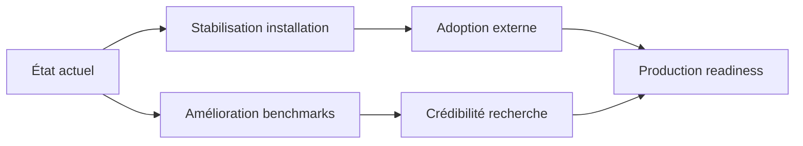

# 🔍 Analyse du Repository YGN-SAGE

## 📋 Vue d'ensemble du projet

**YGN-SAGE** (*Self-Adaptive Generation Engine*) est un kit de développement d'agents IA de recherche, conçu pour créer des topologies multi-agents adaptatives. [[2]]

### Architecture technique
- **Stack hybride** : Python 76.8% / Rust 21.0% / JavaScript 1.7%
- **Core Rust** : `sage-core` via PyO3 pour les composants critiques (exécution, sandbox, routage)
- **SDK Python** : `sage-python` pour l'orchestration et l'API utilisateur
- **Dashboard** : FastAPI + WebSocket pour la visualisation en temps réel

---

## 🧠 Les 5 Piliers Cognitifs

| Pilier | Description | État |
|--------|-------------|------|
| **Topology** | Moteur à 6 chemins (S-MMU, MAP-Elites, CMA-ME, MCTS, LLM synthesis, templates) | ✅ Actif |
| **Tools** | Sandbox 3 couches (tree-sitter, Wasm WASI, subprocess) + ToolForge | ✅ Actif |
| **Memory** | 4 niveaux : Working (Arrow), Episodic (SQLite), Semantic (graph), ExoCortex (RAG) | ✅ Actif |
| **Evolution** | MAP-Elites + CMA-ME + mutation operators + LLM-as-mutator | ✅ Actif |
| **Strategy** | Routage cognitif S1/S2/S3 avec kNN (92% accuracy) + bandit contextuel | ✅ Actif |

---

## 📈 Évolutions Récentes (Avril 2026)

### Cycle 7-8 : Consolidation de l'OracleStack (30 avril 2026)
- **Flip par défaut** : `SAGE_ORACLE` passe en **ON par défaut** (kill-switch : `0|false|off|no|disable|disabled`) [[web_extractor]]
- **Payload schema versioning** : 14 schémas d'événements avec validation stricte et tripwire de dérive
- **Allowlist controller_decision** : suppression du champ `reason` libre pour éviter les fuites PII/stack-trace
- **N=50 validation** : BigCodeBench Hard Instruct → 30% interne / 32% Docker / 98% accord par tâche

### Corrections critiques (27-30 avril 2026)
1. **Persistance CMA-ME** : Ajout de `engine_extras.json` pour sauvegarder l'état de l'optimiseur continu et les posteriors Thompson des mutations [[web_extractor]]
2. **Boot health-check** : Correction du pattern `asyncio.run()` qui corrompait la boucle d'événements
3. **Write-gate telemetry** : Split des raisons de skip mémoire (`memory_backend_unwired` vs `content_too_short`)
4. **RNG determinism** : Seed explicite + tri des clés pour reproductibilité des tests stochastiques

### Métriques tests (avril 2026)
```
✅ Python : 2484 tests passants (+127 vs baseline)
✅ Rust : 522 tests passants (--features smt,cognitive,sandbox,cranelift,tool-executor)
✅ Static : mypy 0 erreurs / 204 fichiers, ruff clean
✅ CI : 8 jobs (Linux/Windows, Rust/Python, OTel, integration)
```

---

## 🎯 Recommandations Stratégiques

### 🔴 Priorité Immédiate (Horizon A - 1-2 semaines)

1. **Finaliser A3 : Diff-context verifier repair mode**
   - Actuellement en mode `observe` uniquement
   - Le passage en `repair` permettrait d'améliorer le taux de résolution SWE-bench
   - Coût : ~3 jours, impact potentiel : +4pp sur les benchmarks

2. **Stabiliser B4 : Wheels PyPI avec Rust core**
   - Installation actuelle complexe (`maturin build` requis)
   - Bloquant pour l'adoption externe
   - Prérequis : CI wasm + `SAGE_REQUIRE_WASM=1` (A23 déjà livré)

3. **Documenter A31 : S-MMU cold-start design**
   - Clarifier si le cache mémoire est intentionnellement volatile
   - Ajouter une ligne ADR ou implémenter la persistance Arrow IPC

### 🟡 Moyen Terme (Horizon B - 1-2 mois)

4. **B2 : Trace durable + replay harness**
   - Prérequis pour toute vérification formelle sérieuse
   - Permettrait la reproductibilité des benchmarks et le debugging

5. **B3 : ToolPolicy capability manifest**
   - Sécurité critique : déclaration explicite des capacités/outils
   - Protection contre l'injection de prompt via les outils

6. **Wire AdaptiveMutator dans l'évolution offline** (A32-followup)
   - La persistance est livrée, mais l'intégration dans `EvolutionEngine` reste à faire
   - Potentiel d'amélioration auto-adaptative des stratégies de mutation

### 🔵 Long Terme (Horizon C - 3-6 mois)

7. **C3 : Benchmarks externes** (GAIA, AgentBench, τ-bench)
   - Nécessaire pour crédibiliser les résultats face à la communauté
   - Actuellement uniquement des benchmarks internes (`sage-mas-bench`)

8. **C4 : Runtime assurance layer**
   - Pré/post-conditions sur les appels outils
   - Enforcement de politiques avant effets de bord

---

## ⚠️ Points de Vigilance

| Risque | Impact | Mitigation |
|--------|--------|-----------|
| **Complexité d'installation** | Adoption limitée | Prioriser B4 (wheels PyPI) |
| **Documentation éparpillée** | Onboarding difficile | Centraliser dans `CLAUDE.md` + `README.md` |
| **Tests stochastiques flakes** | CI instable | Implémenter le split 3 couches (A26 livré) |
| **Fuites PII via logs** | Sécurité | Allowlist controller_decision (livré cycle 7) |
| **Dépendances transitives** | Drift silencieux | `constraints.txt` + job weekly (A27 livré) |

---

## 🚀 Direction Recommandée



**Recommandation principale** : Concentrer les efforts sur **B4 (wheels PyPI)** et **A3 (diff-verifier repair)** en parallèle. Ces deux livrables adressent respectivement l'adoption et la performance — les deux leviers critiques pour transformer ce prototype de recherche en outil usable.

**Secondary focus** : Documenter clairement les choix architecturaux (ADR pour S-MMU, boundaries Rust/Python) pour faciliter les contributions externes et réduire la dette cognitive.

> ℹ️ *Note : Le projet est explicitement marqué "research prototype, not production-ready" [[web_extractor]]. Toute roadmap doit intégrer cette honnêteté technique dans la communication externe.*