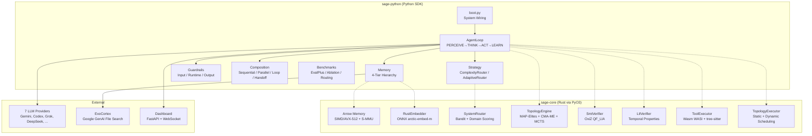
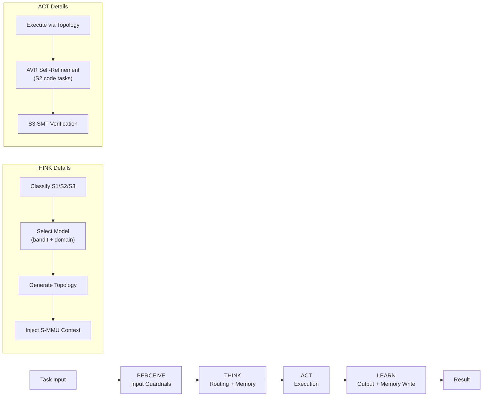
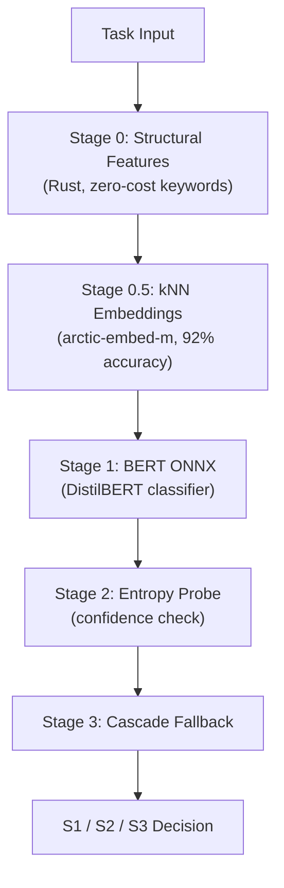

# Architecture Overview

YGN-SAGE is structured as a Rust core with Python SDK bindings, organized around five cognitive pillars. This page explains the high-level architecture and data flow.

## System Diagram



## Component Overview

### sage-core (Rust)

The performance-critical core, exposed to Python via PyO3 bindings. All hot-path operations run natively:

| Module | Purpose |
|--------|---------|
| `memory/` | Arrow-backed working memory with SIMD/AVX-512, S-MMU paging, ULID chunk IDs |
| `memory/embedder.rs` | ONNX Runtime embedder (snowflake-arctic-embed-m, 768-dim) |
| `memory/rag_cache.rs` | FIFO+TTL cache for File Search results (DashMap) |
| `routing/` | SystemRouter (bandit + domain scoring), ContextualBandit, ModelRegistry |
| `routing/router.rs` | AdaptiveRouter with BERT ONNX classifier (Stage 0 + Stage 1) |
| `topology/` | TopologyGraph IR, 8 templates, MAP-Elites, CMA-ME, MCTS, LLM synthesis |
| `topology/executor.rs` | Dual-mode scheduling (static toposort / dynamic gate-based) |
| `verification/smt.rs` | OxiZ pure-Rust SMT solver (10 PyO3 methods, QF_LIA) |
| `verification/ltl.rs` | Temporal property verification (reachability, safety, liveness) |
| `sandbox/` | Wasm WASI sandbox + tree-sitter AST validation + subprocess fallback |

### sage-python (Python SDK)

The agent framework layer that wires pillars together and provides the developer API:

| Module | Purpose |
|--------|---------|
| `boot.py` | System wiring: all pillars + EventBus + GuardrailPipeline + TopologyEngine |
| `agent_loop.py` | PERCEIVE -> THINK -> ACT -> LEARN runtime with AVR self-refinement |
| `orchestrator.py` | CognitiveOrchestrator with FrugalGPT cascade fallback |
| `strategy/` | ComplexityRouter (heuristic), AdaptiveRouter (5-stage learned), KnnRouter |
| `memory/` | 4-tier memory, MemoryAgent, S-MMU context, CRAG relevance gate |
| `guardrails/` | 3-layer pipeline (input, runtime, output) |
| `agents/` | SequentialAgent, ParallelAgent, LoopAgent, Handoff |
| `topology/` | Evolutionary topology, Process Reward Model (Z3 DSL), LLM caller |
| `contracts/` | TaskDAG, verification, policy, DAGExecutor, RepairLoop (CEGAR) |
| `bench/` | EvalPlus, ablation, routing GT, memory/evolution ablation |
| `protocols/` | MCP server + A2A agent |

### sage-discover (Knowledge Pipeline)

Ingests research papers from arXiv, Semantic Scholar, and HuggingFace into the ExoCortex:

```bash
python -m discover.pipeline --mode nightly    # Papers from yesterday
python -m discover.pipeline --mode on-demand --query "PSRO"
python -m discover.pipeline --mode migrate    # Bootstrap from NotebookLM exports
```

### ui (Dashboard)

FastAPI backend with WebSocket push for real-time observability:

- **EventBus** streams all AgentEvents to connected clients
- Sections: Routing S1/S2/S3, Response, Memory 4-tier, Guardrails, Events, Benchmarks
- HTTPBearer auth via `SAGE_DASHBOARD_TOKEN` (optional)
- Task queue: `asyncio.Queue(maxsize=10)`

## Data Flow

Every task processed by SAGE follows this pipeline:



### Phase Details

**PERCEIVE** -- Input guardrails check the task before any LLM call. Tasks can be blocked (severity="block") or flagged. The EventBus emits a `GUARDRAIL_CHECK` event.

**THINK** -- The routing engine classifies the task into a cognitive system:

- **S1 (Fast/Intuitive)**: Simple tasks handled by budget models with minimal overhead
- **S2 (Analytical)**: Complex tasks requiring reasoning, with AVR (Act-Verify-Refine) self-correction
- **S3 (Formal)**: Tasks requiring formal verification via SMT solvers and LTL model checking

The TopologyEngine generates a multi-agent graph (6-path strategy: S-MMU recall, archive lookup, LLM synthesis, mutation, MCTS, template fallback). The S-MMU injects relevant context from prior interactions as a SYSTEM message.

**ACT** -- The TopologyExecutor runs the generated graph. For acyclic topologies, it uses Kahn's topological sort (static mode). For cyclic topologies with loops or conditional gates, it uses dynamic gate-based readiness scheduling. Code tasks go through sandboxed execution (Wasm WASI -> tree-sitter validation -> subprocess fallback).

**LEARN** -- Output guardrails validate the result (cost, length, refusal detection). The MemoryAgent extracts entities for the semantic graph. The compressor writes to S-MMU with keywords, embeddings, and summaries. The outcome feeds back into the contextual bandit and MAP-Elites archive.

## Routing Pipeline

The 5-stage adaptive routing pipeline:



Each stage can short-circuit if confidence is high enough. The system falls back to the heuristic ComplexityRouter if `sage_core[onnx]` is unavailable.

## Model Tiers

SAGE uses a tiered model configuration with 7 LLM providers:

| Tier | Model | Provider | Use Case |
|------|-------|----------|----------|
| codex | gpt-5.3-codex | Codex CLI | Default, SOTA coding |
| codex_max | gpt-5.2 | Codex CLI | Most powerful reasoning |
| reasoner | gemini-3.1-pro-preview | Google API | Complex evaluation |
| mutator | gemini-3-flash-preview | Google API | Code mutation |
| fast | gemini-3.1-flash-lite-preview | Google API | Low-latency |
| budget | gemini-2.5-flash-lite | Google API | Cheapest |
| fallback | gemini-2.5-flash | Google API | Reliability fallback |

Model IDs resolve in order: `SAGE_MODEL_<TIER>` env var > `config/models.toml` > hardcoded defaults.

## Resilience

SAGE uses circuit breakers to isolate subsystem failures:

- **6 breakers** in the agent loop: semantic_memory, smmu_context, runtime_guardrails, episodic_store, entity_extraction, evolution_stats
- After 3 consecutive failures, the circuit opens and skips calls with a WARNING log
- `record_success()` resets the failure counter
- Each subsystem degrades gracefully rather than crashing the entire pipeline
