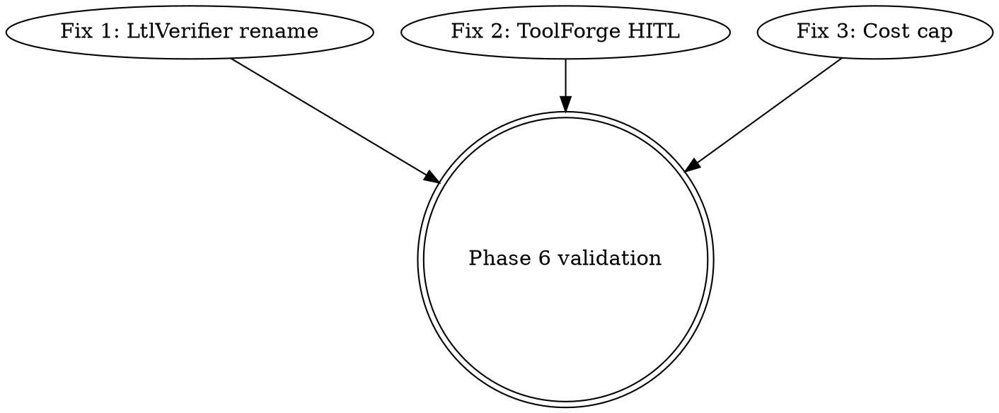

# AUDIT3 Phase 3-4 plan — 3 quick wins
**Date:** 2026-04-24 · **Basis:** `audit-checklist.md` · **Protocol:** PROMPT.md §3-4

Scope: 3 actionable items with highest (severity × leverage) / effort
ratio from the 5 Phase 3 candidates. Remaining 2 candidates
(prompt-injection filter, threshold-calibration ablation) deferred —
filter is security-architectural and wants a design doc first; ablation
is a multi-day bench run.

---

## Fix 1 — `LtlVerifier` → `GraphPropertyChecker` rename

**Claim:** AUDIT3 §3 claim #8 — "LtlVerifier: reachability, safety,
liveness via BFS/DFS — misnamed. No temporal-logic parser exists."

**Severity:** **LOW**. Criterion: no runtime/correctness impact; the
name misleads reviewers into expecting temporal-logic capabilities the
code doesn't have. Credibility/overclaiming risk, not security.

**SOTA research:** not applicable — pure rename. Python ecosystem
convention: name-reflects-behaviour. LTL model-checkers (SPIN,
PRISM-games, NuSMV) all expose formula parsers; ours doesn't. The
proposed `GraphPropertyChecker` name matches what the class actually
does (`check_reachability` BFS, `check_safety` no-HIGH→LOW-path,
`check_liveness` entries→exits reachability, `check_bounded_liveness`
depth-K).

**Oracle consultation:** skip (complexity < medium, no divergence).

**Solution:**
1. Rename `sage-core/src/verification/ltl.rs::LtlVerifier` struct →
   `GraphPropertyChecker` (class + pymethods).
2. Update module path `verification::ltl` → `verification::graph_properties`
   OR keep module path + only rename class (simpler; ADR note explains
   the history).
3. Grep update callers: `sage-core/src/lib.rs:90` (PyO3 export),
   `sage-core/src/README.md:88`, `sage-core/src/topology/reward.rs:93`
   (comment reference), any Python import sites (none expected —
   verifier is instantiated from Rust-side code paths per
   memory-reward integration).
4. Add deprecation alias `LtlVerifier = GraphPropertyChecker` at the
   module level with `#[deprecated]` attribute + one-release removal
   note so downstream users pinning `from sage_core import LtlVerifier`
   get a warning but don't break.
5. ADR-014 (new) documents the rename + why: "graph-structural checks
   are not temporal-logic verification; name now reflects reality."

**Files to modify (expected):** 4-5
- `sage-core/src/verification/ltl.rs` (or rename file to `graph_properties.rs`)
- `sage-core/src/verification/mod.rs`
- `sage-core/src/lib.rs`
- `sage-core/src/README.md`
- `sage-core/src/topology/reward.rs` (comment)
- `docs/adr/ADR-014-ltl-verifier-rename.md` (new)

**LOC estimate:** ~100 (mostly rename sed + 1 ADR)

**Acceptance criterion:** `cargo test --features smt --lib` green
AND `cargo build` green AND `grep -rn "LtlVerifier" sage-core/src/`
returns ≤ 1 line (the deprecation alias).

**Risk:** Low. Pure mechanical rename + alias for back-compat.

---

## Fix 2 — ToolForge HITL approval gate

**Claim:** AUDIT3 §3 claim #11, §6 risk register, §10 top-10 #8 — "Dynamic
tool synthesis (ToolForge) without permission boundaries or HITL gating."

**Severity:** **HIGH**. Criterion:
- Blast radius: unbounded tool execution. Once a forged tool lands in
  the registry, any subsequent agent invocation can call it without
  further approval.
- Exploitability: any prompt-injection that reaches the agent loop
  can bias `GapDetector` into generating a "capability gap" ticket,
  which `BuildLoop` then fulfills by synthesizing and registering a
  tool. No human-in-the-loop gate between detection and registration.
- Frequency: ToolForge doesn't auto-trigger today — it's driven by
  explicit `process_ticket(s)` calls. But the persistence path lacks
  the safety net.

**SOTA research:** LangChain's Agent Executor uses explicit
`handle_parsing_errors=True` for controlled tool execution; OpenAI's
Assistants API requires all tools to be registered at assistant-creation
time (no runtime injection). Aider + Continue use user-confirmation
prompts for filesystem write tools. The common pattern is:
1. Generation detects a gap.
2. Proposed tool spec shown to human reviewer.
3. Reviewer approves or rejects.
4. Only approved specs enter the registry.

**Oracle consultation:** skip (design pattern well-established; no
real divergence).

**Solution (minimum-viable HITL gate):**
1. Add `approval_callback: Callable[[str, str], bool] | None` parameter
   to `BuildLoop.__init__`. Default None = current unsafe behaviour
   (for back-compat + tests), documented as "unsafe without approval;
   set `approval_callback` in production".
2. Add env var gate `SAGE_TOOLFORGE_REQUIRE_APPROVAL=1`. When set AND
   `approval_callback is None`, `process_ticket` raises `RuntimeError`
   with a pointer to this fix (fail-closed by env — mirrors
   SAGE_STRICT_GOVERNANCE pattern from A0b).
3. In `process_ticket`: after tool generation, before `mark_source`:

   ```python
   if approval_callback is not None:
       allowed = approval_callback(ticket.name, tool_spec_text)
       if not allowed:
           log.info("ToolForge: approval denied for %s", ticket.name)
           return None
   ```
4. Add `SAGE_TOOLFORGE_APPROVE_ALL=1` opt-in for test environments
   (so tests don't need to mock the callback each time) with a WARN
   logged the first time it fires in a process.
5. Registry metadata: persist `approved_by=<callback name or "env">`
   alongside `source=forged` so post-hoc audit can see who approved.

**Files to modify:** 2-3
- `sage-python/src/sage/tools/forge.py` (BuildLoop + process_ticket)
- `sage-python/src/sage/tools/registry.py` (persist approved_by field
  if needed)
- `sage-python/tests/test_toolforge.py` or equivalent (new tests)

**LOC estimate:** ~80 core + ~60 tests = ~140

**Acceptance criteria:**
- New test: `process_ticket` with `approval_callback=lambda n,s: False`
  returns None AND does NOT touch the registry.
- New test: `process_ticket` with `approval_callback=lambda n,s: True`
  registers the tool AND sets `approved_by` in registry metadata.
- New test: `SAGE_TOOLFORGE_REQUIRE_APPROVAL=1` + no callback raises.
- New test: existing tests (back-compat unsafe path) still pass.
- `grep "approval_callback" sage-python/src/sage/tools/forge.py` finds
  the gate.

**Risk:** Medium. Touches a security boundary; fail-closed default
under env flag prevents regression. Back-compat preserved via None
default.

---

## Fix 3 — Pipeline-level cost cap enforcement

**Claim:** AUDIT3 §3 claim #12, §6 risk register, §10 top-10 #2 — "No
cost caps or budget-aware routing documented. Prevents financial
runaway."

**Severity:** **HIGH**. Criterion:
- Blast radius: unbounded spend per task. Bandit could burn arbitrary
  $ on runaway topology evolution or infinite tool-call loops.
- Exploitability: any task that triggers repeated bandit exploration
  OR a provider with a pricing bug (e.g. 10x output tokens)
  compounds quickly.
- Current state: `budget_usd` is THREADED through the stack (Rust
  assigner skips models over remaining budget per-node) AND
  `CostTracker` exists and tracks total spend. But: `is_over_budget`
  is READ NOWHERE at the pipeline level. No short-circuit abort.
  Default `budget_usd=0` means unlimited.

**SOTA research:** Anthropic's Claude API "max_tokens" + OpenAI's
per-request usage caps are request-level, not task-level.
OpenRouter's "max_cost" header is a request-level soft cap that
returns 402. Task-level requires application-side enforcement — the
pattern is a tracker + a checkpoint at every boundary (node entry,
tool call, retry). Existing CostTracker is fit-for-purpose; missing
piece is the boundary check.

**Oracle consultation:** skip (well-established pattern, no divergence).

**Solution:**
1. Pass `cost_tracker: CostTracker | None` through
   `CognitiveOrchestrationPipeline.run()` → `_stage_execute` →
   `TopologyRunner._execute_node`.
2. At each node-entry and at the top of the bypass path:

   ```python
   if cost_tracker is not None and cost_tracker.is_over_budget:
       log.warning("Task aborted: budget %.4f exceeded (spent %.4f)",
                   cost_tracker.budget_usd, cost_tracker.total_spent)
       ctx.result = "[sage: budget exceeded]"
       return ctx
   ```
3. Instantiate a CostTracker when `budget_usd > 0` is passed to
   `pipeline.run()` (env var `SAGE_TASK_BUDGET_USD` as fallback).
   Record per-node cost from `ctx.cost` after each node.
4. Add a new pipeline event `EXECUTE_BUDGET_EXCEEDED` with the tracker's
   stats dict for observability.
5. Default behaviour unchanged: `budget_usd=0` → unlimited (no tracker
   instantiated). Opt-in via constructor arg or env var.

**Files to modify:**
- `sage-python/src/sage/pipeline.py` (wire CostTracker + node-entry checks)
- `sage-python/src/sage/topology/runner.py` (node-entry check)
- `sage-python/src/sage/contracts/cost_tracker.py` (already exists — no change)
- `sage-python/tests/test_pipeline_budget.py` (new)

**LOC estimate:** ~100 core + ~80 tests = ~180

**Acceptance criteria:**
- New test: `pipeline.run(task, budget_usd=0.01)` aborts mid-run when
  the first node's cost exceeds $0.01; `ctx.result` contains the
  sentinel.
- New test: `EXECUTE_BUDGET_EXCEEDED` event fires via `_emit`.
- New test: `budget_usd=0` (default) → no tracker, no short-circuit,
  unchanged behaviour on existing call sites.
- New test: `SAGE_TASK_BUDGET_USD=5.00` env var is picked up when
  constructor doesn't set budget.
- Grep `is_over_budget.*return\|abort` in pipeline/runner finds the
  new check.

**Risk:** Medium. Early-exit on budget could interact with the
verification-fail path (`ctx.verification_passed=False`) — need to
ensure budget-exceeded takes precedence AND the existing
`EXECUTE_HALTED_UNVERIFIED` still fires cleanly in strict mode. Tests
must exercise both orderings.

---

## DAG + dependencies



All three fixes are **independent** (no shared files beyond docs and
tests). Can land in any order. Recommended order by ascending risk:
1. Rename (lowest risk — mechanical)
2. HITL (medium — new code path with env gate)
3. Budget (highest — must interact correctly with strict-governance)

## Phase 5 per-fix workflow (per PROMPT.md §5.2)

For each fix:
- Branch `fix/audit3-<id>` off main
- TDD-inverse: write test that FAILS on current code → code → test
  passes → commit
- ≤ 10 files, ≤ 200 LOC (all three fixes comfortably under)
- Tests run after each fix (sub-suite first, full second)
- Commit message includes claim-ID + verdict pre/post + files/LOC stats

## Total budget estimate

| Fix | Core | Tests | Commit | Total |
|---|---|---|---|---|
| 1 rename | 40 min | 15 min | 5 min | ~1 h |
| 2 HITL | 1 h | 45 min | 5 min | ~2 h |
| 3 budget | 1 h 15 min | 45 min | 5 min | ~2 h |
| **Total** | 2h 55min | 1h 45min | 15 min | **~5 h** |

Exceeds PROMPT.md §5 individual-fix 30-min/200-LOC target on the core
work (normal for combined plan); each fix individually meets the LOC
cap. Scheduling: consecutive, not parallel — shared Rust rebuild +
test-run latency dominates.

## Advisor gate (PROMPT.md §5 entry)

Calling advisor with this plan BEFORE Phase 5 starts per §5 mandatory
gate. Questions:
1. Ordering risk — rename before HITL before budget, or reorder?
2. Any fix that should bundle with another in one PR, or all three
   as separate commits to same audit branch?
3. Pre-requisites missed (feature flag, rollback plan) for any of the
   three?
