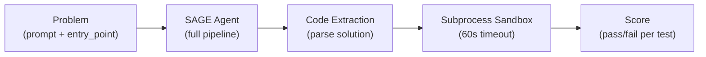

# Evaluation Methodology

This page documents the evaluation protocols, statistical methods, and design decisions behind YGN-SAGE's benchmark suite.

---

## Principles

1. **Non-circular evaluation**: Ground truth labels are created by domain expertise, never reverse-engineered from the system's own heuristics
2. **Real conditions**: Benchmarks run through the full agent pipeline (routing, topology, memory, guardrails) -- no shortcuts or mock providers
3. **Reproducible**: All benchmarks are CLI-runnable with deterministic task sets
4. **Error-transparent**: The evaluation protocol captures full tracebacks, phases, models, and routing decisions for post-mortem debugging

---

## EvalPlus Adapter

The `sage.bench.evalplus_bench` module adapts the EvalPlus benchmark suite for SAGE evaluation.

### HumanEval+

- **164 coding problems** from OpenAI's HumanEval dataset
- **80x more tests** than the original (up to 999 `plus_inputs` per task)
- **Metric**: pass@1 -- each problem gets one attempt
- **Execution**: subprocess sandbox (Windows-compatible)
- **Two scores reported**: base (original tests only) and plus (including hardened tests)

### MBPP+

- **378 Python problems** from the Mostly Basic Python Programming dataset
- **35x more tests** than the original
- **Same protocol** as HumanEval+ (subprocess sandbox, pass@1)

### Execution Pipeline



Each task runs through SAGE's full cognitive pipeline:

1. Task is routed to S1/S2/S3
2. Topology is generated or recalled
3. LLM generates a solution
4. S2 code tasks get AVR (Act-Verify-Refine) self-correction with edge case injection
5. Code is extracted and executed in a subprocess sandbox with 60-second timeout
6. Each test case is evaluated independently

---

## Ablation Framework

The `sage.bench.ablation` module implements a 6-configuration ablation study to quantify each pillar's contribution.

### Configurations

| Config | Description |
|--------|-------------|
| `full` | Complete SAGE system (all pillars active) |
| `baseline` | Bare LLM call (no framework) |
| `no-memory` | Full system minus memory injection |
| `no-avr` | Full system minus AVR self-refinement |
| `no-routing` | Full system with random tier assignment |
| `no-guardrails` | Full system minus input/output guardrails |

### Protocol

- A/B paired tests: each configuration runs the **same tasks** with the **same model**
- 20 tasks per configuration (configurable via `--limit`)
- pass@1 metric for code tasks
- The delta between `full` and each disabled config isolates that pillar's contribution

---

## TopologyBench Protocol

Tests the hypothesis that agent topology structure impacts performance more than model capability (per AdaptOrch, arXiv 2602.16873).

### Design

- **Task set**: Full HumanEval+ (164 problems)
- **Topologies**: All 9 templates (sequential, parallel, avr, selfmoa, hierarchical, hub, debate, brainstorming, evolved)
- **Same model**: All topologies use the same underlying LLM (budget Gemini 2.5 Flash)
- **Metric**: pass@1 per topology

### Evolved Topology

The `evolved` entry is generated by the `DynamicTopologyEngine` using the 6-path strategy (S-MMU recall -> archive -> LLM synthesis -> mutation -> MCTS -> template fallback). It represents the system's best attempt at generating an optimal topology per task.

### Statistical Analysis

On 20 tasks with real topology execution, we observe a 10pp spread (90-100%) with **zero failure overlap** across 4 topologies. While McNemar tests are non-significant (N=20 is too small for sufficient power), the perfectly disjoint failure pattern is the key qualitative finding:

- Each of the 4 failing tasks fails in exactly one topology
- Jaccard similarity = 0.00 for all 6 pairwise comparisons
- This demonstrates complementary topology strengths

Previous results (9 topologies, mean 94.0%, spread 4.3pp) were invalidated due to a topology execution bypass bug. Full 164-task confirmation with corrected execution path is in progress.

### Cost Estimation

A full TopologyBench run across all 9 topologies on 164 tasks costs approximately $28 in API calls. Use `--dry-run` for cost estimation before running.

---

## Routing Ground Truth

The `sage.bench.routing_gt` module evaluates routing accuracy against human-labeled ground truth.

### Task Set

50 tasks with human-assigned cognitive system labels:

- **10 S1 tasks**: simple lookups, greetings, arithmetic
- **20 S2 tasks**: code generation, multi-step reasoning, analysis
- **20 S3 tasks**: formal proofs, invariant verification, SAT problems

### Non-Circular Labeling

Labels are assigned by **domain expertise** based on the cognitive demands of each task. They are explicitly NOT reverse-engineered from the heuristic router's output. This prevents the circular validation problem where the benchmark measures agreement with itself.

### Evaluated Routers

- **kNN** (`KnnRouter`): kNN on arctic-embed-m embeddings with distance-weighted majority vote
- **Rust SystemRouter**: Domain scoring from `cards.toml` with bandit selection
- **Heuristic** (`ComplexityRouter`): Word-boundary regex matching
- **DeBERTa zero-shot**: NVIDIA prompt-task-and-complexity-classifier
- **Python AdaptiveRouter**: Structural features only (Stage 0)

---

## Memory and Evolution Ablation

### Memory Ablation

4-configuration measurement isolating each memory tier:

| Config | Active Tiers |
|--------|-------------|
| `none` | No memory |
| `tier0` | Working memory (STM) only |
| `tier01` | Working + Episodic |
| `full` | All 4 tiers |

### Evolution Ablation

3-configuration measurement isolating evolutionary search value:

| Config | Description |
|--------|-------------|
| `none` | Fixed topology (no evolution) |
| `random` | Random mutations (no directed search) |
| `full` | Full MAP-Elites + CMA-ME + MCTS |

---

## Shadow Trace Analysis

The `ShadowRouter` runs both Rust and Python routers on every task and logs divergences as JSONL traces.

### Collection

```bash
cd sage-python
python scripts/collect_shadow_traces.py --rounds 20  # 1000 traces
```

### Phase 5 Gate Criteria

The original Phase 5 gate used divergence rate as the criterion:

- **Soft gate**: 500 traces, <10% divergence
- **Hard gate**: 1000 traces, <5% divergence

After analysis of 1090 traces (49.6% divergence), it was determined that divergence is the wrong metric -- the Rust router is more accurate (88%) than the Python router (44%). The gate criterion has been revised to accuracy-based evidence.

---

## Quality Estimation Evaluation

The `DistilBERT QualityEstimator` is evaluated using the SHIP (Statistical Hypothesis of Improved Performance) protocol:

- **Training data**: 600 quality triples collected via `scripts/collect_quality_triples.py`
- **Metric**: Pearson correlation between predicted and actual quality scores
- **Baseline**: The `len > 10` heuristic (Pearson r = 0.0, no correlation)
- **Result**: r = 0.3436, a +34.4 percentage point improvement

---

## Official Evaluation Protocol

The `sage.bench.eval_protocol` module provides the most rigorous evaluation with full error capture:

```bash
# Run with verbose error logging
python -m sage.bench.eval_protocol --suite humaneval --limit 20 -v

# Output:
# - JSON report: docs/benchmarks/<date>-humaneval-report.json
# - JSONL error log: docs/benchmarks/errors.jsonl

# Post-mortem analysis
python -m sage.bench.eval_protocol --replay docs/benchmarks/errors.jsonl
```

Each error log entry contains:

- Full traceback
- Phase where the error occurred (PERCEIVE, THINK, ACT, LEARN)
- Model used
- Routing decision (S1/S2/S3)
- Task metadata

This enables systematic post-mortem analysis of failures without re-running the benchmark.
