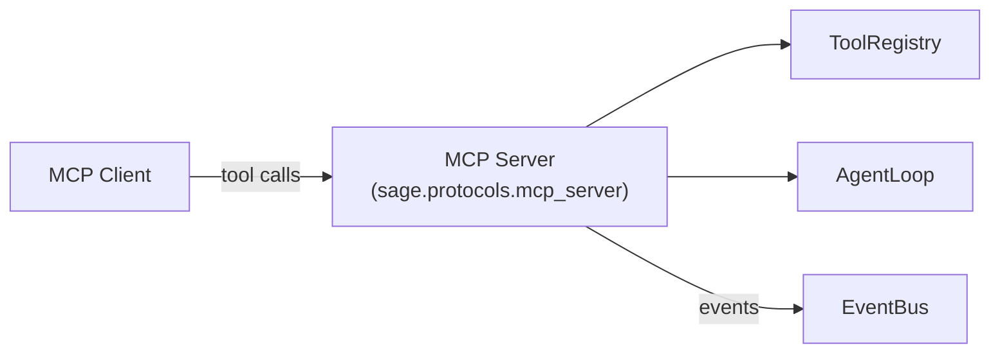
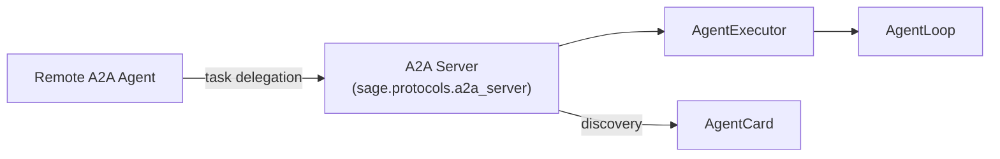

# Protocols: MCP + A2A

YGN-SAGE supports two standard agent communication protocols: **MCP** (Model Context Protocol) and **A2A** (Agent-to-Agent). Both can run simultaneously from a single CLI entry point.

---

## Installation

```bash
pip install ygn-sage[protocols]
```

This installs the MCP and A2A SDK dependencies.

---

## Quick Start

```bash
# MCP server only
python -m sage.protocols.serve --mcp --mcp-port 8001

# A2A agent only
python -m sage.protocols.serve --a2a --a2a-port 8002

# Both simultaneously
python -m sage.protocols.serve --mcp --a2a
```

---

## MCP Server

The MCP server exposes SAGE's capabilities as MCP tools that any MCP-compatible client can discover and invoke.

### Architecture



### Exposed Tools

The MCP server automatically exposes all tools in the SAGE ToolRegistry, plus:

- **`run_task`**: Meta-tool that submits a task to the full SAGE agent pipeline and returns the result

### EventBus Resource

The MCP server exposes the EventBus as an MCP resource, allowing clients to subscribe to agent events (routing decisions, guardrail checks, memory operations, etc.).

### Example: Connecting from Claude Desktop

In your Claude Desktop MCP configuration, add the SAGE server:

```json
{
  "mcpServers": {
    "sage": {
      "command": "python",
      "args": ["-m", "sage.protocols.serve", "--mcp", "--mcp-port", "8001"]
    }
  }
}
```

---

## A2A Agent

The A2A server exposes SAGE as an A2A-compatible agent that other agents can discover and delegate tasks to.

### Architecture



### AgentCard

The A2A server publishes an AgentCard with three skill declarations:

| Skill | Description |
|-------|-------------|
| **general** | General-purpose task completion |
| **code** | Code generation, review, and debugging |
| **research** | In-depth research using ExoCortex knowledge base |

### Discovery

Other A2A agents can discover SAGE via the standard A2A discovery protocol:

```
GET http://localhost:8002/.well-known/agent.json
```

Returns the AgentCard with skill descriptions, supported protocols, and endpoint information.

### SDK Version

SAGE uses `a2a-sdk >= 1.0`. Note that there are breaking changes from v0.3 -- ensure your clients are also on v1.0+.

---

## Running Both Protocols

The unified CLI runs both servers in the same process:

```bash
python -m sage.protocols.serve --mcp --a2a
```

Default ports:

- MCP: 8001
- A2A: 8002

Both servers share the same `AgentLoop`, `EventBus`, and `GuardrailPipeline` instances wired by `boot()`.

---

## Feature Detection

The protocols module auto-detects available SDKs:

```python
from sage.protocols import HAS_MCP, HAS_A2A

if HAS_MCP:
    # MCP SDK is available
    from sage.protocols.mcp_server import create_mcp_server

if HAS_A2A:
    # A2A SDK is available
    from sage.protocols.a2a_server import create_a2a_agent
```

This allows SAGE to be installed without protocol dependencies (`pip install ygn-sage`) and only enable protocols when the extras are installed (`pip install ygn-sage[protocols]`).

---

## Dashboard Integration

The MCP and A2A servers coexist with the SAGE dashboard:

```bash
# Terminal 1: Dashboard
python ui/app.py  # http://localhost:8000

# Terminal 2: Protocol servers
python -m sage.protocols.serve --mcp --a2a
```

All three share the same EventBus, so protocol-initiated tasks appear in the dashboard in real-time via WebSocket push.
